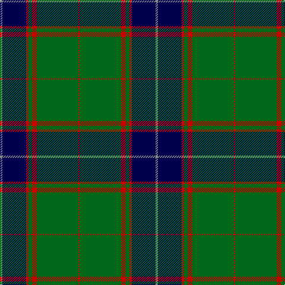

In pattern [RBRGRGR](/stripes/rbrgrgr/).

This was sourced from tartans-authority.  It is a [7 stripe tartan](/stripes/stripes7/).

Original link http://www.tartansauthority.com/tartan-ferret/display/10110/

## Thread count
N/4 DB40 R4 G6 R8 G70 R/2

## Palette
Each colour and the base-6 reference it is a variant of.

| Colour | Shade | Base |
|---|---|---|
| DB | <code style="background-color:#00004C;">#00004C</code> `oklch(18.8% 0.130 264.1)` <small>#00004C</small> | B <code style="background-color:#2A418A;">#2A418A</code> |
| G | <code style="background-color:#006818;">#006818</code> `oklch(45.0% 0.142 145.0)` <small>#006818</small> | G <code style="background-color:#006100;">#006100</code> |
| N | <code style="background-color:#888888;">#888888</code> `oklch(62.7% 0.000 89.9)` <small>#888888</small> | R <code style="background-color:#CC0000;">#CC0000</code> |
| R | <code style="background-color:#C80000;">#C80000</code> `oklch(52.3% 0.215 29.2)` <small>#C80000</small> | R <code style="background-color:#CC0000;">#CC0000</code> |

# Sample pattern

## Nearest tartans

The nearest existing variants by ΔTartan distance.

1. [Gretna Green](/setts/s8/db2g2ly1g30db20r2db2r2~x2/) — ΔT 0.85
1. [Mackie (2016)](/setts/s8/g2k1db6k11g26k1g1lo2~x2/) — ΔT 0.88
1. [Gretna Green Fashion Tartan Tartan Number: 5119. Earliest known date: 01/01/1996 Designed in 1996 by Lochcarron for Tartan & Tweeds of Gretna Green. Gretna Green became famous for runaway marriages when 'irregular' marriages were banned by law in England in 1753. Couples were able to run to Scotland and become legally married by proclamation in front of two witnesses. This form of marriage was recognised worldwide. From the middle of the 18th century these marriages were in such demand that the blacksmith, conveniently situated on the crossroads at Gretna Green, became known as the 'anvil priest', giving birth to the anvil as the symbol of Gretna Green. Many couples are still married at the original smithy while many others, although married elsewhere, visit Gretna Green to take the traditional Scottish oath. The Gretna Green tartan reflects the twin influences of this history and that of the powerful border clan Johnstone, so influential in this area of Dumfriesshire, on which this tartan is based. Sample in Scottish Tartans Authority's Johnston Collection. See products available Copyright © Blair Urquhart, Comrie, 2015](/setts/s8/db2g2k1g30db20r2db2r2~x2/) — ΔT 0.89
1. [Dropkick Murphys](/setts/s9/k6g55g6k85g4k4g12k2w5/) — ΔT 0.97
1. [Oliphant](/setts/s6/db4k4db24g32w1g2~x2/) — ΔT 1.00
1. [Moran (Name)](/setts/s6/g55k17r9k11ly2k4~x2/) — ΔT 1.02
1. [Johnston / Johnstone](/setts/s8/ly3g2k1g30db24k2db2k2~x2/) — ΔT 1.04
1. [Black Thistle](/setts/s9/b10k6g42k2g1k2r1k24r2~x2/) — ΔT 1.17
1. [MacDiarmid #2](/setts/s8/k83r16dg56k2w5k2dg56r5~x2/) — ΔT 1.25
1. [Moran Family Tartan Tartan Number: 675. Earliest known date: 1986 The designers requested that the threadcount be Restricted. See products available Copyright © Blair Urquhart, Comrie, 2015](/setts/s6/g55k17r9k11ly2db4~x2/) — ΔT 1.29

## Neighbour map

Every grey dot is one of 14299 variants placed by the first two principal components of the ΔTartan feature space (44% of its variance). Red is this tartan; blue dots are its nearest — click one to open its page.

<svg viewBox="0 0 640 380" role="img" style="max-width:100%;height:auto;border:1px solid #e0e0e0;border-radius:4px;display:block" xmlns="http://www.w3.org/2000/svg"><image href="/nn/cloud.v1.png" width="640" height="380"/><a href="/setts/s8/db2g2ly1g30db20r2db2r2~x2/"><circle cx="367.6" cy="141.2" r="4" fill="#3465a4"><title>Gretna Green</title></circle></a><a href="/setts/s8/g2k1db6k11g26k1g1lo2~x2/"><circle cx="380.7" cy="157.4" r="4" fill="#3465a4"><title>Mackie (2016)</title></circle></a><a href="/setts/s8/db2g2k1g30db20r2db2r2~x2/"><circle cx="369.1" cy="142.5" r="4" fill="#3465a4"><title>Gretna Green Fashion Tartan Tartan Number: 5119. Earliest known date: 01/01/1996 Designed in 1996 by Lochcarron for Tartan &amp; Tweeds of Gretna Green. Gretna Green became famous for runaway marriages when 'irregular' marriages were banned by law in England in 1753. Couples were able to run to Scotland and become legally married by proclamation in front of two witnesses. This form of marriage was recognised worldwide. From the middle of the 18th century these marriages were in such demand that the blacksmith, conveniently situated on the crossroads at Gretna Green, became known as the 'anvil priest', giving birth to the anvil as the symbol of Gretna Green. Many couples are still married at the original smithy while many others, although married elsewhere, visit Gretna Green to take the traditional Scottish oath. The Gretna Green tartan reflects the twin influences of this history and that of the powerful border clan Johnstone, so influential in this area of Dumfriesshire, on which this tartan is based. Sample in Scottish Tartans Authority's Johnston Collection. See products available Copyright © Blair Urquhart, Comrie, 2015</title></circle></a><a href="/setts/s9/k6g55g6k85g4k4g12k2w5/"><circle cx="384.9" cy="124.0" r="4" fill="#3465a4"><title>Dropkick Murphys</title></circle></a><a href="/setts/s6/db4k4db24g32w1g2~x2/"><circle cx="350.3" cy="166.0" r="4" fill="#3465a4"><title>Oliphant</title></circle></a><a href="/setts/s6/g55k17r9k11ly2k4~x2/"><circle cx="369.9" cy="171.1" r="4" fill="#3465a4"><title>Moran (Name)</title></circle></a><a href="/setts/s8/ly3g2k1g30db24k2db2k2~x2/"><circle cx="324.4" cy="135.4" r="4" fill="#3465a4"><title>Johnston / Johnstone</title></circle></a><a href="/setts/s9/b10k6g42k2g1k2r1k24r2~x2/"><circle cx="336.5" cy="118.8" r="4" fill="#3465a4"><title>Black Thistle</title></circle></a><a href="/setts/s8/k83r16dg56k2w5k2dg56r5~x2/"><circle cx="358.6" cy="151.7" r="4" fill="#3465a4"><title>MacDiarmid #2</title></circle></a><a href="/setts/s6/g55k17r9k11ly2db4~x2/"><circle cx="345.4" cy="155.8" r="4" fill="#3465a4"><title>Moran Family Tartan Tartan Number: 675. Earliest known date: 1986 The designers requested that the threadcount be Restricted. See products available Copyright © Blair Urquhart, Comrie, 2015</title></circle></a><circle cx="376.6" cy="144.8" r="5" fill="#c00000"/></svg>

ID: /setts/s7/o2db20r2g3r4g35r1~x2/
