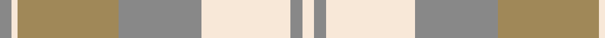

This page is one **sett** — a single exact thread-count. It belongs to the [tartan](/tartans/o2w1lo17o14w15o2w2/)
(the same proportion at any scale), whose colour order is pattern [RWYRWRW](/stripes/rwyrwrw/).

Sourced from register-of-tartans.  It is a [7 stripe tartan](/stripes/stripes7/).

Original link https://www.tartanregister.gov.uk/tartanDetails.aspx?ref=3088

## Also known as

This cloth is also recorded under:

- North American Sheep Breeders Association

2 attestations — the source records this cloth was collapsed from (oldest owns this page)

<ul>
<li>01/02/2007 — North American Sheep Breeders Association (register-of-tartans, <a href="https://www.tartanregister.gov.uk/tartanDetails.aspx?ref=3088">record</a>)</li>
<li>Feb 2007 — NASSA (Corporate) (tartans-authority, <a href="http://www.tartansauthority.com/tartan-ferret/display/7097/">record</a>)</li>
</ul>

## Register references

External register numbers recorded for this tartan.

- Scottish Register of Tartans: [3088](https://www.tartanregister.gov.uk/tartanDetails.aspx?ref=3088)
- Scottish Tartans Authority (ITI): 7097

## Thread count
N/4 LY2 LT34 N28 LY30 N4 LY/4

## Palette

Palette: <strong>Tartan Register</strong> <small style="color:#888">(2 of 3 colours)</small>
<table><thead><tr><th>Colour</th><th>Threads</th><th>Shade</th><th>Base</th><th>OKLCh</th></tr></thead><tbody><tr><td>N/</td><td style="text-align:right;font-variant-numeric:tabular-nums">4</td><td><code style="background-color:#888888;">#888888</code> <small style="color:#888">#888888</small></td><td>R <code style="background-color:#CC0000;">#CC0000</code></td><td><small style="color:#888">oklch(62.7% 0.000 89.9)</small></td></tr><tr><td>LY</td><td style="text-align:right;font-variant-numeric:tabular-nums">2</td><td><code style="background-color:#F8E8D8;">#F8E8D8</code> <small style="color:#888">#F8E8D8</small></td><td>W <code style="background-color:#F7F7F7;">#F7F7F7</code></td><td><small style="color:#888">oklch(93.9% 0.028 67.5)</small></td></tr><tr><td>LT</td><td style="text-align:right;font-variant-numeric:tabular-nums">34</td><td><code style="background-color:#A08858;">#A08858</code> <small style="color:#888">#A08858</small></td><td>Y <code style="background-color:#F2BF00;">#F2BF00</code></td><td><small style="color:#888">oklch(63.7% 0.071 84.0)</small></td></tr><tr><td>N</td><td style="text-align:right;font-variant-numeric:tabular-nums">28</td><td><code style="background-color:#888888;">#888888</code> <small style="color:#888">#888888</small></td><td>R <code style="background-color:#CC0000;">#CC0000</code></td><td><small style="color:#888">oklch(62.7% 0.000 89.9)</small></td></tr><tr><td>LY</td><td style="text-align:right;font-variant-numeric:tabular-nums">30</td><td><code style="background-color:#F8E8D8;">#F8E8D8</code> <small style="color:#888">#F8E8D8</small></td><td>W <code style="background-color:#F7F7F7;">#F7F7F7</code></td><td><small style="color:#888">oklch(93.9% 0.028 67.5)</small></td></tr><tr><td>N</td><td style="text-align:right;font-variant-numeric:tabular-nums">4</td><td><code style="background-color:#888888;">#888888</code> <small style="color:#888">#888888</small></td><td>R <code style="background-color:#CC0000;">#CC0000</code></td><td><small style="color:#888">oklch(62.7% 0.000 89.9)</small></td></tr><tr><td>LY/</td><td style="text-align:right;font-variant-numeric:tabular-nums">4</td><td><code style="background-color:#F8E8D8;">#F8E8D8</code> <small style="color:#888">#F8E8D8</small></td><td>W <code style="background-color:#F7F7F7;">#F7F7F7</code></td><td><small style="color:#888">oklch(93.9% 0.028 67.5)</small></td></tr></tbody></table>

# Sample pattern

## Nearest tartans

The nearest existing variants by ΔTartan distance, with this tartan at the top so the swatches line up against it.

ΔTartan

Tartan

Sett

—

<a href="/ttd/edit/#slug=o2w1lo17o14w15o2w2~x2">North American Sheep Breeders Association</a> <a class="nn-out" href="/setts/s7/o2w1lo17o14w15o2w2~x2/" title="open its dictionary page">↗</a>

1.62

<a href="/ttd/edit/#slug=y2w19lr2w2y3w3y3lr6ly25w2~x2">Llama (Fashion)</a> <a class="nn-out" href="/setts/s10/y2w19lr2w2y3w3y3lr6ly25w2~x2/" title="open its dictionary page">↗</a>

1.62

<a href="/ttd/edit/#slug=g5lbi15lb11lbi2lb1lbi1g4~x4">Highlands Country Club (Corporate)</a> <a class="nn-out" href="/setts/s7/g5lbi15lb11lbi2lb1lbi1g4~x4/" title="open its dictionary page">↗</a>

1.74

<a href="/ttd/edit/#slug=o2dy2o15dy2w10lo15dy2lo2~x2">Bannockbane Grey #2</a> <a class="nn-out" href="/setts/s8/o2dy2o15dy2w10lo15dy2lo2~x2/" title="open its dictionary page">↗</a>

1.81

<a href="/ttd/edit/#slug=lb4n2lb18r2n5o16r2o2r2o2~x2">Clyde Trade Tartan Tartan Number: 1296. Earliest known date: pre 1992 See Strathclyde District See products available Copyright © Blair Urquhart, Comrie, 2015</a> <a class="nn-out" href="/setts/s10/lb4n2lb18r2n5o16r2o2r2o2~x2/" title="open its dictionary page">↗</a>

1.89

<a href="/ttd/edit/#slug=lb4n2lb18r2n5y16r2y2r2y2~x2">Clyde</a> <a class="nn-out" href="/setts/s10/lb4n2lb18r2n5y16r2y2r2y2~x2/" title="open its dictionary page">↗</a>

1.92

<a href="/ttd/edit/#slug=o2oi2o15w10oi2y15oi2y2~x2">Bannockbane, Grey</a> <a class="nn-out" href="/setts/s8/o2oi2o15w10oi2y15oi2y2~x2/" title="open its dictionary page">↗</a>

1.96

<a href="/ttd/edit/#slug=dy1w2lb16dy8o16dy2w1~x2">Jones (2016)</a> <a class="nn-out" href="/setts/s7/dy1w2lb16dy8o16dy2w1~x2/" title="open its dictionary page">↗</a>

2.00

<a href="/ttd/edit/#slug=o9w9o9n25o1w1o1w1g3~x2">Ailsa, Grey (Fashion)</a> <a class="nn-out" href="/setts/s9/o9w9o9n25o1w1o1w1g3~x2/" title="open its dictionary page">↗</a>

2.02

<a href="/ttd/edit/#slug=n2w2ly7lb14n2w2~x2">Cairngorm</a> <a class="nn-out" href="/setts/s6/n2w2ly7lb14n2w2~x2/" title="open its dictionary page">↗</a>

2.08

<a href="/ttd/edit/#slug=y6db2y1w17y1db2y16lo27dg2~x2">Rutlin (Personal)</a> <a class="nn-out" href="/setts/s9/y6db2y1w17y1db2y16lo27dg2~x2/" title="open its dictionary page">↗</a>

## Neighbour map

Every grey dot is one of 14359 variants placed by the first two principal components of the ΔTartan feature space (44% of its variance). Red is this tartan; blue dots are its nearest — click one to open its page.

<svg viewBox="0 0 640 380" role="img" style="max-width:100%;height:auto;border:1px solid #e0e0e0;border-radius:4px;display:block" xmlns="http://www.w3.org/2000/svg"><image href="/nn/cloud.v1.png" width="640" height="380"/><a href="/setts/s10/y2w19lr2w2y3w3y3lr6ly25w2~x2/"><circle cx="265.0" cy="156.0" r="4" fill="#3465a4"><title>Llama (Fashion)</title></circle></a><a href="/setts/s7/g5lbi15lb11lbi2lb1lbi1g4~x4/"><circle cx="240.8" cy="191.9" r="4" fill="#3465a4"><title>Highlands Country Club (Corporate)</title></circle></a><a href="/setts/s8/o2dy2o15dy2w10lo15dy2lo2~x2/"><circle cx="214.0" cy="214.9" r="4" fill="#3465a4"><title>Bannockbane Grey #2</title></circle></a><a href="/setts/s10/lb4n2lb18r2n5o16r2o2r2o2~x2/"><circle cx="263.0" cy="187.4" r="4" fill="#3465a4"><title>Clyde Trade Tartan Tartan Number: 1296. Earliest known date: pre 1992 See Strathclyde District See products available Copyright © Blair Urquhart, Comrie, 2015</title></circle></a><a href="/setts/s10/lb4n2lb18r2n5y16r2y2r2y2~x2/"><circle cx="249.5" cy="180.8" r="4" fill="#3465a4"><title>Clyde</title></circle></a><a href="/setts/s8/o2oi2o15w10oi2y15oi2y2~x2/"><circle cx="220.4" cy="217.9" r="4" fill="#3465a4"><title>Bannockbane, Grey</title></circle></a><a href="/setts/s7/dy1w2lb16dy8o16dy2w1~x2/"><circle cx="218.1" cy="163.6" r="4" fill="#3465a4"><title>Jones (2016)</title></circle></a><a href="/setts/s9/o9w9o9n25o1w1o1w1g3~x2/"><circle cx="297.2" cy="148.9" r="4" fill="#3465a4"><title>Ailsa, Grey (Fashion)</title></circle></a><a href="/setts/s6/n2w2ly7lb14n2w2~x2/"><circle cx="262.1" cy="214.4" r="4" fill="#3465a4"><title>Cairngorm</title></circle></a><a href="/setts/s9/y6db2y1w17y1db2y16lo27dg2~x2/"><circle cx="251.6" cy="128.2" r="4" fill="#3465a4"><title>Rutlin (Personal)</title></circle></a><circle cx="274.2" cy="202.0" r="5" fill="#c00000"/></svg>

ID: /setts/s7/o2w1lo17o14w15o2w2~x2/
