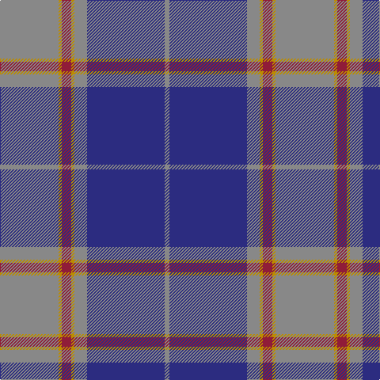

This page is one **sett** — a single exact thread-count. It belongs to the [tartan](/tartans/n37dy2dr6dy2n8db49n3/)
(the same proportion at any scale), whose colour order is pattern [RBRYRYR](/stripes/rbryryr/).

Sourced from tartans-authority.  It is a [7 stripe tartan](/stripes/stripes7/).

Original link http://www.tartansauthority.com/tartan-ferret/display/7749/

## Also known as

This cloth is also recorded under:

- U.S. Merchant Marine Academy (Corpo

2 attestations — the source records this cloth was collapsed from (oldest owns this page)

<ul>
<li>August 2008 — U.S. Merchant Marine Academy (Corpo (tartans-authority, <a href="http://www.tartansauthority.com/tartan-ferret/display/7749/">record</a>)</li>
<li>undated — U.S. Merchant Marine Academy (register-of-tartans, <a href="https://www.tartanregister.gov.uk/tartanDetails.aspx?ref=5730">record</a>)</li>
</ul>

## Register references

External register numbers recorded for this tartan.

- Scottish Register of Tartans: [5730](https://www.tartanregister.gov.uk/tartanDetails.aspx?ref=5730)
- Scottish Tartans Authority (ITI): 7749

## Thread count
N/74 DY4 DR12 DY4 N16 DB98 N/6

## Palette
Each colour and the base-6 reference it is a variant of.

| Colour | Shade | Base |
|---|---|---|
| DB | <code style="background-color:#2C2C80;">#2C2C80</code> `oklch(35.0% 0.138 276.6)` <small>#2C2C80</small> | B <code style="background-color:#2A418A;">#2A418A</code> |
| DR | <code style="background-color:#901C38;">#901C38</code> `oklch(43.2% 0.150 13.1)` <small>#901C38</small> | R <code style="background-color:#CC0000;">#CC0000</code> |
| DY | <code style="background-color:#BC8C00;">#BC8C00</code> `oklch(66.8% 0.137 84.1)` <small>#BC8C00</small> | Y <code style="background-color:#F2BF00;">#F2BF00</code> |
| N | <code style="background-color:#888888;">#888888</code> `oklch(62.7% 0.000 89.9)` <small>#888888</small> | R <code style="background-color:#CC0000;">#CC0000</code> |

# Sample pattern

## Nearest tartans

The nearest existing variants by ΔTartan distance, with this tartan at the top so the swatches line up against it.

ΔTartan

Tartan

Sett

—

<a href="/ttd/edit/#slug=o37lo2r6lo2o8db49o3~x2">U.S. Merchant Marine Academy (Corpo</a> <a class="nn-out" href="/setts/s7/o37lo2r6lo2o8db49o3~x2/" title="open its dictionary page">↗</a>

1.15

<a href="/ttd/edit/#slug=dt4lr1dt1lr3dt24o9k1o9k3~x2">Historic Scotland (pre 1998) (Corp)</a> <a class="nn-out" href="/setts/s9/dt4lr1dt1lr3dt24o9k1o9k3~x2/" title="open its dictionary page">↗</a>

1.21

<a href="/ttd/edit/#slug=n42db2n2db17lo8db4~x2">Connecticut State Police PB (Cor.)</a> <a class="nn-out" href="/setts/s6/n42db2n2db17lo8db4~x2/" title="open its dictionary page">↗</a>

1.23

<a href="/ttd/edit/#slug=t28dt15r2dt2w1dt6~x2">Corries</a> <a class="nn-out" href="/setts/s6/t28dt15r2dt2w1dt6~x2/" title="open its dictionary page">↗</a>

1.26

<a href="/ttd/edit/#slug=t14w1t3ly2t3w1t4db24r3~x2">Musselburgh</a> <a class="nn-out" href="/setts/s9/t14w1t3ly2t3w1t4db24r3~x2/" title="open its dictionary page">↗</a>

1.35

<a href="/ttd/edit/#slug=db2ly1db18g7r7db1g1~x2">Unnamed C20th - USA</a> <a class="nn-out" href="/setts/s7/db2ly1db18g7r7db1g1~x2/" title="open its dictionary page">↗</a>

1.36

<a href="/ttd/edit/#slug=n20db2n2db2n2o47db24w2">Browne (Personal)</a> <a class="nn-out" href="/setts/s8/n20db2n2db2n2o47db24w2/" title="open its dictionary page">↗</a>

1.44

<a href="/ttd/edit/#slug=o37db4o7db4o9db40t2db4o2">Edwards</a> <a class="nn-out" href="/setts/s9/o37db4o7db4o9db40t2db4o2/" title="open its dictionary page">↗</a>

1.45

<a href="/ttd/edit/#slug=o8ly4o35db2t8db2o4db21o4~x2">Bedford Academy (Corporate)</a> <a class="nn-out" href="/setts/s9/o8ly4o35db2t8db2o4db21o4~x2/" title="open its dictionary page">↗</a>

1.48

<a href="/ttd/edit/#slug=r6db2r1db16r3db16dg28w2dg4~x2">George (Personal)</a> <a class="nn-out" href="/setts/s9/r6db2r1db16r3db16dg28w2dg4~x2/" title="open its dictionary page">↗</a>

1.48

<a href="/ttd/edit/#slug=dp6ly1dp20db6g19dp2~x4">Discover Islay (District)</a> <a class="nn-out" href="/setts/s6/dp6ly1dp20db6g19dp2~x4/" title="open its dictionary page">↗</a>

## Neighbour map

Every grey dot is one of 14299 variants placed by the first two principal components of the ΔTartan feature space (44% of its variance). Red is this tartan; blue dots are its nearest — click one to open its page.

<svg viewBox="0 0 640 380" role="img" style="max-width:100%;height:auto;border:1px solid #e0e0e0;border-radius:4px;display:block" xmlns="http://www.w3.org/2000/svg"><image href="/nn/cloud.v1.png" width="640" height="380"/><a href="/setts/s9/dt4lr1dt1lr3dt24o9k1o9k3~x2/"><circle cx="364.3" cy="161.4" r="4" fill="#3465a4"><title>Historic Scotland (pre 1998) (Corp)</title></circle></a><a href="/setts/s6/n42db2n2db17lo8db4~x2/"><circle cx="381.3" cy="179.2" r="4" fill="#3465a4"><title>Connecticut State Police PB (Cor.)</title></circle></a><a href="/setts/s6/t28dt15r2dt2w1dt6~x2/"><circle cx="381.9" cy="178.5" r="4" fill="#3465a4"><title>Corries</title></circle></a><a href="/setts/s9/t14w1t3ly2t3w1t4db24r3~x2/"><circle cx="311.6" cy="140.5" r="4" fill="#3465a4"><title>Musselburgh</title></circle></a><a href="/setts/s7/db2ly1db18g7r7db1g1~x2/"><circle cx="350.5" cy="172.9" r="4" fill="#3465a4"><title>Unnamed C20th - USA</title></circle></a><a href="/setts/s8/n20db2n2db2n2o47db24w2/"><circle cx="345.3" cy="165.3" r="4" fill="#3465a4"><title>Browne (Personal)</title></circle></a><a href="/setts/s9/o37db4o7db4o9db40t2db4o2/"><circle cx="375.5" cy="169.8" r="4" fill="#3465a4"><title>Edwards</title></circle></a><a href="/setts/s9/o8ly4o35db2t8db2o4db21o4~x2/"><circle cx="357.7" cy="165.6" r="4" fill="#3465a4"><title>Bedford Academy (Corporate)</title></circle></a><a href="/setts/s9/r6db2r1db16r3db16dg28w2dg4~x2/"><circle cx="316.5" cy="164.4" r="4" fill="#3465a4"><title>George (Personal)</title></circle></a><a href="/setts/s6/dp6ly1dp20db6g19dp2~x4/"><circle cx="337.3" cy="195.3" r="4" fill="#3465a4"><title>Discover Islay (District)</title></circle></a><circle cx="346.5" cy="161.7" r="5" fill="#c00000"/></svg>

ID: /setts/s7/o37lo2r6lo2o8db49o3~x2/
