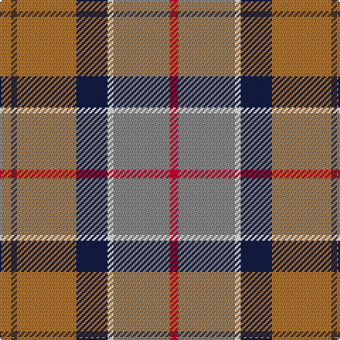

This page is one **sett** — a single exact thread-count. It belongs to the [tartan](/tartans/o4do2o21db11w2o20r3/)
(the same proportion at any scale), whose colour order is pattern [RBRBWRR](/stripes/rbrbwrr/).

Sourced from register-of-tartans.  It is a [7 stripe tartan](/stripes/stripes7/).

Original link https://www.tartanregister.gov.uk/tartanDetails.aspx?ref=11194

## Register references

External register numbers recorded for this tartan.

- Scottish Register of Tartans: [11194](https://www.tartanregister.gov.uk/tartanDetails.aspx?ref=11194)

## Thread count
LT/8 T4 LT42 DB22 W4 N40 R/6

## Palette

Palette: <strong>Tartan Register</strong>
<table><thead><tr><th>Colour</th><th>Threads</th><th>Shade</th><th>Base</th><th>OKLCh</th></tr></thead><tbody><tr><td>LT/</td><td style="text-align:right;font-variant-numeric:tabular-nums">8</td><td><code style="background-color:#B07430;">#B07430</code> <small style="color:#888">#B07430</small></td><td>R <code style="background-color:#CC0000;">#CC0000</code></td><td><small style="color:#888">oklch(61.0% 0.112 66.0)</small></td></tr><tr><td>T</td><td style="text-align:right;font-variant-numeric:tabular-nums">4</td><td><code style="background-color:#4C3428;">#4C3428</code> <small style="color:#888">#4C3428</small></td><td>B <code style="background-color:#2A418A;">#2A418A</code></td><td><small style="color:#888">oklch(34.9% 0.040 47.5)</small></td></tr><tr><td>LT</td><td style="text-align:right;font-variant-numeric:tabular-nums">42</td><td><code style="background-color:#B07430;">#B07430</code> <small style="color:#888">#B07430</small></td><td>R <code style="background-color:#CC0000;">#CC0000</code></td><td><small style="color:#888">oklch(61.0% 0.112 66.0)</small></td></tr><tr><td>DB</td><td style="text-align:right;font-variant-numeric:tabular-nums">22</td><td><code style="background-color:#141E46;">#141E46</code> <small style="color:#888">#141E46</small></td><td>B <code style="background-color:#2A418A;">#2A418A</code></td><td><small style="color:#888">oklch(25.2% 0.076 269.7)</small></td></tr><tr><td>W</td><td style="text-align:right;font-variant-numeric:tabular-nums">4</td><td><code style="background-color:#F8F8F8;">#F8F8F8</code> <small style="color:#888">#F8F8F8</small></td><td>W <code style="background-color:#F7F7F7;">#F7F7F7</code></td><td><small style="color:#888">oklch(97.9% 0.000 89.9)</small></td></tr><tr><td>N</td><td style="text-align:right;font-variant-numeric:tabular-nums">40</td><td><code style="background-color:#888888;">#888888</code> <small style="color:#888">#888888</small></td><td>R <code style="background-color:#CC0000;">#CC0000</code></td><td><small style="color:#888">oklch(62.7% 0.000 89.9)</small></td></tr><tr><td>R/</td><td style="text-align:right;font-variant-numeric:tabular-nums">6</td><td><code style="background-color:#C8002C;">#C8002C</code> <small style="color:#888">#C8002C</small></td><td>R <code style="background-color:#CC0000;">#CC0000</code></td><td><small style="color:#888">oklch(52.6% 0.212 22.0)</small></td></tr></tbody></table>

# Sample pattern

## Nearest tartans

The nearest existing variants by ΔTartan distance, with this tartan at the top so the swatches line up against it.

ΔTartan

Tartan

Sett

—

<a href="/ttd/edit/#slug=o4do2o21db11w2o20r3~x2">Barbour Dress</a> <a class="nn-out" href="/setts/s7/o4do2o21db11w2o20r3~x2/" title="open its dictionary page">↗</a>

0.88

<a href="/ttd/edit/#slug=r3w2o7n25k8o15dg2~x2">Allman-Jones (Personal)</a> <a class="nn-out" href="/setts/s7/r3w2o7n25k8o15dg2~x2/" title="open its dictionary page">↗</a>

1.04

<a href="/ttd/edit/#slug=w15lo98do72r25do8lg15">Afternoon Tea / Milk Tea</a> <a class="nn-out" href="/setts/s6/w15lo98do72r25do8lg15/" title="open its dictionary page">↗</a>

1.09

<a href="/ttd/edit/#slug=r16ly2dy7ly2t24k2g2~x2">Traill (Personal)</a> <a class="nn-out" href="/setts/s7/r16ly2dy7ly2t24k2g2~x2/" title="open its dictionary page">↗</a>

1.10

<a href="/ttd/edit/#slug=r3w2y7n25k8y15dg2~x2">Allman-Jones (Personal)</a> <a class="nn-out" href="/setts/s7/r3w2y7n25k8y15dg2~x2/" title="open its dictionary page">↗</a>

1.12

<a href="/ttd/edit/#slug=w3o4dg2o22dt5o16ly3~x2">Pubcrawlers, The</a> <a class="nn-out" href="/setts/s7/w3o4dg2o22dt5o16ly3~x2/" title="open its dictionary page">↗</a>

1.12

<a href="/ttd/edit/#slug=t3y1k1r12r1g9r1y1t3~x2">Murray of Abercairney</a> <a class="nn-out" href="/setts/s9/t3y1k1r12r1g9r1y1t3~x2/" title="open its dictionary page">↗</a>

1.14

<a href="/ttd/edit/#slug=lb5o49lb3dg24r5lo4dy30lb4~x2">State Seal of New Mexico (Fashion)</a> <a class="nn-out" href="/setts/s8/lb5o49lb3dg24r5lo4dy30lb4~x2/" title="open its dictionary page">↗</a>

1.15

<a href="/ttd/edit/#slug=r10n3db1lb8db1lo2g5~x4">Porcupine City of</a> <a class="nn-out" href="/setts/s7/r10n3db1lb8db1lo2g5~x4/" title="open its dictionary page">↗</a>

1.16

<a href="/ttd/edit/#slug=lr6o5k2y18r28w2~x2">Dundhuin</a> <a class="nn-out" href="/setts/s6/lr6o5k2y18r28w2~x2/" title="open its dictionary page">↗</a>

1.17

<a href="/ttd/edit/#slug=t4dy27lo8k4lo8k4lo8r11ly3~x2">Brittany National Walking</a> <a class="nn-out" href="/setts/s9/t4dy27lo8k4lo8k4lo8r11ly3~x2/" title="open its dictionary page">↗</a>

## Neighbour map

Every grey dot is one of 14299 variants placed by the first two principal components of the ΔTartan feature space (44% of its variance). Red is this tartan; blue dots are its nearest — click one to open its page.

<svg viewBox="0 0 640 380" role="img" style="max-width:100%;height:auto;border:1px solid #e0e0e0;border-radius:4px;display:block" xmlns="http://www.w3.org/2000/svg"><image href="/nn/cloud.v1.png" width="640" height="380"/><a href="/setts/s7/r3w2o7n25k8o15dg2~x2/"><circle cx="206.2" cy="168.1" r="4" fill="#3465a4"><title>Allman-Jones (Personal)</title></circle></a><a href="/setts/s6/w15lo98do72r25do8lg15/"><circle cx="227.8" cy="181.5" r="4" fill="#3465a4"><title>Afternoon Tea / Milk Tea</title></circle></a><a href="/setts/s7/r16ly2dy7ly2t24k2g2~x2/"><circle cx="203.4" cy="141.3" r="4" fill="#3465a4"><title>Traill (Personal)</title></circle></a><a href="/setts/s7/r3w2y7n25k8y15dg2~x2/"><circle cx="214.2" cy="174.1" r="4" fill="#3465a4"><title>Allman-Jones (Personal)</title></circle></a><a href="/setts/s7/w3o4dg2o22dt5o16ly3~x2/"><circle cx="238.0" cy="164.5" r="4" fill="#3465a4"><title>Pubcrawlers, The</title></circle></a><a href="/setts/s9/t3y1k1r12r1g9r1y1t3~x2/"><circle cx="183.8" cy="132.2" r="4" fill="#3465a4"><title>Murray of Abercairney</title></circle></a><a href="/setts/s8/lb5o49lb3dg24r5lo4dy30lb4~x2/"><circle cx="197.1" cy="135.7" r="4" fill="#3465a4"><title>State Seal of New Mexico (Fashion)</title></circle></a><a href="/setts/s7/r10n3db1lb8db1lo2g5~x4/"><circle cx="116.5" cy="163.3" r="4" fill="#3465a4"><title>Porcupine City of</title></circle></a><a href="/setts/s6/lr6o5k2y18r28w2~x2/"><circle cx="258.0" cy="163.0" r="4" fill="#3465a4"><title>Dundhuin</title></circle></a><a href="/setts/s9/t4dy27lo8k4lo8k4lo8r11ly3~x2/"><circle cx="152.5" cy="169.8" r="4" fill="#3465a4"><title>Brittany National Walking</title></circle></a><circle cx="189.8" cy="167.4" r="5" fill="#c00000"/></svg>

ID: /setts/s7/o4do2o21db11w2o20r3~x2/
