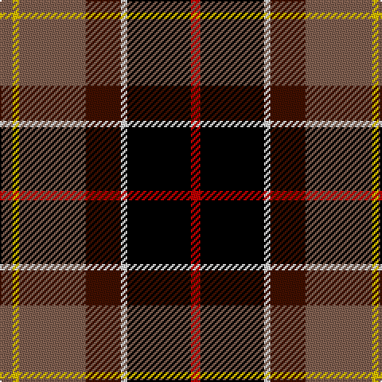

This page is one **sett** — a single exact thread-count. It belongs to the [tartan](/tartans/lt4y2lt21dr11ln2k20r3/)
(the same proportion at any scale), whose colour order is pattern [RKWBRYR](/stripes/rkwbryr/).

Sourced from weddslist.  It is a [7 stripe tartan](/stripes/stripes7/).

Original link http://www.weddslist.com/cgi-bin/tartans/pg.pl?source=sts

## Thread count
LT/8 Y4 LT42 DR22 LN4 K40 R/6

## Palette
Each colour and the base-6 reference it is a variant of.

| Colour | Shade | Base |
|---|---|---|
| DR | <code style="background-color:#401000;">#401000</code> `oklch(25.3% 0.079 39.9)` <small>#401000</small> | B <code style="background-color:#2A418A;">#2A418A</code> |
| K | <code style="background-color:#000000;">#000000</code> `oklch(0.0% 0.000 0.0)` <small>#000000</small> | K <code style="background-color:#000000;">#000000</code> |
| LN | <code style="background-color:#E0E0E0;">#E0E0E0</code> `oklch(90.7% 0.000 89.9)` <small>#E0E0E0</small> | W <code style="background-color:#F7F7F7;">#F7F7F7</code> |
| LT | <code style="background-color:#806050;">#806050</code> `oklch(51.7% 0.049 47.8)` <small>#806050</small> | R <code style="background-color:#CC0000;">#CC0000</code> |
| R | <code style="background-color:#C00000;">#C00000</code> `oklch(50.7% 0.208 29.2)` <small>#C00000</small> | R <code style="background-color:#CC0000;">#CC0000</code> |
| Y | <code style="background-color:#F0C000;">#F0C000</code> `oklch(82.7% 0.169 90.5)` <small>#F0C000</small> | Y <code style="background-color:#F2BF00;">#F2BF00</code> |

# Sample pattern

## Nearest tartans

The nearest existing variants by ΔTartan distance, with this tartan at the top so the swatches line up against it.

ΔTartan

Tartan

Sett

—

<a href="/ttd/edit/#slug=o4ly2o21dr11w2k20r3~x2">Barbour</a> <a class="nn-out" href="/setts/s7/o4ly2o21dr11w2k20r3~x2/" title="open its dictionary page">↗</a>

0.73

<a href="/ttd/edit/#slug=dg3g3r22k5k22ly2~x2">Clan MacLeod Society of Scotland, Centenary</a> <a class="nn-out" href="/setts/s6/dg3g3r22k5k22ly2~x2/" title="open its dictionary page">↗</a>

1.03

<a href="/ttd/edit/#slug=dg22w3k2ly3k19r18g4~x2">Scotch House 2000, dress</a> <a class="nn-out" href="/setts/s7/dg22w3k2ly3k19r18g4~x2/" title="open its dictionary page">↗</a>

1.08

<a href="/ttd/edit/#slug=do8w8k16dg32dp3lo5w5~x2">Mellor, Phillip (Oldham)</a> <a class="nn-out" href="/setts/s7/do8w8k16dg32dp3lo5w5~x2/" title="open its dictionary page">↗</a>

1.12

<a href="/ttd/edit/#slug=y4ly2y21do11w2k20r3~x2">Barbour Corporate Tartan Tartan Number: 2489. Earliest known date: 1998 For the linings of Barbour's famous wax jackets. Tartan designed by Kinloch Anderson of Edinburgh. See products available Copyright © Blair Urquhart, Comrie, 2015</a> <a class="nn-out" href="/setts/s7/y4ly2y21do11w2k20r3~x2/" title="open its dictionary page">↗</a>

1.12

<a href="/ttd/edit/#slug=k10ly2dg11r11w1r1w1k9~x2">Unidentified No 5</a> <a class="nn-out" href="/setts/s8/k10ly2dg11r11w1r1w1k9~x2/" title="open its dictionary page">↗</a>

1.12

<a href="/ttd/edit/#slug=g19k18r18w2ly2dp2ly2w2r8dp3~x2">McMuldroch (2014)</a> <a class="nn-out" href="/setts/s10/g19k18r18w2ly2dp2ly2w2r8dp3~x2/" title="open its dictionary page">↗</a>

1.12

<a href="/ttd/edit/#slug=w3g2r21k26db18k2db3ly3~x2">Loch Etive</a> <a class="nn-out" href="/setts/s8/w3g2r21k26db18k2db3ly3~x2/" title="open its dictionary page">↗</a>

1.14

<a href="/ttd/edit/#slug=r3k20w2dy11o21ly2o2~x2">Barbour</a> <a class="nn-out" href="/setts/s7/r3k20w2dy11o21ly2o2~x2/" title="open its dictionary page">↗</a>

1.14

<a href="/ttd/edit/#slug=ly3db3k2db18k26r21g2lb3~x2">Loch Etive</a> <a class="nn-out" href="/setts/s8/ly3db3k2db18k26r21g2lb3~x2/" title="open its dictionary page">↗</a>

1.16

<a href="/ttd/edit/#slug=o4ly2o21dy11w2k20r3~x2">Barbour - Classic</a> <a class="nn-out" href="/setts/s7/o4ly2o21dy11w2k20r3~x2/" title="open its dictionary page">↗</a>

## Neighbour map

Every grey dot is one of 14299 variants placed by the first two principal components of the ΔTartan feature space (44% of its variance). Red is this tartan; blue dots are its nearest — click one to open its page.

<svg viewBox="0 0 640 380" role="img" style="max-width:100%;height:auto;border:1px solid #e0e0e0;border-radius:4px;display:block" xmlns="http://www.w3.org/2000/svg"><image href="/nn/cloud.v1.png" width="640" height="380"/><a href="/setts/s6/dg3g3r22k5k22ly2~x2/"><circle cx="170.2" cy="154.5" r="4" fill="#3465a4"><title>Clan MacLeod Society of Scotland, Centenary</title></circle></a><a href="/setts/s7/dg22w3k2ly3k19r18g4~x2/"><circle cx="101.0" cy="155.1" r="4" fill="#3465a4"><title>Scotch House 2000, dress</title></circle></a><a href="/setts/s7/do8w8k16dg32dp3lo5w5~x2/"><circle cx="127.7" cy="151.9" r="4" fill="#3465a4"><title>Mellor, Phillip (Oldham)</title></circle></a><a href="/setts/s7/y4ly2y21do11w2k20r3~x2/"><circle cx="176.3" cy="168.6" r="4" fill="#3465a4"><title>Barbour Corporate Tartan Tartan Number: 2489. Earliest known date: 1998 For the linings of Barbour's famous wax jackets. Tartan designed by Kinloch Anderson of Edinburgh. See products available Copyright © Blair Urquhart, Comrie, 2015</title></circle></a><a href="/setts/s8/k10ly2dg11r11w1r1w1k9~x2/"><circle cx="174.2" cy="169.9" r="4" fill="#3465a4"><title>Unidentified No 5</title></circle></a><a href="/setts/s10/g19k18r18w2ly2dp2ly2w2r8dp3~x2/"><circle cx="106.5" cy="129.5" r="4" fill="#3465a4"><title>McMuldroch (2014)</title></circle></a><a href="/setts/s8/w3g2r21k26db18k2db3ly3~x2/"><circle cx="153.5" cy="132.2" r="4" fill="#3465a4"><title>Loch Etive</title></circle></a><a href="/setts/s7/r3k20w2dy11o21ly2o2~x2/"><circle cx="167.3" cy="156.1" r="4" fill="#3465a4"><title>Barbour</title></circle></a><a href="/setts/s8/ly3db3k2db18k26r21g2lb3~x2/"><circle cx="158.4" cy="136.0" r="4" fill="#3465a4"><title>Loch Etive</title></circle></a><a href="/setts/s7/o4ly2o21dy11w2k20r3~x2/"><circle cx="172.6" cy="160.6" r="4" fill="#3465a4"><title>Barbour - Classic</title></circle></a><circle cx="152.8" cy="155.8" r="5" fill="#c00000"/></svg>

ID: /setts/s7/o4ly2o21dr11w2k20r3~x2/
