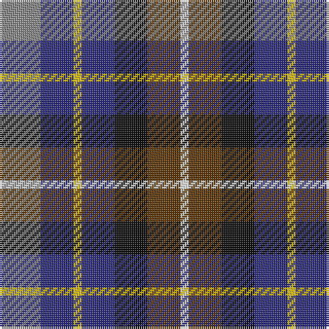

**Bands:** [RBYBKGW](/stripes/rbybkgw/) · **Stripes:** [O DB LY DB K DY W](/stripes/stripes7/) O DB LY DB K DY W

This was sourced from register-of-tartans.  It is a [7 band tartan](/bands/bands7/).

Original link https://www.tartanregister.gov.uk/tartanDetails.aspx?ref=922

## Attestations

This cloth appears in 2 source records; the oldest owns this page.

- 01/01/1984 — Devon Companion (register-of-tartans, [record](https://www.tartanregister.gov.uk/tartanDetails.aspx?ref=922))
- 1984 — Devon Companion (District) (tartans-authority, [record](http://www.tartansauthority.com/tartan-ferret/display/1283/))

## Register references

External register numbers recorded for this tartan.

- Scottish Register of Tartans: [922](https://www.tartanregister.gov.uk/tartanDetails.aspx?ref=922)
- Scottish Tartans Authority (ITI): 1283
- Scottish Tartans World Register: 1283

## Thread count
N/20 DB16 Y4 DB16 K16 T16 W/4

## Palette
Each colour and its ΔE from the base-6 reference it is a variant of.

| Colour | Shade | Base | ΔE (OKLab) |
|---|---|---|---|
| DB | <code style="background-color:#2C2C80;">#2C2C80</code> `#2C2C80` | B <code style="background-color:#2A418A;">#2A418A</code> | 0.06 |
| K | <code style="background-color:#101010;">#101010</code> `#101010` | K <code style="background-color:#000000;">#000000</code> | 0.17 |
| N | <code style="background-color:#888888;">#888888</code> `#888888` | R <code style="background-color:#CC0000;">#CC0000</code> | 0.24 |
| T | <code style="background-color:#603800;">#603800</code> `#603800` | G <code style="background-color:#006100;">#006100</code> | 0.16 |
| W | <code style="background-color:#FCFCFC;">#FCFCFC</code> `#FCFCFC` | W <code style="background-color:#F7F7F7;">#F7F7F7</code> | 0.01 |
| Y | <code style="background-color:#E8C000;">#E8C000</code> `#E8C000` | Y <code style="background-color:#F2BF00;">#F2BF00</code> | 0.02 |

# Sample pattern

## Nearest tartans

The nearest existing variants by ΔTartan distance.

1. [Devon Companion District Tartan Tartan Number: 1283. Earliest known date: 1984 The Devon Original and Devon Companion owe their origin to the success of the Cornish St Piran sett, which was woven by Coldharbour Mill in the early 1980's. The accreditation certificate was presented to the Mayor of Barnstaple in 1991. In a poem describing the tartan, Miss M. Miles says, "So, in the mind, Devon's beauty is retrieved By contemplating Devon's tartan's weave." See products available Copyright © Blair Urquhart, Comrie, 2015](/setts/s7/o5db4ly1db4k4dr4w1~x4/) — ΔT 0.44
1. [Blackdown Hills Corporate Tartan Tartan Number: 6711. Earliest known date: 1991 The Blackdown Hills on the Devon/Somerset border were designated as an Area of Outstanding Natural Beauty (AONB) in 1991 and this tartan was designed to celebrate that occasion. Designed at Coldharbour Mill at Cullompton in Devon. See products available Copyright © Blair Urquhart, Comrie, 2015](/setts/s7/k4n4lo1n4r4db4w1~x8/) — ΔT 0.57
1. [Hawkes, Norman (Personal)](/setts/s6/g7w4k21n16db16r5~x2/) — ΔT 1.02
1. [Devon, Companion](/setts/s7/y5db4ly1db4k4o4w1~x4/) — ΔT 1.02
1. [MacBlain (2016)](/setts/s6/db5dp3w2dg3k1ly1~x10/) — ΔT 1.06
1. [Cherokee](/setts/s8/g4t2g9k4g2r6db12w2~x2/) — ΔT 1.18
1. [Reekie (Name)](/setts/s6/k8r12w8g15db30ly5~x2/) — ΔT 1.18
1. [Sustainability (Fashion)](/setts/s8/db20k3g18r12t4r12db15ly4~x2/) — ΔT 1.20
1. [Hoban (Name)](/setts/s9/ly3lp9k3lp4k9g15k9db11w2~x4/) — ΔT 1.23
1. [DunBroch](/setts/s11/db4t8k2t5lb2t5dg8dr7dg2dr7dg3~x2/) — ΔT 1.25

## Neighbour map

Every grey dot is one of 14299 variants placed by the first two principal components of the ΔTartan feature space (44% of its variance). Red is this tartan; blue dots are its nearest — click one to open its page.

<svg viewBox="0 0 640 380" role="img" style="max-width:100%;height:auto;border:1px solid #e0e0e0;border-radius:4px;display:block" xmlns="http://www.w3.org/2000/svg"><image href="/nn/cloud.v1.png" width="640" height="380"/><a href="/setts/s7/o5db4ly1db4k4dr4w1~x4/"><circle cx="55.3" cy="231.8" r="4" fill="#3465a4"><title>Devon Companion District Tartan Tartan Number: 1283. Earliest known date: 1984 The Devon Original and Devon Companion owe their origin to the success of the Cornish St Piran sett, which was woven by Coldharbour Mill in the early 1980's. The accreditation certificate was presented to the Mayor of Barnstaple in 1991. In a poem describing the tartan, Miss M. Miles says, &quot;So, in the mind, Devon's beauty is retrieved By contemplating Devon's tartan's weave.&quot; See products available Copyright © Blair Urquhart, Comrie, 2015</title></circle></a><a href="/setts/s7/k4n4lo1n4r4db4w1~x8/"><circle cx="59.1" cy="244.9" r="4" fill="#3465a4"><title>Blackdown Hills Corporate Tartan Tartan Number: 6711. Earliest known date: 1991 The Blackdown Hills on the Devon/Somerset border were designated as an Area of Outstanding Natural Beauty (AONB) in 1991 and this tartan was designed to celebrate that occasion. Designed at Coldharbour Mill at Cullompton in Devon. See products available Copyright © Blair Urquhart, Comrie, 2015</title></circle></a><a href="/setts/s6/g7w4k21n16db16r5~x2/"><circle cx="35.5" cy="216.2" r="4" fill="#3465a4"><title>Hawkes, Norman (Personal)</title></circle></a><a href="/setts/s7/y5db4ly1db4k4o4w1~x4/"><circle cx="37.9" cy="226.7" r="4" fill="#3465a4"><title>Devon, Companion</title></circle></a><a href="/setts/s6/db5dp3w2dg3k1ly1~x10/"><circle cx="35.4" cy="210.6" r="4" fill="#3465a4"><title>MacBlain (2016)</title></circle></a><a href="/setts/s8/g4t2g9k4g2r6db12w2~x2/"><circle cx="90.5" cy="190.9" r="4" fill="#3465a4"><title>Cherokee</title></circle></a><a href="/setts/s6/k8r12w8g15db30ly5~x2/"><circle cx="84.4" cy="199.6" r="4" fill="#3465a4"><title>Reekie (Name)</title></circle></a><a href="/setts/s8/db20k3g18r12t4r12db15ly4~x2/"><circle cx="121.4" cy="202.9" r="4" fill="#3465a4"><title>Sustainability (Fashion)</title></circle></a><a href="/setts/s9/ly3lp9k3lp4k9g15k9db11w2~x4/"><circle cx="51.0" cy="181.4" r="4" fill="#3465a4"><title>Hoban (Name)</title></circle></a><a href="/setts/s11/db4t8k2t5lb2t5dg8dr7dg2dr7dg3~x2/"><circle cx="55.6" cy="222.2" r="4" fill="#3465a4"><title>DunBroch</title></circle></a><circle cx="53.1" cy="230.2" r="5" fill="#c00000"/></svg>

ID: /setts/s7/o5db4ly1db4k4dy4w1~x4/
