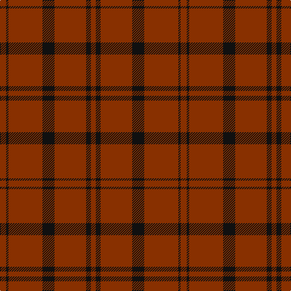

In pattern [RKRKRKR](/stripes/rkrkrkr/).

This was sourced from tartans-authority.  It is a [7 stripe tartan](/stripes/stripes7/).

Original link http://www.tartansauthority.com/tartan-ferret/display/4745/

## Thread count
R/10 K4 R56 K20 R52 K8 R/8

## Palette
Each colour and the base-6 reference it is a variant of.

| Colour | Shade | Base |
|---|---|---|
| K | <code style="background-color:#101010;">#101010</code> `oklch(17.3% 0.000 89.9)` <small>#101010</small> | K <code style="background-color:#000000;">#000000</code> |
| R | <code style="background-color:#883000;">#883000</code> `oklch(43.2% 0.130 42.0)` <small>#883000</small> | R <code style="background-color:#CC0000;">#CC0000</code> |

# Sample pattern

## Nearest tartans

The nearest existing variants by ΔTartan distance, with this tartan at the top so the swatches line up against it.

ΔTartan

Tartan

Sett

—

<a href="/ttd/edit/#slug=o5k2o28k10o26k4o4~x2">Dunbar, John Telfer (Personal)</a> <a class="nn-out" href="/setts/s7/o5k2o28k10o26k4o4~x2/" title="open its dictionary page">↗</a>

1.73

<a href="/ttd/edit/#slug=db1r9db2r9lo1~x4">Brooks Brothers Tattersall Red</a> <a class="nn-out" href="/setts/s5/db1r9db2r9lo1~x4/" title="open its dictionary page">↗</a>

1.77

<a href="/ttd/edit/#slug=r3dy16dy10r3dy3lb2dy3r3~x2">Scott Htg (Error 2)</a> <a class="nn-out" href="/setts/s8/r3dy16dy10r3dy3lb2dy3r3~x2/" title="open its dictionary page">↗</a>

1.82

<a href="/ttd/edit/#slug=r38dg2r5dg16~x2">MacDonald Lord of the Isles</a> <a class="nn-out" href="/setts/s4/r38dg2r5dg16~x2/" title="open its dictionary page">↗</a>

1.92

<a href="/ttd/edit/#slug=dy9t3dy6t3dy20ly2~x2">Oman RAF, Sultanate of (Military)</a> <a class="nn-out" href="/setts/s6/dy9t3dy6t3dy20ly2~x2/" title="open its dictionary page">↗</a>

2.01

<a href="/setts/s10/dy9t3dy6t3dy20ly2~x2/">Oman, Sultanate of / Oliver dress</a>

2.05

<a href="/ttd/edit/#slug=m18dg1k5dg1k1dg1m9~x2">Inverness Augustus</a> <a class="nn-out" href="/setts/s7/m18dg1k5dg1k1dg1m9~x2/" title="open its dictionary page">↗</a>

2.06

<a href="/ttd/edit/#slug=r8g2r2k1r1g2~x10">Waverley Care Aids Trust (Corporate)</a> <a class="nn-out" href="/setts/s6/r8g2r2k1r1g2~x10/" title="open its dictionary page">↗</a>

2.23

<a href="/ttd/edit/#slug=r36dg2r5dg16~x2">MacDonald of Sleat - 1810 (Clan)</a> <a class="nn-out" href="/setts/s4/r36dg2r5dg16~x2/" title="open its dictionary page">↗</a>

2.32

<a href="/ttd/edit/#slug=r36g2r5g16~x2">MacDonald of Sleat</a> <a class="nn-out" href="/setts/s4/r36g2r5g16~x2/" title="open its dictionary page">↗</a>

2.32

<a href="/ttd/edit/#slug=r38dg2r5dg16">MacDonald Lord of the Isles</a> <a class="nn-out" href="/setts/s4/r38dg2r5dg16/" title="open its dictionary page">↗</a>

## Neighbour map

Every grey dot is one of 14299 variants placed by the first two principal components of the ΔTartan feature space (44% of its variance). Red is this tartan; blue dots are its nearest — click one to open its page.

<svg viewBox="0 0 640 380" role="img" style="max-width:100%;height:auto;border:1px solid #e0e0e0;border-radius:4px;display:block" xmlns="http://www.w3.org/2000/svg"><image href="/nn/cloud.v1.png" width="640" height="380"/><a href="/setts/s5/db1r9db2r9lo1~x4/"><circle cx="606.7" cy="273.8" r="4" fill="#3465a4"><title>Brooks Brothers Tattersall Red</title></circle></a><a href="/setts/s8/r3dy16dy10r3dy3lb2dy3r3~x2/"><circle cx="511.7" cy="252.2" r="4" fill="#3465a4"><title>Scott Htg (Error 2)</title></circle></a><a href="/setts/s4/r38dg2r5dg16~x2/"><circle cx="556.3" cy="250.8" r="4" fill="#3465a4"><title>MacDonald Lord of the Isles</title></circle></a><a href="/setts/s6/dy9t3dy6t3dy20ly2~x2/"><circle cx="559.0" cy="256.1" r="4" fill="#3465a4"><title>Oman RAF, Sultanate of (Military)</title></circle></a><a href="/setts/s10/dy9t3dy6t3dy20ly2~x2/"><circle cx="561.4" cy="240.3" r="4" fill="#3465a4"><title>Oman, Sultanate of / Oliver dress</title></circle></a><a href="/setts/s7/m18dg1k5dg1k1dg1m9~x2/"><circle cx="588.1" cy="221.5" r="4" fill="#3465a4"><title>Inverness Augustus</title></circle></a><a href="/setts/s6/r8g2r2k1r1g2~x10/"><circle cx="471.5" cy="253.9" r="4" fill="#3465a4"><title>Waverley Care Aids Trust (Corporate)</title></circle></a><a href="/setts/s4/r36dg2r5dg16~x2/"><circle cx="531.7" cy="241.3" r="4" fill="#3465a4"><title>MacDonald of Sleat - 1810 (Clan)</title></circle></a><a href="/setts/s4/r36g2r5g16~x2/"><circle cx="522.3" cy="237.6" r="4" fill="#3465a4"><title>MacDonald of Sleat</title></circle></a><a href="/setts/s4/r38dg2r5dg16/"><circle cx="528.1" cy="231.6" r="4" fill="#3465a4"><title>MacDonald Lord of the Isles</title></circle></a><circle cx="602.2" cy="250.8" r="5" fill="#c00000"/></svg>

ID: /setts/s7/o5k2o28k10o26k4o4~x2/
