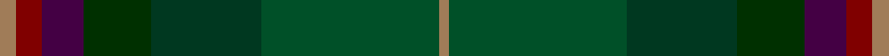
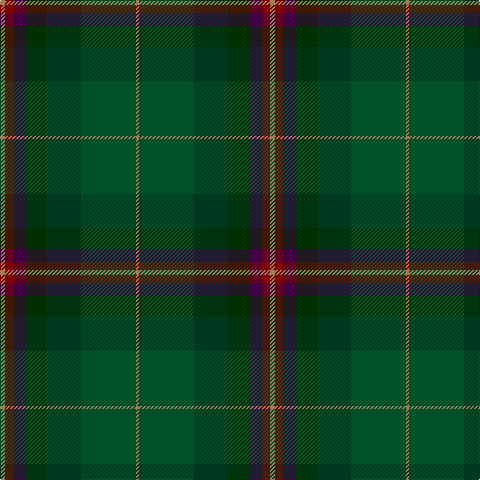

**Bands:** [RRBGGGR](/stripes/rrbgggr/) · **Stripes:** [O R DP DG DG DG O](/stripes/stripes7/) O R DP DG DG DG O

This was sourced from register-of-tartans.  It is a [7 band tartan](/bands/bands7/).

Original link https://www.tartanregister.gov.uk/tartanDetails.aspx?ref=2251

## Attestations

This cloth appears in 2 source records; the oldest owns this page.

- 01/06/2007 — Lunting Papi (Personal) (register-of-tartans, [record](https://www.tartanregister.gov.uk/tartanDetails.aspx?ref=2251))
- June 2007 — Lunting Papi (Personal) (tartans-authority, [record](http://www.tartansauthority.com/tartan-ferret/display/7223/))

## Register references

External register numbers recorded for this tartan.

- Scottish Register of Tartans: [2251](https://www.tartanregister.gov.uk/tartanDetails.aspx?ref=2251)
- Scottish Tartans Authority (ITI): 7223

## Thread count
LT/5 DR8 DP13 DG21 DGa34 G55 LT/3

## Palette
Each colour and its ΔE from the base-6 reference it is a variant of.

| Colour | Shade | Base | ΔE (OKLab) |
|---|---|---|---|
| DG | <code style="background-color:#003000;">#003000</code> `#003000` | G <code style="background-color:#006100;">#006100</code> | 0.17 |
| DGa | <code style="background-color:#003820;">#003820</code> `#003820` | G <code style="background-color:#006100;">#006100</code> | 0.15 |
| DP | <code style="background-color:#440044;">#440044</code> `#440044` | B <code style="background-color:#2A418A;">#2A418A</code> | 0.18 |
| DR | <code style="background-color:#800000;">#800000</code> `#800000` | R <code style="background-color:#CC0000;">#CC0000</code> | 0.17 |
| G | <code style="background-color:#005028;">#005028</code> `#005028` | G <code style="background-color:#006100;">#006100</code> | 0.07 |
| LT | <code style="background-color:#A07C58;">#A07C58</code> `#A07C58` | R <code style="background-color:#CC0000;">#CC0000</code> | 0.19 |

# Sample pattern

## Nearest tartans

The nearest existing variants by ΔTartan distance.

1. [Uitwaaien Papi (Personal)](/setts/s7/r5do8dp13dt21dg34dg55r3/) — ΔT 1.21
1. [Glens of Corbie](/setts/s9/lo3g30y20o6y3o3y3dt20r2~x2/) — ΔT 1.52
1. [Linden Family Tartan Tartan Number: 5772. Earliest known date: Jan 2003 Blue and white from the saltire. Purple and green from the thistle. The name Linden is associated with the colour green. The Linden tree is a lime tree. See products available Copyright © Blair Urquhart, Comrie, 2015](/setts/s8/dt4k9dg20dp2dg20k5dt6lr2~x2/) — ΔT 1.53
1. [Little-Dowse Wedding](/setts/s8/dy31y6o3db31dy8y60y7b7~x2/) — ΔT 1.62
1. [de Meuron (Family)](/setts/s12/y9g13dg26dy6dp5dy40dp5dy6dg26g13y9dg3~x2/) — ΔT 1.72
1. [Cornish Countryside](/setts/s6/do19lo3w1k18dg30r2~x2/) — ΔT 1.74
1. [Ramsay (Green Fashion)](/setts/s7/g1r7g7n2r1dg15lb1~x4/) — ΔT 1.86
1. [Ithilien Heather (Personal)](/setts/s9/dg20r2y3dt12k20r2n3dt4n3~x2/) — ΔT 1.89
1. [House of Bruar (Corporate)](/setts/s6/dr6do26dt28g26dt8y3~x2/) — ΔT 1.90
1. [Cowal Highland Gathering](/setts/s9/dg2y8dt1y1dt1y1dt8dt9n1~x4/) — ΔT 1.93

## Neighbour map

Every grey dot is one of 14299 variants placed by the first two principal components of the ΔTartan feature space (44% of its variance). Red is this tartan; blue dots are its nearest — click one to open its page.

<svg viewBox="0 0 640 380" role="img" style="max-width:100%;height:auto;border:1px solid #e0e0e0;border-radius:4px;display:block" xmlns="http://www.w3.org/2000/svg"><image href="/nn/cloud.v1.png" width="640" height="380"/><a href="/setts/s7/r5do8dp13dt21dg34dg55r3/"><circle cx="309.3" cy="231.0" r="4" fill="#3465a4"><title>Uitwaaien Papi (Personal)</title></circle></a><a href="/setts/s9/lo3g30y20o6y3o3y3dt20r2~x2/"><circle cx="238.1" cy="190.0" r="4" fill="#3465a4"><title>Glens of Corbie</title></circle></a><a href="/setts/s8/dt4k9dg20dp2dg20k5dt6lr2~x2/"><circle cx="200.2" cy="233.6" r="4" fill="#3465a4"><title>Linden Family Tartan Tartan Number: 5772. Earliest known date: Jan 2003 Blue and white from the saltire. Purple and green from the thistle. The name Linden is associated with the colour green. The Linden tree is a lime tree. See products available Copyright © Blair Urquhart, Comrie, 2015</title></circle></a><a href="/setts/s8/dy31y6o3db31dy8y60y7b7~x2/"><circle cx="285.7" cy="185.5" r="4" fill="#3465a4"><title>Little-Dowse Wedding</title></circle></a><a href="/setts/s12/y9g13dg26dy6dp5dy40dp5dy6dg26g13y9dg3~x2/"><circle cx="276.2" cy="232.2" r="4" fill="#3465a4"><title>de Meuron (Family)</title></circle></a><a href="/setts/s6/do19lo3w1k18dg30r2~x2/"><circle cx="306.5" cy="192.1" r="4" fill="#3465a4"><title>Cornish Countryside</title></circle></a><a href="/setts/s7/g1r7g7n2r1dg15lb1~x4/"><circle cx="314.2" cy="212.2" r="4" fill="#3465a4"><title>Ramsay (Green Fashion)</title></circle></a><a href="/setts/s9/dg20r2y3dt12k20r2n3dt4n3~x2/"><circle cx="227.2" cy="223.7" r="4" fill="#3465a4"><title>Ithilien Heather (Personal)</title></circle></a><a href="/setts/s6/dr6do26dt28g26dt8y3~x2/"><circle cx="251.6" cy="272.8" r="4" fill="#3465a4"><title>House of Bruar (Corporate)</title></circle></a><a href="/setts/s9/dg2y8dt1y1dt1y1dt8dt9n1~x4/"><circle cx="256.0" cy="239.2" r="4" fill="#3465a4"><title>Cowal Highland Gathering</title></circle></a><circle cx="283.4" cy="218.0" r="5" fill="#c00000"/></svg>

ID: /setts/s7/o5r8dp13dg21dg34dg55o3/
