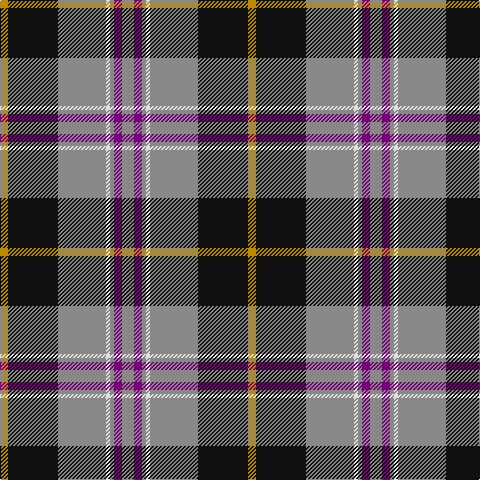

In pattern [RBRWRKY](/stripes/rbrwrky/).

This was sourced from tartans-authority.  It is a [7 stripe tartan](/stripes/stripes7/).

Original link http://www.tartansauthority.com/tartan-ferret/display/6899/

## Thread count
N/12 P8 N4 LN4 N48 K50 DY/8

## Palette
Each colour and the base-6 reference it is a variant of.

| Colour | Shade | Base |
|---|---|---|
| DY | <code style="background-color:#BC8C00;">#BC8C00</code> `oklch(66.8% 0.137 84.1)` <small>#BC8C00</small> | Y <code style="background-color:#F2BF00;">#F2BF00</code> |
| K | <code style="background-color:#101010;">#101010</code> `oklch(17.3% 0.000 89.9)` <small>#101010</small> | K <code style="background-color:#000000;">#000000</code> |
| LN | <code style="background-color:#E0E0E0;">#E0E0E0</code> `oklch(90.7% 0.000 89.9)` <small>#E0E0E0</small> | W <code style="background-color:#F7F7F7;">#F7F7F7</code> |
| N | <code style="background-color:#888888;">#888888</code> `oklch(62.7% 0.000 89.9)` <small>#888888</small> | R <code style="background-color:#CC0000;">#CC0000</code> |
| P | <code style="background-color:#780078;">#780078</code> `oklch(40.2% 0.185 328.4)` <small>#780078</small> | B <code style="background-color:#2A418A;">#2A418A</code> |

# Sample pattern

## Nearest tartans

The nearest existing variants by ΔTartan distance.

1. [New York State Troopers](/setts/s7/n6dp4n2w2n25k26ly4~x2/) — ΔT 0.73
1. [Jewell of Kernow (Personal)](/setts/s6/w6k29o29dp7k3r3~x2/) — ΔT 0.94
1. [Afternoon Tea / Darjeeling](/setts/s6/w15y98db72r25db8ly15/) — ΔT 1.06
1. [Asheville Firefighters, The](/setts/s6/k17dg48ly4r10lb12dg4/) — ΔT 1.10
1. [Afternoon Tea / Black Tea](/setts/s6/m15dt8y25dt72n98w15/) — ΔT 1.10
1. [Bryan Wedding (Personal)](/setts/s6/dy30ly5b10k10w2k2~x2/) — ΔT 1.10
1. [Bryan Wedding (Personal)](/setts/s6/dy30ly5t10k10w2k2~x2/) — ΔT 1.14
1. [Ware/Warr (Name)](/setts/s8/b9w2dg30o6r2o2r2o6~x2/) — ΔT 1.15
1. [Vance (Family Association)](/setts/s6/r4db24w2g13db2k3~x4/) — ΔT 1.18
1. [Clyde Valley HOG](/setts/s8/k54lr6k6lr6o20lo40k6ly3/) — ΔT 1.18

## Neighbour map

Every grey dot is one of 14299 variants placed by the first two principal components of the ΔTartan feature space (44% of its variance). Red is this tartan; blue dots are its nearest — click one to open its page.

<svg viewBox="0 0 640 380" role="img" style="max-width:100%;height:auto;border:1px solid #e0e0e0;border-radius:4px;display:block" xmlns="http://www.w3.org/2000/svg"><image href="/nn/cloud.v1.png" width="640" height="380"/><a href="/setts/s7/n6dp4n2w2n25k26ly4~x2/"><circle cx="258.2" cy="167.0" r="4" fill="#3465a4"><title>New York State Troopers</title></circle></a><a href="/setts/s6/w6k29o29dp7k3r3~x2/"><circle cx="188.8" cy="177.3" r="4" fill="#3465a4"><title>Jewell of Kernow (Personal)</title></circle></a><a href="/setts/s6/w15y98db72r25db8ly15/"><circle cx="203.2" cy="180.3" r="4" fill="#3465a4"><title>Afternoon Tea / Darjeeling</title></circle></a><a href="/setts/s6/k17dg48ly4r10lb12dg4/"><circle cx="262.0" cy="178.0" r="4" fill="#3465a4"><title>Asheville Firefighters, The</title></circle></a><a href="/setts/s6/m15dt8y25dt72n98w15/"><circle cx="211.7" cy="182.8" r="4" fill="#3465a4"><title>Afternoon Tea / Black Tea</title></circle></a><a href="/setts/s6/dy30ly5b10k10w2k2~x2/"><circle cx="267.9" cy="171.8" r="4" fill="#3465a4"><title>Bryan Wedding (Personal)</title></circle></a><a href="/setts/s6/dy30ly5t10k10w2k2~x2/"><circle cx="252.7" cy="161.5" r="4" fill="#3465a4"><title>Bryan Wedding (Personal)</title></circle></a><a href="/setts/s8/b9w2dg30o6r2o2r2o6~x2/"><circle cx="277.2" cy="144.8" r="4" fill="#3465a4"><title>Ware/Warr (Name)</title></circle></a><a href="/setts/s6/r4db24w2g13db2k3~x4/"><circle cx="277.3" cy="178.6" r="4" fill="#3465a4"><title>Vance (Family Association)</title></circle></a><a href="/setts/s8/k54lr6k6lr6o20lo40k6ly3/"><circle cx="229.2" cy="131.4" r="4" fill="#3465a4"><title>Clyde Valley HOG</title></circle></a><circle cx="242.4" cy="158.3" r="5" fill="#c00000"/></svg>

ID: /setts/s7/o6dp4o2w2o24k25lo4~x2/
