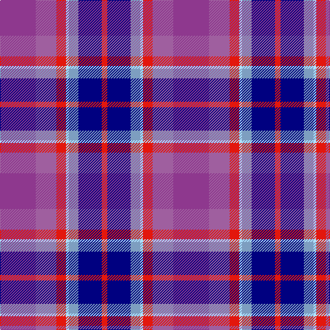

This page is one **sett** — a single exact thread-count. It belongs to the [tartan](/tartans/p26m15r7lb2lr7db17r4/)
(the same proportion at any scale), whose colour order is pattern [BRRWYBR](/stripes/brrwybr/).

Sourced from register-of-tartans.  It is a [7 stripe tartan](/stripes/stripes7/).

Original link https://www.tartanregister.gov.uk/tartanDetails.aspx?ref=10351

## Register references

External register numbers recorded for this tartan.

- Scottish Register of Tartans: [10351](https://www.tartanregister.gov.uk/tartanDetails.aspx?ref=10351)

## Thread count
LP/52 LPa30 R14 LB4 B14 DB34 R/8

## Palette

Palette: <strong>custom</strong>
<table><thead><tr><th>Colour</th><th>Threads</th><th>Shade</th><th>Base</th><th>OKLCh</th></tr></thead><tbody><tr><td>LP/</td><td style="text-align:right;font-variant-numeric:tabular-nums">52</td><td><code style="background-color:#8E388E;">#8E388E</code> <small style="color:#888">#8E388E</small></td><td>B <code style="background-color:#2A418A;">#2A418A</code></td><td><small style="color:#888">oklch(49.3% 0.158 327.7)</small></td></tr><tr><td>LPa</td><td style="text-align:right;font-variant-numeric:tabular-nums">30</td><td><code style="background-color:#9F5F9F;">#9F5F9F</code> <small style="color:#888">#9F5F9F</small></td><td>R <code style="background-color:#CC0000;">#CC0000</code></td><td><small style="color:#888">oklch(58.0% 0.120 327.0)</small></td></tr><tr><td>R</td><td style="text-align:right;font-variant-numeric:tabular-nums">14</td><td><code style="background-color:#E3170D;">#E3170D</code> <small style="color:#888">#E3170D</small></td><td>R <code style="background-color:#CC0000;">#CC0000</code></td><td><small style="color:#888">oklch(58.1% 0.230 29.4)</small></td></tr><tr><td>LB</td><td style="text-align:right;font-variant-numeric:tabular-nums">4</td><td><code style="background-color:#B0E2FF;">#B0E2FF</code> <small style="color:#888">#B0E2FF</small></td><td>W <code style="background-color:#F7F7F7;">#F7F7F7</code></td><td><small style="color:#888">oklch(88.8% 0.065 233.9)</small></td></tr><tr><td>B</td><td style="text-align:right;font-variant-numeric:tabular-nums">14</td><td><code style="background-color:#7D9EC0;">#7D9EC0</code> <small style="color:#888">#7D9EC0</small></td><td>Y <code style="background-color:#F2BF00;">#F2BF00</code></td><td><small style="color:#888">oklch(68.7% 0.062 249.5)</small></td></tr><tr><td>DB</td><td style="text-align:right;font-variant-numeric:tabular-nums">34</td><td><code style="background-color:#000080;">#000080</code> <small style="color:#888">#000080</small></td><td>B <code style="background-color:#2A418A;">#2A418A</code></td><td><small style="color:#888">oklch(27.1% 0.188 264.1)</small></td></tr><tr><td>R/</td><td style="text-align:right;font-variant-numeric:tabular-nums">8</td><td><code style="background-color:#E3170D;">#E3170D</code> <small style="color:#888">#E3170D</small></td><td>R <code style="background-color:#CC0000;">#CC0000</code></td><td><small style="color:#888">oklch(58.1% 0.230 29.4)</small></td></tr></tbody></table>

# Sample pattern

## Nearest tartans

The nearest existing variants by ΔTartan distance, with this tartan at the top so the swatches line up against it.

ΔTartan

Tartan

Sett

—

<a href="/ttd/edit/#slug=p26m15r7lb2lr7db17r4~x2">Redpath, The Ronald</a> <a class="nn-out" href="/setts/s7/p26m15r7lb2lr7db17r4~x2/" title="open its dictionary page">↗</a>

1.34

<a href="/ttd/edit/#slug=dp26dpi15r7t2ti7dt17r4~x2">Redpath, Ronald (Personal)</a> <a class="nn-out" href="/setts/s7/dp26dpi15r7t2ti7dt17r4~x2/" title="open its dictionary page">↗</a>

1.73

<a href="/ttd/edit/#slug=r6db3dp24w2k23y23k2y6~x2">Culloden Grey</a> <a class="nn-out" href="/setts/s8/r6db3dp24w2k23y23k2y6~x2/" title="open its dictionary page">↗</a>

1.75

<a href="/ttd/edit/#slug=dp24y2o2y2o5y8lr20dy4~x2">Glen Shee</a> <a class="nn-out" href="/setts/s8/dp24y2o2y2o5y8lr20dy4~x2/" title="open its dictionary page">↗</a>

1.76

<a href="/ttd/edit/#slug=o10t5db15k3db15k5r25k3w4~x2">Galway County Crest (Fashion)</a> <a class="nn-out" href="/setts/s9/o10t5db15k3db15k5r25k3w4~x2/" title="open its dictionary page">↗</a>

1.78

<a href="/ttd/edit/#slug=w2k1dp10k6db12ly2~x2">Soroptimist International Corporate Tartan Tartan Number: 3097. Earliest known date: 2002 Non-repeating sett. Launched at the Federation of Great Britain &amp; Ireland Conference in 2002 during the Presidency of Lynn Dunning. The design and the colours have been chosen carefully to symbolise the purple heather of the mountains and hills of Scotland together with the blue and gold of Soroptimist International woven together with the white hand of Peace. See products available Copyright © Blair Urquhart, Comrie, 2015</a> <a class="nn-out" href="/setts/s6/w2k1dp10k6db12ly2~x2/" title="open its dictionary page">↗</a>

1.86

<a href="/ttd/edit/#slug=p26w2p3db15o26r2o3db4~x2">Scottish Highlander Dress (Fashion)</a> <a class="nn-out" href="/setts/s8/p26w2p3db15o26r2o3db4~x2/" title="open its dictionary page">↗</a>

1.89

<a href="/ttd/edit/#slug=g3p7b11db3o8w2db3b3~x2">Scotia</a> <a class="nn-out" href="/setts/s8/g3p7b11db3o8w2db3b3~x2/" title="open its dictionary page">↗</a>

1.90

<a href="/ttd/edit/#slug=db1w2t12k2db2k2dp15db2ly1~x2">Hek (Name)</a> <a class="nn-out" href="/setts/s9/db1w2t12k2db2k2dp15db2ly1~x2/" title="open its dictionary page">↗</a>

1.95

<a href="/ttd/edit/#slug=w1dbi6g1dbi1g1dbi1db4r5lo1~x4">McLion (Corporate)</a> <a class="nn-out" href="/setts/s9/w1dbi6g1dbi1g1dbi1db4r5lo1~x4/" title="open its dictionary page">↗</a>

1.97

<a href="/ttd/edit/#slug=g4dpi48dp10lb3dp16lb3o30lb3db2~x2">Heather (NSPCC) (Corporate)</a> <a class="nn-out" href="/setts/s9/g4dpi48dp10lb3dp16lb3o30lb3db2~x2/" title="open its dictionary page">↗</a>

## Neighbour map

Every grey dot is one of 14359 variants placed by the first two principal components of the ΔTartan feature space (44% of its variance). Red is this tartan; blue dots are its nearest — click one to open its page.

<svg viewBox="0 0 640 380" role="img" style="max-width:100%;height:auto;border:1px solid #e0e0e0;border-radius:4px;display:block" xmlns="http://www.w3.org/2000/svg"><image href="/nn/cloud.v1.png" width="640" height="380"/><a href="/setts/s7/dp26dpi15r7t2ti7dt17r4~x2/"><circle cx="167.4" cy="189.4" r="4" fill="#3465a4"><title>Redpath, Ronald (Personal)</title></circle></a><a href="/setts/s8/r6db3dp24w2k23y23k2y6~x2/"><circle cx="138.1" cy="152.9" r="4" fill="#3465a4"><title>Culloden Grey</title></circle></a><a href="/setts/s8/dp24y2o2y2o5y8lr20dy4~x2/"><circle cx="203.0" cy="162.4" r="4" fill="#3465a4"><title>Glen Shee</title></circle></a><a href="/setts/s9/o10t5db15k3db15k5r25k3w4~x2/"><circle cx="124.2" cy="174.0" r="4" fill="#3465a4"><title>Galway County Crest (Fashion)</title></circle></a><a href="/setts/s6/w2k1dp10k6db12ly2~x2/"><circle cx="169.9" cy="190.1" r="4" fill="#3465a4"><title>Soroptimist International Corporate Tartan Tartan Number: 3097. Earliest known date: 2002 Non-repeating sett. Launched at the Federation of Great Britain &amp; Ireland Conference in 2002 during the Presidency of Lynn Dunning. The design and the colours have been chosen carefully to symbolise the purple heather of the mountains and hills of Scotland together with the blue and gold of Soroptimist International woven together with the white hand of Peace. See products available Copyright © Blair Urquhart, Comrie, 2015</title></circle></a><a href="/setts/s8/p26w2p3db15o26r2o3db4~x2/"><circle cx="213.1" cy="163.9" r="4" fill="#3465a4"><title>Scottish Highlander Dress (Fashion)</title></circle></a><a href="/setts/s8/g3p7b11db3o8w2db3b3~x2/"><circle cx="79.1" cy="202.8" r="4" fill="#3465a4"><title>Scotia</title></circle></a><a href="/setts/s9/db1w2t12k2db2k2dp15db2ly1~x2/"><circle cx="186.2" cy="118.4" r="4" fill="#3465a4"><title>Hek (Name)</title></circle></a><a href="/setts/s9/w1dbi6g1dbi1g1dbi1db4r5lo1~x4/"><circle cx="137.6" cy="186.6" r="4" fill="#3465a4"><title>McLion (Corporate)</title></circle></a><a href="/setts/s9/g4dpi48dp10lb3dp16lb3o30lb3db2~x2/"><circle cx="232.1" cy="108.6" r="4" fill="#3465a4"><title>Heather (NSPCC) (Corporate)</title></circle></a><circle cx="139.3" cy="169.8" r="5" fill="#c00000"/></svg>

ID: /setts/s7/p26m15r7lb2lr7db17r4~x2/
