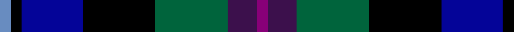
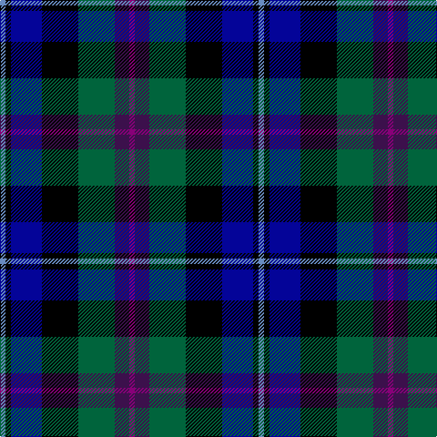

**Bands:** [BBGKBKB](/stripes/bbgkbkb/) · **Stripes:** [P DP G K DB K T](/stripes/stripes7/) P DP G K DB K T

This was sourced from register-of-tartans.  It is a [7 band tartan](/bands/bands7/).

Original link https://www.tartanregister.gov.uk/tartanDetails.aspx?ref=10874

## Register references

External register numbers recorded for this tartan.

- Scottish Register of Tartans: [10874](https://www.tartanregister.gov.uk/tartanDetails.aspx?ref=10874)

## Thread count
B/6 K6 DB34 K40 G40 DP16 P/6

## Palette
Each colour and its ΔE from the base-6 reference it is a variant of.

| Colour | Shade | Base | ΔE (OKLab) |
|---|---|---|---|
| B | <code style="background-color:#688CC0;">#688CC0</code> `#688CC0` | B <code style="background-color:#2A418A;">#2A418A</code> | 0.24 |
| DB | <code style="background-color:#040498;">#040498</code> `#040498` | B <code style="background-color:#2A418A;">#2A418A</code> | 0.12 |
| DP | <code style="background-color:#3C104C;">#3C104C</code> `#3C104C` | B <code style="background-color:#2A418A;">#2A418A</code> | 0.15 |
| G | <code style="background-color:#00643C;">#00643C</code> `#00643C` | G <code style="background-color:#006100;">#006100</code> | 0.05 |
| K | <code style="background-color:#000000;">#000000</code> `#000000` | K <code style="background-color:#000000;">#000000</code> | 0.00 |
| P | <code style="background-color:#880078;">#880078</code> `#880078` | B <code style="background-color:#2A418A;">#2A418A</code> | 0.19 |

# Sample pattern

## Nearest tartans

The nearest existing variants by ΔTartan distance.

1. [Saorsa Corporate Tartan Tartan Number: 10739. Earliest known date: 07/11/2012 Designed by Maggie Scott-Stewart and Lori Scott Ryan for the Fellowship of the Thistle, a select group of invited individuals who work together for the 'betterment' and freedom of Scotland. Green represents the hills and glens of Scotland; blue represents the saltire; purple for the thistle and black for the union. The name of the tartan, 'Saorsa', means 'freedom' in Gaelic. Miss Lori Scott Ryan, 25/19 Gullans Close, Edinburgh, Mid Lothian, Scotland, EH8 8JW redruairidh@hotmail.co.uk See products available Copyright © Blair Urquhart, Comrie, 2015](/setts/s6/db11y15k2dp5db3k11~x2/) — ΔT 0.98
1. [Hebridean Celebration](/setts/s8/k1g6k6g1m2o2db6w1~x4/) — ΔT 1.12
1. [Herd](/setts/s6/dp4dg25k24w3db24w4~x2/) — ΔT 1.24
1. [MacCraig](/setts/s9/dr2lb1g7r1k7g1db7r1g2~x8/) — ΔT 1.26
1. [Leslie Hunting](/setts/s6/r2db8k8lb1dg8k1~x2/) — ΔT 1.29
1. [MacNiel of Barra](/setts/s6/lr3db14k12dg12k2ly3~x2/) — ΔT 1.29
1. [MacNiel of Barra](/setts/s6/lr3db14k12dg12k2ly3/) — ΔT 1.29
1. [Campbell of Cawdor](/setts/s7/b2k1dg8k8db8k1r2~x2/) — ΔT 1.30
1. [Campbell of Cawdor](/setts/s7/b2k1dg8k8db8k1r2/) — ΔT 1.30
1. [Huntly Gordon](/setts/s6/ly2dg11k11n12dt3r2~x2/) — ΔT 1.32

## Neighbour map

Every grey dot is one of 14313 variants placed by the first two principal components of the ΔTartan feature space (44% of its variance). Red is this tartan; blue dots are its nearest — click one to open its page.

<svg viewBox="0 0 640 380" role="img" style="max-width:100%;height:auto;border:1px solid #e0e0e0;border-radius:4px;display:block" xmlns="http://www.w3.org/2000/svg"><image href="/nn/cloud.v1.png" width="640" height="380"/><a href="/setts/s6/db11y15k2dp5db3k11~x2/"><circle cx="101.8" cy="226.6" r="4" fill="#3465a4"><title>Saorsa Corporate Tartan Tartan Number: 10739. Earliest known date: 07/11/2012 Designed by Maggie Scott-Stewart and Lori Scott Ryan for the Fellowship of the Thistle, a select group of invited individuals who work together for the 'betterment' and freedom of Scotland. Green represents the hills and glens of Scotland; blue represents the saltire; purple for the thistle and black for the union. The name of the tartan, 'Saorsa', means 'freedom' in Gaelic. Miss Lori Scott Ryan, 25/19 Gullans Close, Edinburgh, Mid Lothian, Scotland, EH8 8JW redruairidh@hotmail.co.uk See products available Copyright © Blair Urquhart, Comrie, 2015</title></circle></a><a href="/setts/s8/k1g6k6g1m2o2db6w1~x4/"><circle cx="40.6" cy="186.7" r="4" fill="#3465a4"><title>Hebridean Celebration</title></circle></a><a href="/setts/s6/dp4dg25k24w3db24w4~x2/"><circle cx="115.4" cy="217.2" r="4" fill="#3465a4"><title>Herd</title></circle></a><a href="/setts/s9/dr2lb1g7r1k7g1db7r1g2~x8/"><circle cx="102.6" cy="176.9" r="4" fill="#3465a4"><title>MacCraig</title></circle></a><a href="/setts/s6/r2db8k8lb1dg8k1~x2/"><circle cx="124.6" cy="219.0" r="4" fill="#3465a4"><title>Leslie Hunting</title></circle></a><a href="/setts/s6/lr3db14k12dg12k2ly3~x2/"><circle cx="100.0" cy="228.4" r="4" fill="#3465a4"><title>MacNiel of Barra</title></circle></a><a href="/setts/s6/lr3db14k12dg12k2ly3/"><circle cx="100.0" cy="228.4" r="4" fill="#3465a4"><title>MacNiel of Barra</title></circle></a><a href="/setts/s7/b2k1dg8k8db8k1r2~x2/"><circle cx="143.5" cy="219.0" r="4" fill="#3465a4"><title>Campbell of Cawdor</title></circle></a><a href="/setts/s7/b2k1dg8k8db8k1r2/"><circle cx="143.5" cy="219.0" r="4" fill="#3465a4"><title>Campbell of Cawdor</title></circle></a><a href="/setts/s6/ly2dg11k11n12dt3r2~x2/"><circle cx="65.7" cy="209.6" r="4" fill="#3465a4"><title>Huntly Gordon</title></circle></a><circle cx="84.0" cy="204.6" r="5" fill="#c00000"/></svg>

ID: /setts/s7/p3dp8g20k20db17k3t3~x2/
