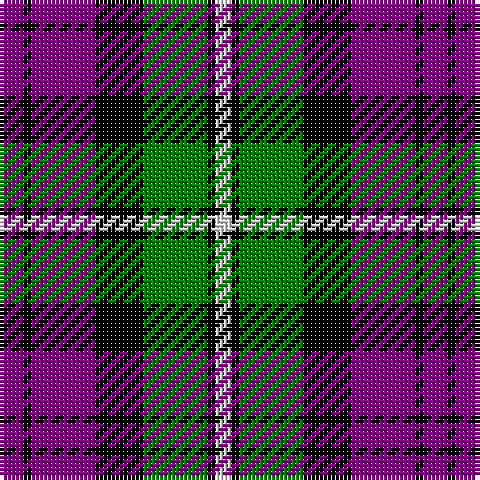

This page is one **sett** — a single exact thread-count. It belongs to the [tartan](/tartans/p3k1p8k6g8k1w2/)
(the same proportion at any scale), whose colour order is pattern [BKBKGKW](/stripes/bkbkgkw/).

Sourced from weddslist.  It is a [7 stripe tartan](/stripes/stripes7/).

Original link http://www.weddslist.com/cgi-bin/tartans/pg.pl?source=sts

## Thread count
P/6 K2 P16 K12 G16 K2 LN/4

## Palette

Palette: <strong>Tartan Register</strong> <small style="color:#888">(2 of 4 colours)</small>
<table><thead><tr><th>Colour</th><th>Threads</th><th>Shade</th><th>Base</th><th>OKLCh</th></tr></thead><tbody><tr><td>P/</td><td style="text-align:right;font-variant-numeric:tabular-nums">6</td><td><code style="background-color:#800080;">#800080</code> <small style="color:#888">#800080</small></td><td>B <code style="background-color:#2A418A;">#2A418A</code></td><td><small style="color:#888">oklch(42.1% 0.193 328.4)</small></td></tr><tr><td>K</td><td style="text-align:right;font-variant-numeric:tabular-nums">2</td><td><code style="background-color:#000000;">#000000</code> <small style="color:#888">#000000</small></td><td>K <code style="background-color:#000000;">#000000</code></td><td><small style="color:#888">oklch(0.0% 0.000 0.0)</small></td></tr><tr><td>P</td><td style="text-align:right;font-variant-numeric:tabular-nums">16</td><td><code style="background-color:#800080;">#800080</code> <small style="color:#888">#800080</small></td><td>B <code style="background-color:#2A418A;">#2A418A</code></td><td><small style="color:#888">oklch(42.1% 0.193 328.4)</small></td></tr><tr><td>K</td><td style="text-align:right;font-variant-numeric:tabular-nums">12</td><td><code style="background-color:#000000;">#000000</code> <small style="color:#888">#000000</small></td><td>K <code style="background-color:#000000;">#000000</code></td><td><small style="color:#888">oklch(0.0% 0.000 0.0)</small></td></tr><tr><td>G</td><td style="text-align:right;font-variant-numeric:tabular-nums">16</td><td><code style="background-color:#008000;">#008000</code> <small style="color:#888">#008000</small></td><td>G <code style="background-color:#006100;">#006100</code></td><td><small style="color:#888">oklch(52.0% 0.177 142.5)</small></td></tr><tr><td>K</td><td style="text-align:right;font-variant-numeric:tabular-nums">2</td><td><code style="background-color:#000000;">#000000</code> <small style="color:#888">#000000</small></td><td>K <code style="background-color:#000000;">#000000</code></td><td><small style="color:#888">oklch(0.0% 0.000 0.0)</small></td></tr><tr><td>LN/</td><td style="text-align:right;font-variant-numeric:tabular-nums">4</td><td><code style="background-color:#E0E0E0;">#E0E0E0</code> <small style="color:#888">#E0E0E0</small></td><td>W <code style="background-color:#F7F7F7;">#F7F7F7</code></td><td><small style="color:#888">oklch(90.7% 0.000 89.9)</small></td></tr></tbody></table>

# Sample pattern

## Nearest tartans

The nearest existing variants by ΔTartan distance, with this tartan at the top so the swatches line up against it.

ΔTartan

Tartan

Sett

—

<a href="/ttd/edit/#slug=p3k1p8k6g8k1w2~x2">Baillie</a> <a class="nn-out" href="/setts/s7/p3k1p8k6g8k1w2~x2/" title="open its dictionary page">↗</a>

0.85

<a href="/ttd/edit/#slug=k3g17w2k18p17g3~x2">Wilson's, No 76</a> <a class="nn-out" href="/setts/s6/k3g17w2k18p17g3~x2/" title="open its dictionary page">↗</a>

0.91

<a href="/ttd/edit/#slug=k3g17ly2k18p17g3~x2">Wilson's, No 100</a> <a class="nn-out" href="/setts/s6/k3g17ly2k18p17g3~x2/" title="open its dictionary page">↗</a>

0.96

<a href="/ttd/edit/#slug=w2p10k10g9k3w2~x2">MacNeil 2</a> <a class="nn-out" href="/setts/s6/w2p10k10g9k3w2~x2/" title="open its dictionary page">↗</a>

0.97

<a href="/ttd/edit/#slug=oi4db19oi3k20o24db3~x2">Edinburgh International Conference Centre</a> <a class="nn-out" href="/setts/s6/oi4db19oi3k20o24db3~x2/" title="open its dictionary page">↗</a>

0.98

<a href="/ttd/edit/#slug=ly6g3ly3g22k23p23k4~x2">Gordon of Esslemont</a> <a class="nn-out" href="/setts/s7/ly6g3ly3g22k23p23k4~x2/" title="open its dictionary page">↗</a>

1.00

<a href="/ttd/edit/#slug=w23db6w6r5k35r10~x2">Meg, Merrilees</a> <a class="nn-out" href="/setts/s6/w23db6w6r5k35r10~x2/" title="open its dictionary page">↗</a>

1.02

<a href="/ttd/edit/#slug=w2r3dg9r3db2r3db3w1~x6">Utah (US State)</a> <a class="nn-out" href="/setts/s8/w2r3dg9r3db2r3db3w1~x6/" title="open its dictionary page">↗</a>

1.05

<a href="/ttd/edit/#slug=r20k14w2k14g9r3g11~x2">Brough</a> <a class="nn-out" href="/setts/s7/r20k14w2k14g9r3g11~x2/" title="open its dictionary page">↗</a>

1.07

<a href="/ttd/edit/#slug=p6k3p21k23w3g24r3~x2">Colquhoun</a> <a class="nn-out" href="/setts/s7/p6k3p21k23w3g24r3~x2/" title="open its dictionary page">↗</a>

1.08

<a href="/ttd/edit/#slug=db5k1g1k1r3k1~x4">Clerk</a> <a class="nn-out" href="/setts/s6/db5k1g1k1r3k1~x4/" title="open its dictionary page">↗</a>

## Neighbour map

Every grey dot is one of 14359 variants placed by the first two principal components of the ΔTartan feature space (44% of its variance). Red is this tartan; blue dots are its nearest — click one to open its page.

<svg viewBox="0 0 640 380" role="img" style="max-width:100%;height:auto;border:1px solid #e0e0e0;border-radius:4px;display:block" xmlns="http://www.w3.org/2000/svg"><image href="/nn/cloud.v1.png" width="640" height="380"/><a href="/setts/s6/k3g17w2k18p17g3~x2/"><circle cx="154.6" cy="213.7" r="4" fill="#3465a4"><title>Wilson's, No 76</title></circle></a><a href="/setts/s6/k3g17ly2k18p17g3~x2/"><circle cx="155.6" cy="214.0" r="4" fill="#3465a4"><title>Wilson's, No 100</title></circle></a><a href="/setts/s6/w2p10k10g9k3w2~x2/"><circle cx="106.7" cy="239.7" r="4" fill="#3465a4"><title>MacNeil 2</title></circle></a><a href="/setts/s6/oi4db19oi3k20o24db3~x2/"><circle cx="153.2" cy="224.2" r="4" fill="#3465a4"><title>Edinburgh International Conference Centre</title></circle></a><a href="/setts/s7/ly6g3ly3g22k23p23k4~x2/"><circle cx="122.0" cy="203.0" r="4" fill="#3465a4"><title>Gordon of Esslemont</title></circle></a><a href="/setts/s6/w23db6w6r5k35r10~x2/"><circle cx="158.2" cy="200.6" r="4" fill="#3465a4"><title>Meg, Merrilees</title></circle></a><a href="/setts/s8/w2r3dg9r3db2r3db3w1~x6/"><circle cx="158.4" cy="207.6" r="4" fill="#3465a4"><title>Utah (US State)</title></circle></a><a href="/setts/s7/r20k14w2k14g9r3g11~x2/"><circle cx="160.8" cy="219.3" r="4" fill="#3465a4"><title>Brough</title></circle></a><a href="/setts/s7/p6k3p21k23w3g24r3~x2/"><circle cx="121.2" cy="186.9" r="4" fill="#3465a4"><title>Colquhoun</title></circle></a><a href="/setts/s6/db5k1g1k1r3k1~x4/"><circle cx="172.1" cy="234.6" r="4" fill="#3465a4"><title>Clerk</title></circle></a><circle cx="147.8" cy="208.7" r="5" fill="#c00000"/></svg>

ID: /setts/s7/p3k1p8k6g8k1w2~x2/
