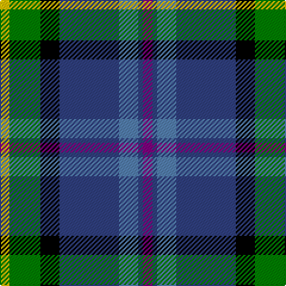

This page is one **sett** — a single exact thread-count. It belongs to the [tartan](/tartans/y4g13k8b25ba8b2p4/)
(the same proportion at any scale), whose colour order is pattern [BBBBKGY](/stripes/bbbbkgy/).

Sourced from weddslist.  It is a [7 stripe tartan](/stripes/stripes7/).

Original link http://www.weddslist.com/cgi-bin/tartans/pg.pl?source=sts

## Thread count
Y/8 G26 K16 B50 Ba16 B4 P/8

## Palette
Each colour and the base-6 reference it is a variant of.

| Colour | Shade | Base |
|---|---|---|
| B | <code style="background-color:#304080;">#304080</code> `oklch(39.4% 0.109 270.2)` <small>#304080</small> | B <code style="background-color:#2A418A;">#2A418A</code> |
| Ba | <code style="background-color:#5480B0;">#5480B0</code> `oklch(58.8% 0.089 251.5)` <small>#5480B0</small> | B <code style="background-color:#2A418A;">#2A418A</code> |
| G | <code style="background-color:#008000;">#008000</code> `oklch(52.0% 0.177 142.5)` <small>#008000</small> | G <code style="background-color:#006100;">#006100</code> |
| K | <code style="background-color:#000000;">#000000</code> `oklch(0.0% 0.000 0.0)` <small>#000000</small> | K <code style="background-color:#000000;">#000000</code> |
| P | <code style="background-color:#800080;">#800080</code> `oklch(42.1% 0.193 328.4)` <small>#800080</small> | B <code style="background-color:#2A418A;">#2A418A</code> |
| Y | <code style="background-color:#F0C000;">#F0C000</code> `oklch(82.7% 0.169 90.5)` <small>#F0C000</small> | Y <code style="background-color:#F2BF00;">#F2BF00</code> |

# Sample pattern

## Nearest tartans

The nearest existing variants by ΔTartan distance, with this tartan at the top so the swatches line up against it.

ΔTartan

Tartan

Sett

—

<a href="/ttd/edit/#slug=p4db2t8db25k8g13ly4~x2">Renfrewshire Tartan</a> <a class="nn-out" href="/setts/s7/p4db2t8db25k8g13ly4~x2/" title="open its dictionary page">↗</a>

0.69

<a href="/ttd/edit/#slug=t26db13k13w2g8k5r3t3~x2">Moran (Coilessan) (Personal)</a> <a class="nn-out" href="/setts/s8/t26db13k13w2g8k5r3t3~x2/" title="open its dictionary page">↗</a>

0.71

<a href="/ttd/edit/#slug=dp4db2t8db25k8g13ly4~x2">Renfrewshire</a> <a class="nn-out" href="/setts/s7/dp4db2t8db25k8g13ly4~x2/" title="open its dictionary page">↗</a>

0.72

<a href="/ttd/edit/#slug=ly4g22r3k17r3db37w3~x2">Souza Nery (Personal)</a> <a class="nn-out" href="/setts/s7/ly4g22r3k17r3db37w3~x2/" title="open its dictionary page">↗</a>

0.72

<a href="/ttd/edit/#slug=m4db2t7db20k7g10ly4~x2">Renfrewshire District Tartan Tartan Number: 2560. Earliest known date: 1998 Designed for anyone residing in the County of Renfrewshire See products available Copyright © Blair Urquhart, Comrie, 2015</a> <a class="nn-out" href="/setts/s7/m4db2t7db20k7g10ly4~x2/" title="open its dictionary page">↗</a>

0.86

<a href="/ttd/edit/#slug=t3r3k5g8w2k13db13t26w3~x2">Moran (Virgin Islands) (Personal)</a> <a class="nn-out" href="/setts/s9/t3r3k5g8w2k13db13t26w3~x2/" title="open its dictionary page">↗</a>

0.89

<a href="/ttd/edit/#slug=db60t5w4o12g42p12t5p12">St Columba</a> <a class="nn-out" href="/setts/s8/db60t5w4o12g42p12t5p12/" title="open its dictionary page">↗</a>

0.92

<a href="/ttd/edit/#slug=k6w3k2db30r9k4g20ly3~x2">Minnesota (District)</a> <a class="nn-out" href="/setts/s8/k6w3k2db30r9k4g20ly3~x2/" title="open its dictionary page">↗</a>

0.94

<a href="/ttd/edit/#slug=w2db20r3k10g20lo2~x2">Morris of Eddergoll (Personal)</a> <a class="nn-out" href="/setts/s6/w2db20r3k10g20lo2~x2/" title="open its dictionary page">↗</a>

0.95

<a href="/ttd/edit/#slug=dt36y20dg6w12k6r3~x2">Sirens &amp; Swords</a> <a class="nn-out" href="/setts/s6/dt36y20dg6w12k6r3~x2/" title="open its dictionary page">↗</a>

0.96

<a href="/ttd/edit/#slug=k16w6k4b64m19k8g42ly6">Unidentified (Woven sample)</a> <a class="nn-out" href="/setts/s8/k16w6k4b64m19k8g42ly6/" title="open its dictionary page">↗</a>

## Neighbour map

Every grey dot is one of 14299 variants placed by the first two principal components of the ΔTartan feature space (44% of its variance). Red is this tartan; blue dots are its nearest — click one to open its page.

<svg viewBox="0 0 640 380" role="img" style="max-width:100%;height:auto;border:1px solid #e0e0e0;border-radius:4px;display:block" xmlns="http://www.w3.org/2000/svg"><image href="/nn/cloud.v1.png" width="640" height="380"/><a href="/setts/s8/t26db13k13w2g8k5r3t3~x2/"><circle cx="150.9" cy="159.3" r="4" fill="#3465a4"><title>Moran (Coilessan) (Personal)</title></circle></a><a href="/setts/s7/dp4db2t8db25k8g13ly4~x2/"><circle cx="168.2" cy="173.8" r="4" fill="#3465a4"><title>Renfrewshire</title></circle></a><a href="/setts/s7/ly4g22r3k17r3db37w3~x2/"><circle cx="176.3" cy="155.4" r="4" fill="#3465a4"><title>Souza Nery (Personal)</title></circle></a><a href="/setts/s7/m4db2t7db20k7g10ly4~x2/"><circle cx="139.2" cy="183.8" r="4" fill="#3465a4"><title>Renfrewshire District Tartan Tartan Number: 2560. Earliest known date: 1998 Designed for anyone residing in the County of Renfrewshire See products available Copyright © Blair Urquhart, Comrie, 2015</title></circle></a><a href="/setts/s9/t3r3k5g8w2k13db13t26w3~x2/"><circle cx="133.4" cy="145.1" r="4" fill="#3465a4"><title>Moran (Virgin Islands) (Personal)</title></circle></a><a href="/setts/s8/db60t5w4o12g42p12t5p12/"><circle cx="166.6" cy="137.6" r="4" fill="#3465a4"><title>St Columba</title></circle></a><a href="/setts/s8/k6w3k2db30r9k4g20ly3~x2/"><circle cx="154.7" cy="132.9" r="4" fill="#3465a4"><title>Minnesota (District)</title></circle></a><a href="/setts/s6/w2db20r3k10g20lo2~x2/"><circle cx="138.9" cy="181.3" r="4" fill="#3465a4"><title>Morris of Eddergoll (Personal)</title></circle></a><a href="/setts/s6/dt36y20dg6w12k6r3~x2/"><circle cx="154.2" cy="162.6" r="4" fill="#3465a4"><title>Sirens &amp; Swords</title></circle></a><a href="/setts/s8/k16w6k4b64m19k8g42ly6/"><circle cx="161.8" cy="135.5" r="4" fill="#3465a4"><title>Unidentified (Woven sample)</title></circle></a><circle cx="149.3" cy="164.6" r="5" fill="#c00000"/></svg>

ID: /setts/s7/p4db2t8db25k8g13ly4~x2/
