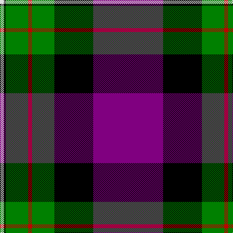

In pattern [BKGRGKW](/stripes/bkgrgkw/).

This was sourced from weddslist.  It is a [7 stripe tartan](/stripes/stripes7/).

Original link http://www.weddslist.com/cgi-bin/tartans/pg.pl?source=sts

## Also known as

This cloth is also recorded under:

- Ferguson, Unidentified

## Thread count
P/144 K80 G46 R8 G46 K4 LN/8

## Palette
Each colour and the base-6 reference it is a variant of.

| Colour | Shade | Base |
|---|---|---|
| G | <code style="background-color:#008000;">#008000</code> `oklch(52.0% 0.177 142.5)` <small>#008000</small> | G <code style="background-color:#006100;">#006100</code> |
| K | <code style="background-color:#000000;">#000000</code> `oklch(0.0% 0.000 0.0)` <small>#000000</small> | K <code style="background-color:#000000;">#000000</code> |
| LN | <code style="background-color:#E0E0E0;">#E0E0E0</code> `oklch(90.7% 0.000 89.9)` <small>#E0E0E0</small> | W <code style="background-color:#F7F7F7;">#F7F7F7</code> |
| P | <code style="background-color:#800080;">#800080</code> `oklch(42.1% 0.193 328.4)` <small>#800080</small> | B <code style="background-color:#2A418A;">#2A418A</code> |
| R | <code style="background-color:#C00000;">#C00000</code> `oklch(50.7% 0.208 29.2)` <small>#C00000</small> | R <code style="background-color:#CC0000;">#CC0000</code> |

# Sample pattern

## Nearest tartans

The nearest existing variants by ΔTartan distance, with this tartan at the top so the swatches line up against it.

ΔTartan

Tartan

Sett

—

<a href="/ttd/edit/#slug=p72k40g23r4g23k2w4~x2">Ferguson, Unidentified</a> <a class="nn-out" href="/setts/s7/p72k40g23r4g23k2w4~x2/" title="open its dictionary page">↗</a>

0.85

<a href="/ttd/edit/#slug=k3m2db30m1k18o30m2o3~x2">Bannockbane Navy Fashion Tartan Tartan Number: 3653. Earliest known date: Not Specified. This is a variation on a trade sett which originated in the early 1970s. Other variants of the design (in different colourways) are included in the Register. See products available Copyright © Blair Urquhart, Comrie, 2015</a> <a class="nn-out" href="/setts/s8/k3m2db30m1k18o30m2o3~x2/" title="open its dictionary page">↗</a>

1.28

<a href="/ttd/edit/#slug=k35m2k3dp13g8w4g8dp8~x2">Sheboom</a> <a class="nn-out" href="/setts/s8/k35m2k3dp13g8w4g8dp8~x2/" title="open its dictionary page">↗</a>

1.29

<a href="/ttd/edit/#slug=w10db2w1db35dg10lo3dg10r4~x2">Sandelin #2 (Personal)</a> <a class="nn-out" href="/setts/s8/w10db2w1db35dg10lo3dg10r4~x2/" title="open its dictionary page">↗</a>

1.31

<a href="/ttd/edit/#slug=p18k7g5r4g7k1ly2~x2">Regent</a> <a class="nn-out" href="/setts/s7/p18k7g5r4g7k1ly2~x2/" title="open its dictionary page">↗</a>

1.33

<a href="/ttd/edit/#slug=t4w1k36db2r4w1db14r8w1~x2">Midnight Balmoral (Personal)</a> <a class="nn-out" href="/setts/s9/t4w1k36db2r4w1db14r8w1~x2/" title="open its dictionary page">↗</a>

1.35

<a href="/ttd/edit/#slug=k35p2k3dp13g8w4g8dp8~x2">SheBoom</a> <a class="nn-out" href="/setts/s8/k35p2k3dp13g8w4g8dp8~x2/" title="open its dictionary page">↗</a>

1.39

<a href="/ttd/edit/#slug=r8lg9dp3ly1dp1ly2dp2k32dp3~x2">Gedling, Peter (Personal)</a> <a class="nn-out" href="/setts/s9/r8lg9dp3ly1dp1ly2dp2k32dp3~x2/" title="open its dictionary page">↗</a>

1.42

<a href="/ttd/edit/#slug=n8r11n28r4k17n1k7r2~x2">Kilbranan Sound (Personal)</a> <a class="nn-out" href="/setts/s8/n8r11n28r4k17n1k7r2~x2/" title="open its dictionary page">↗</a>

1.42

<a href="/ttd/edit/#slug=db4ly1r28db25k10db5k3~x2">McKnight (Personal)</a> <a class="nn-out" href="/setts/s7/db4ly1r28db25k10db5k3~x2/" title="open its dictionary page">↗</a>

1.42

<a href="/ttd/edit/#slug=w6n8db4n2db31k16r1k2r4r3~x2">Bell Rock Lighthouse 200th Anniversary, The</a> <a class="nn-out" href="/setts/s10/w6n8db4n2db31k16r1k2r4r3~x2/" title="open its dictionary page">↗</a>

## Neighbour map

Every grey dot is one of 14299 variants placed by the first two principal components of the ΔTartan feature space (44% of its variance). Red is this tartan; blue dots are its nearest — click one to open its page.

<svg viewBox="0 0 640 380" role="img" style="max-width:100%;height:auto;border:1px solid #e0e0e0;border-radius:4px;display:block" xmlns="http://www.w3.org/2000/svg"><image href="/nn/cloud.v1.png" width="640" height="380"/><a href="/setts/s8/k3m2db30m1k18o30m2o3~x2/"><circle cx="212.7" cy="116.6" r="4" fill="#3465a4"><title>Bannockbane Navy Fashion Tartan Tartan Number: 3653. Earliest known date: Not Specified. This is a variation on a trade sett which originated in the early 1970s. Other variants of the design (in different colourways) are included in the Register. See products available Copyright © Blair Urquhart, Comrie, 2015</title></circle></a><a href="/setts/s8/k35m2k3dp13g8w4g8dp8~x2/"><circle cx="239.6" cy="146.8" r="4" fill="#3465a4"><title>Sheboom</title></circle></a><a href="/setts/s8/w10db2w1db35dg10lo3dg10r4~x2/"><circle cx="271.8" cy="113.8" r="4" fill="#3465a4"><title>Sandelin #2 (Personal)</title></circle></a><a href="/setts/s7/p18k7g5r4g7k1ly2~x2/"><circle cx="186.2" cy="150.0" r="4" fill="#3465a4"><title>Regent</title></circle></a><a href="/setts/s9/t4w1k36db2r4w1db14r8w1~x2/"><circle cx="297.2" cy="93.3" r="4" fill="#3465a4"><title>Midnight Balmoral (Personal)</title></circle></a><a href="/setts/s8/k35p2k3dp13g8w4g8dp8~x2/"><circle cx="243.8" cy="149.1" r="4" fill="#3465a4"><title>SheBoom</title></circle></a><a href="/setts/s9/r8lg9dp3ly1dp1ly2dp2k32dp3~x2/"><circle cx="291.8" cy="87.8" r="4" fill="#3465a4"><title>Gedling, Peter (Personal)</title></circle></a><a href="/setts/s8/n8r11n28r4k17n1k7r2~x2/"><circle cx="274.4" cy="161.5" r="4" fill="#3465a4"><title>Kilbranan Sound (Personal)</title></circle></a><a href="/setts/s7/db4ly1r28db25k10db5k3~x2/"><circle cx="225.6" cy="135.4" r="4" fill="#3465a4"><title>McKnight (Personal)</title></circle></a><a href="/setts/s10/w6n8db4n2db31k16r1k2r4r3~x2/"><circle cx="217.8" cy="88.2" r="4" fill="#3465a4"><title>Bell Rock Lighthouse 200th Anniversary, The</title></circle></a><circle cx="240.9" cy="119.2" r="5" fill="#c00000"/></svg>

ID: /setts/s7/p72k40g23r4g23k2w4~x2/
