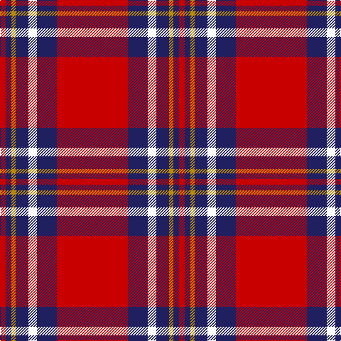

In pattern [RBWBYBR](/patterns/rbwbybr/).

This was sourced from tartans-authority.  It is a [7 stripes tartan](/stripes/stripes7/).

Original link http://www.tartansauthority.com/tartan-ferret/display/10726/

## Thread count
R/8 DB8 DY6 DB18 W12 DB28 R/100

## Palette
Each colour and its ΔE from the base-6 reference it is a variant of.

| Colour | Shade | Base | ΔE (OKLab) |
|---|---|---|---|
| DB | <code style="background-color:#202060;">#202060</code> `#202060` | B <code style="background-color:#2A418A;">#2A418A</code> | 0.11 |
| DY | <code style="background-color:#BC8C00;">#BC8C00</code> `#BC8C00` | Y <code style="background-color:#F2BF00;">#F2BF00</code> | 0.16 |
| R | <code style="background-color:#C80000;">#C80000</code> `#C80000` | R <code style="background-color:#CC0000;">#CC0000</code> | 0.01 |
| W | <code style="background-color:#FCFCFC;">#FCFCFC</code> `#FCFCFC` | W <code style="background-color:#F7F7F7;">#F7F7F7</code> | 0.01 |

# Sample pattern

## Nearest tartans

The nearest existing variants by ΔTartan distance.

1. [Instakilt, Pink (Fashion)](/setts/s7/r16w8r100k24r8k30ra10-k101010-rd84c70-rab468ac-wf8f8f8/) — ΔT 0.83
1. [Texas Lone Star](/setts/s7/r100b28w12b18y6b8r8-b000080-rff0000-wffffff-yffe600/) — ΔT 0.95
1. [Brock University Alumni Association](/setts/s6/r104y4b32y4b6w10-b000080-rc80000-wfcfcfc-yd87c00/) — ΔT 0.96
1. [Leslie Red (VS) (Clan)](/setts/s8/r8k12y4k12r8b32r64k4-b2c2c80-k101010-rc80000-ye8c000/) — ΔT 1.02
1. [Turner (Personal)](/setts/s5/r96k24ra14k10w6-k101010-rc80000-ra888888-wfcfcfc/) — ΔT 1.06
1. [Chisholm of Strathglass](/setts/s10/r14w4r72b12g6b6g6b6g24r8-b2c2c80-g003820-rc80000-wfcfcfc/) — ΔT 1.08
1. [Lantern, The](/setts/s9/w12k4r64y4k12y4r8k4w6-k101010-rc80000-wc0c0c0-yd09800/) — ΔT 1.11
1. [Instakilt, Red (Fashion)](/setts/s7/r16w8r100k24r8k30g10-g289c18-k101010-re40018-wf8f8f8/) — ΔT 1.11
1. [Solberg-Wormald (Personal)](/setts/s7/r155w16k34b48r18y6r9-b240090-k101010-rc80000-w98c8e8-ye8c000/) — ΔT 1.12
1. [O'Meehan (Name)](/setts/s9/y54k8w8r128w8r8k8r8k24-k101010-rc80050-we0e0e0-ye8c000/) — ΔT 1.20

## Neighbour map

Every grey dot is one of 15726 variants placed by the first two principal components of the ΔTartan feature space (44% of its variance). Red is this tartan; blue dots are its nearest — click one to open its page.

<svg viewBox="0 0 640 380" role="img" style="max-width:100%;height:auto;border:1px solid #e0e0e0;border-radius:4px;display:block" xmlns="http://www.w3.org/2000/svg"><image href="/nn/cloud.v1.png" width="640" height="380"/><a href="/setts/s7/r16w8r100k24r8k30ra10-k101010-rd84c70-rab468ac-wf8f8f8/"><circle cx="366.6" cy="156.6" r="4" fill="#3465a4"><title>Instakilt, Pink (Fashion)</title></circle></a><a href="/setts/s7/r100b28w12b18y6b8r8-b000080-rff0000-wffffff-yffe600/"><circle cx="350.6" cy="127.8" r="4" fill="#3465a4"><title>Texas Lone Star</title></circle></a><a href="/setts/s6/r104y4b32y4b6w10-b000080-rc80000-wfcfcfc-yd87c00/"><circle cx="420.9" cy="122.4" r="4" fill="#3465a4"><title>Brock University Alumni Association</title></circle></a><a href="/setts/s8/r8k12y4k12r8b32r64k4-b2c2c80-k101010-rc80000-ye8c000/"><circle cx="332.7" cy="151.8" r="4" fill="#3465a4"><title>Leslie Red (VS) (Clan)</title></circle></a><a href="/setts/s5/r96k24ra14k10w6-k101010-rc80000-ra888888-wfcfcfc/"><circle cx="396.5" cy="163.8" r="4" fill="#3465a4"><title>Turner (Personal)</title></circle></a><a href="/setts/s10/r14w4r72b12g6b6g6b6g24r8-b2c2c80-g003820-rc80000-wfcfcfc/"><circle cx="372.0" cy="130.9" r="4" fill="#3465a4"><title>Chisholm of Strathglass</title></circle></a><a href="/setts/s9/w12k4r64y4k12y4r8k4w6-k101010-rc80000-wc0c0c0-yd09800/"><circle cx="370.0" cy="119.4" r="4" fill="#3465a4"><title>Lantern, The</title></circle></a><a href="/setts/s7/r16w8r100k24r8k30g10-g289c18-k101010-re40018-wf8f8f8/"><circle cx="367.9" cy="154.1" r="4" fill="#3465a4"><title>Instakilt, Red (Fashion)</title></circle></a><a href="/setts/s7/r155w16k34b48r18y6r9-b240090-k101010-rc80000-w98c8e8-ye8c000/"><circle cx="382.2" cy="112.8" r="4" fill="#3465a4"><title>Solberg-Wormald (Personal)</title></circle></a><a href="/setts/s9/y54k8w8r128w8r8k8r8k24-k101010-rc80050-we0e0e0-ye8c000/"><circle cx="326.9" cy="113.0" r="4" fill="#3465a4"><title>O'Meehan (Name)</title></circle></a><circle cx="372.7" cy="141.2" r="5" fill="#c00000"/></svg>

ID: /setts/s7/r100b28w12b18y6b8r8-b202060-rc80000-wfcfcfc-ybc8c00/
