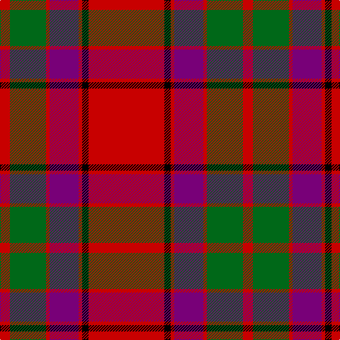

In pattern [RGRBRKR](/patterns/rgrbrkr/).

This was sourced from register-of-tartans.  It is a [7 stripes tartan](/stripes/stripes7/).

Original link https://www.tartanregister.gov.uk/tartanDetails.aspx?ref=411

## Attestations

This cloth appears in 2 source records; the oldest owns this page.

- 01/01/1831 — Buccleuch (register-of-tartans, [record](https://www.tartanregister.gov.uk/tartanDetails.aspx?ref=411))
- 1831 — Buccleuch (Clan) (tartans-authority, [record](http://www.tartansauthority.com/tartan-ferret/display/1505/))

## Thread count
R/14 G51 R5 P41 R5 K9 R/107

## Palette
Each colour and its ΔE from the base-6 reference it is a variant of.

| Colour | Shade | Base | ΔE (OKLab) |
|---|---|---|---|
| G | <code style="background-color:#006818;">#006818</code> `#006818` | G <code style="background-color:#006400;">#006400</code> | 0.02 |
| K | <code style="background-color:#000000;">#000000</code> `#000000` | K <code style="background-color:#000000;">#000000</code> | 0.00 |
| P | <code style="background-color:#780078;">#780078</code> `#780078` | B <code style="background-color:#2C4084;">#2C4084</code> | 0.16 |
| R | <code style="background-color:#C80000;">#C80000</code> `#C80000` | R <code style="background-color:#C80000;">#C80000</code> | 0.00 |

# Sample pattern

ID: /setts/s7/r107k9r5b41r5g51r14-b780078-g006818-k000000-rc80000/
