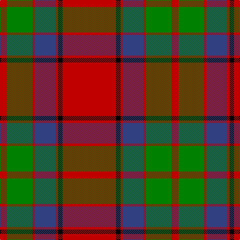

In pattern [RGRBRKR](/patterns/rgrbrkr/).

This was sourced from weddslist.  It is a [7 stripes tartan](/stripes/stripes7/).

Original link http://www.weddslist.com/cgi-bin/tartans/pg.pl?source=sts

## Thread count
R/14 G51 R5 B41 R5 K9 R/107

## Palette
Each colour and its ΔE from the base-6 reference it is a variant of.

| Colour | Shade | Base | ΔE (OKLab) |
|---|---|---|---|
| B | <code style="background-color:#304080;">#304080</code> `#304080` | B <code style="background-color:#2A418A;">#2A418A</code> | 0.02 |
| G | <code style="background-color:#008000;">#008000</code> `#008000` | G <code style="background-color:#006100;">#006100</code> | 0.10 |
| K | <code style="background-color:#000000;">#000000</code> `#000000` | K <code style="background-color:#000000;">#000000</code> | 0.00 |
| R | <code style="background-color:#C00000;">#C00000</code> `#C00000` | R <code style="background-color:#CC0000;">#CC0000</code> | 0.03 |

# Sample pattern

## Nearest tartans

The nearest existing variants by ΔTartan distance.

1. [Buccleuch Family Tartan Tartan Number: 1505. Earliest known date: c.1840 Reduced 50% proportionally. Described by Wilson as a 'Fancy' pattern, taking inspiration from the works of Sir Walter Scott. See products available Copyright © Blair Urquhart, Comrie, 2015](/setts/s7/r107k9r5b41r5g51r14~b2c2c80-g006818-k101010-rc80000/) — ΔT 0.39
1. [Plummer (Personal)](/setts/s6/r100k15g48b5r7b16~b2c2c80-g006818-k101010-rc80000~x2/) — ΔT 0.41
1. [MacPhail Red Clan Tartan Tartan Number: 1031. Earliest known date: 1930-50 This sample comes from the MacGregor-Hastie collection which forms the basis of the cloth archive of the Scottish Tartans Society. Some of the samples, including this one, were unmarked. One can assume that the sample dates between 1930 and 1950. See products available Copyright © Blair Urquhart, Comrie, 2015](/setts/s6/r25k7r3g13b1k2~b5c8ca8-g006818-k101010-rc80000~x4/) — ΔT 0.59
1. [MacPhail](/setts/s6/r25k7r3g13ga1k2~g006818-ga789484-k101010-rc80000~x4/) — ΔT 0.60
1. [Fraser (1745)](/setts/s6/r2b12r2g12r24w1~b2c2c80-g006818-rc80000-wfcfcfc~x2/) — ΔT 0.71
1. [Spens Family Tartan Tartan Number: 1671. Earliest known date: c.1815 The Spens tartan is similar in many respects to the Perthshire District sett, which is in turn, a variation of one of the Drummond tartans. The Perthshire sett was being woven by Wilson's of Bannockburn in the early years of the nineteenth century. The name, Spens, is linked to a specimen preserved in the collection of the Highland Society of London. See products available Copyright © Blair Urquhart, Comrie, 2015](/setts/s8/r56w2b6w2g32r11b6w5~b2c2c80-g006818-rc80000-we0e0e0/) — ΔT 0.76
1. [Buccleuch](/setts/s7/r107k9r5b41r5g51r14~b780078-g006818-k000000-rc80000/) — ΔT 0.82
1. [Spens](/setts/s8/r56w2b6w2g32r11b6w5~b304080-g008000-rc00000-we0e0e0/) — ΔT 0.87
1. [McInally (Name)](/setts/s7/r3g16r4k6r28g2y3~g006818-k101010-rc80000-yd09800~x2/) — ΔT 0.89
1. [Cruikshank (Name)](/setts/s9/r4g15b8g4r48g4b8g4y3~b2c2c80-g006818-rc80000-yfccc00~x2/) — ΔT 0.91

## Neighbour map

Every grey dot is one of 15726 variants placed by the first two principal components of the ΔTartan feature space (44% of its variance). Red is this tartan; blue dots are its nearest — click one to open its page.

<svg viewBox="0 0 640 380" role="img" style="max-width:100%;height:auto;border:1px solid #e0e0e0;border-radius:4px;display:block" xmlns="http://www.w3.org/2000/svg"><image href="/nn/cloud.v1.png" width="640" height="380"/><a href="/setts/s7/r107k9r5b41r5g51r14~b2c2c80-g006818-k101010-rc80000/"><circle cx="360.3" cy="158.2" r="4" fill="#3465a4"><title>Buccleuch Family Tartan Tartan Number: 1505. Earliest known date: c.1840 Reduced 50% proportionally. Described by Wilson as a 'Fancy' pattern, taking inspiration from the works of Sir Walter Scott. See products available Copyright © Blair Urquhart, Comrie, 2015</title></circle></a><a href="/setts/s6/r100k15g48b5r7b16~b2c2c80-g006818-k101010-rc80000~x2/"><circle cx="356.1" cy="165.8" r="4" fill="#3465a4"><title>Plummer (Personal)</title></circle></a><a href="/setts/s6/r25k7r3g13b1k2~b5c8ca8-g006818-k101010-rc80000~x4/"><circle cx="351.2" cy="161.2" r="4" fill="#3465a4"><title>MacPhail Red Clan Tartan Tartan Number: 1031. Earliest known date: 1930-50 This sample comes from the MacGregor-Hastie collection which forms the basis of the cloth archive of the Scottish Tartans Society. Some of the samples, including this one, were unmarked. One can assume that the sample dates between 1930 and 1950. See products available Copyright © Blair Urquhart, Comrie, 2015</title></circle></a><a href="/setts/s6/r25k7r3g13ga1k2~g006818-ga789484-k101010-rc80000~x4/"><circle cx="351.4" cy="161.2" r="4" fill="#3465a4"><title>MacPhail</title></circle></a><a href="/setts/s6/r2b12r2g12r24w1~b2c2c80-g006818-rc80000-wfcfcfc~x2/"><circle cx="332.9" cy="165.6" r="4" fill="#3465a4"><title>Fraser (1745)</title></circle></a><a href="/setts/s8/r56w2b6w2g32r11b6w5~b2c2c80-g006818-rc80000-we0e0e0/"><circle cx="359.9" cy="126.0" r="4" fill="#3465a4"><title>Spens Family Tartan Tartan Number: 1671. Earliest known date: c.1815 The Spens tartan is similar in many respects to the Perthshire District sett, which is in turn, a variation of one of the Drummond tartans. The Perthshire sett was being woven by Wilson's of Bannockburn in the early years of the nineteenth century. The name, Spens, is linked to a specimen preserved in the collection of the Highland Society of London. See products available Copyright © Blair Urquhart, Comrie, 2015</title></circle></a><a href="/setts/s7/r107k9r5b41r5g51r14~b780078-g006818-k000000-rc80000/"><circle cx="364.3" cy="155.6" r="4" fill="#3465a4"><title>Buccleuch</title></circle></a><a href="/setts/s8/r56w2b6w2g32r11b6w5~b304080-g008000-rc00000-we0e0e0/"><circle cx="360.1" cy="126.9" r="4" fill="#3465a4"><title>Spens</title></circle></a><a href="/setts/s7/r3g16r4k6r28g2y3~g006818-k101010-rc80000-yd09800~x2/"><circle cx="345.5" cy="174.1" r="4" fill="#3465a4"><title>McInally (Name)</title></circle></a><a href="/setts/s9/r4g15b8g4r48g4b8g4y3~b2c2c80-g006818-rc80000-yfccc00~x2/"><circle cx="333.8" cy="142.5" r="4" fill="#3465a4"><title>Cruikshank (Name)</title></circle></a><circle cx="351.9" cy="156.1" r="5" fill="#c00000"/></svg>

ID: /setts/s7/r107k9r5b41r5g51r14~b304080-g008000-k000000-rc00000/
