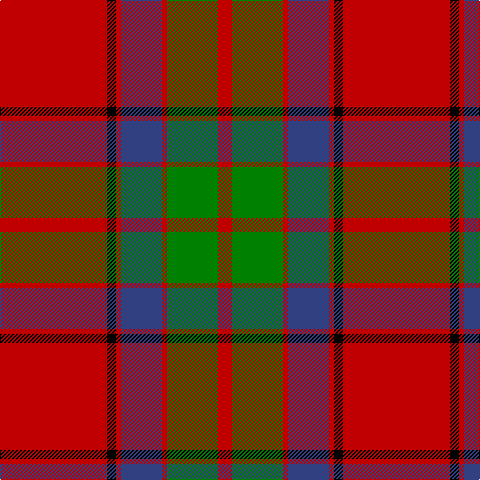

This page is one **sett** — a single exact thread-count. It belongs to the [tartan](/tartans/r107k9r5db41r5g51r14/)
(the same proportion at any scale), whose colour order is pattern [RGRBRKR](/stripes/rgrbrkr/).

Sourced from weddslist.  It is a [7 stripe tartan](/stripes/stripes7/).

Original link http://www.weddslist.com/cgi-bin/tartans/pg.pl?source=sts

2 attestations — the source records this cloth was collapsed from (oldest owns this page)

<ul>
<li>undated — Buccleuch (weddslist, <a href="http://www.weddslist.com/cgi-bin/tartans/pg.pl?source=sts">record</a>)</li>
<li>undated — Buccleuch Family Tartan Tartan Number: 1505. Earliest known date: c.1840 Reduced 50% proportionally. Described by Wilson as a 'Fancy' pattern, taking inspiration from the works of Sir Walter Scott. See products available Copyright © Blair Urquhart, Comrie, 2015 (house-of-tartan, <a href="http://www.house-of-tartan.scotland.net/house/TartanViewjs.asp?colr=Def&tnam=1505">record</a>)</li>
</ul>

## Thread count
R/107 K9 R5 B41 R5 G51 R/14

## Palette

Palette: <strong>Ingles Buchan</strong> <small style="color:#888">(1 of 4 colours)</small>
<table><thead><tr><th>Colour</th><th>Threads</th><th>Shade</th><th>Base</th><th>OKLCh</th></tr></thead><tbody><tr><td>R/</td><td style="text-align:right;font-variant-numeric:tabular-nums">107</td><td><code style="background-color:#C00000;">#C00000</code> <small style="color:#888">#C00000</small></td><td>R <code style="background-color:#CC0000;">#CC0000</code></td><td><small style="color:#888">oklch(50.7% 0.208 29.2)</small></td></tr><tr><td>K</td><td style="text-align:right;font-variant-numeric:tabular-nums">9</td><td><code style="background-color:#000000;">#000000</code> <small style="color:#888">#000000</small></td><td>K <code style="background-color:#000000;">#000000</code></td><td><small style="color:#888">oklch(0.0% 0.000 0.0)</small></td></tr><tr><td>R</td><td style="text-align:right;font-variant-numeric:tabular-nums">5</td><td><code style="background-color:#C00000;">#C00000</code> <small style="color:#888">#C00000</small></td><td>R <code style="background-color:#CC0000;">#CC0000</code></td><td><small style="color:#888">oklch(50.7% 0.208 29.2)</small></td></tr><tr><td>B</td><td style="text-align:right;font-variant-numeric:tabular-nums">41</td><td><code style="background-color:#304080;">#304080</code> <small style="color:#888">#304080</small></td><td>B <code style="background-color:#2A418A;">#2A418A</code></td><td><small style="color:#888">oklch(39.4% 0.109 270.2)</small></td></tr><tr><td>R</td><td style="text-align:right;font-variant-numeric:tabular-nums">5</td><td><code style="background-color:#C00000;">#C00000</code> <small style="color:#888">#C00000</small></td><td>R <code style="background-color:#CC0000;">#CC0000</code></td><td><small style="color:#888">oklch(50.7% 0.208 29.2)</small></td></tr><tr><td>G</td><td style="text-align:right;font-variant-numeric:tabular-nums">51</td><td><code style="background-color:#008000;">#008000</code> <small style="color:#888">#008000</small></td><td>G <code style="background-color:#006100;">#006100</code></td><td><small style="color:#888">oklch(52.0% 0.177 142.5)</small></td></tr><tr><td>R/</td><td style="text-align:right;font-variant-numeric:tabular-nums">14</td><td><code style="background-color:#C00000;">#C00000</code> <small style="color:#888">#C00000</small></td><td>R <code style="background-color:#CC0000;">#CC0000</code></td><td><small style="color:#888">oklch(50.7% 0.208 29.2)</small></td></tr></tbody></table>

# Sample pattern

## Nearest tartans

The nearest existing variants by ΔTartan distance, with this tartan at the top so the swatches line up against it.

ΔTartan

Tartan

Sett

—

<a href="/ttd/edit/#slug=r107k9r5db41r5g51r14">Buccleuch</a> <a class="nn-out" href="/setts/s7/r107k9r5db41r5g51r14/" title="open its dictionary page">↗</a>

0.41

<a href="/ttd/edit/#slug=r100k15g48db5r7db16~x2">Plummer (Personal)</a> <a class="nn-out" href="/setts/s6/r100k15g48db5r7db16~x2/" title="open its dictionary page">↗</a>

0.60

<a href="/ttd/edit/#slug=r25k7r3g13y1k2~x4">MacPhail</a> <a class="nn-out" href="/setts/s6/r25k7r3g13y1k2~x4/" title="open its dictionary page">↗</a>

0.71

<a href="/ttd/edit/#slug=r2db12r2g12r24w1~x2">Fraser (1745)</a> <a class="nn-out" href="/setts/s6/r2db12r2g12r24w1~x2/" title="open its dictionary page">↗</a>

0.83

<a href="/ttd/edit/#slug=r107k9r5dp41r5g51r14">Buccleuch</a> <a class="nn-out" href="/setts/s7/r107k9r5dp41r5g51r14/" title="open its dictionary page">↗</a>

0.87

<a href="/ttd/edit/#slug=r56w2db6w2g32r11db6w5">Spens</a> <a class="nn-out" href="/setts/s8/r56w2db6w2g32r11db6w5/" title="open its dictionary page">↗</a>

0.89

<a href="/ttd/edit/#slug=r3g16r4k6r28g2lo3~x2">McInally (Name)</a> <a class="nn-out" href="/setts/s7/r3g16r4k6r28g2lo3~x2/" title="open its dictionary page">↗</a>

0.90

<a href="/setts/s8/r24t3w1g9r12~x8/">Menzies</a>

0.91

<a href="/ttd/edit/#slug=r4g15db8g4r48g4db8g4ly3~x2">Cruikshank (Name)</a> <a class="nn-out" href="/setts/s9/r4g15db8g4r48g4db8g4ly3~x2/" title="open its dictionary page">↗</a>

0.93

<a href="/ttd/edit/#slug=r28db12r3g20dp1g2dp1g2r7~x2">Carrick (Clan)</a> <a class="nn-out" href="/setts/s9/r28db12r3g20dp1g2dp1g2r7~x2/" title="open its dictionary page">↗</a>

0.93

<a href="/ttd/edit/#slug=r6w1r24db6g2db1g2db1g12r1~x2">Chisholm</a> <a class="nn-out" href="/setts/s10/r6w1r24db6g2db1g2db1g12r1~x2/" title="open its dictionary page">↗</a>

## Neighbour map

Every grey dot is one of 14299 variants placed by the first two principal components of the ΔTartan feature space (44% of its variance). Red is this tartan; blue dots are its nearest — click one to open its page.

<svg viewBox="0 0 640 380" role="img" style="max-width:100%;height:auto;border:1px solid #e0e0e0;border-radius:4px;display:block" xmlns="http://www.w3.org/2000/svg"><image href="/nn/cloud.v1.png" width="640" height="380"/><a href="/setts/s6/r100k15g48db5r7db16~x2/"><circle cx="356.2" cy="163.3" r="4" fill="#3465a4"><title>Plummer (Personal)</title></circle></a><a href="/setts/s6/r25k7r3g13y1k2~x4/"><circle cx="351.6" cy="158.2" r="4" fill="#3465a4"><title>MacPhail</title></circle></a><a href="/setts/s6/r2db12r2g12r24w1~x2/"><circle cx="333.4" cy="163.2" r="4" fill="#3465a4"><title>Fraser (1745)</title></circle></a><a href="/setts/s7/r107k9r5dp41r5g51r14/"><circle cx="363.9" cy="153.0" r="4" fill="#3465a4"><title>Buccleuch</title></circle></a><a href="/setts/s8/r56w2db6w2g32r11db6w5/"><circle cx="360.3" cy="123.9" r="4" fill="#3465a4"><title>Spens</title></circle></a><a href="/setts/s7/r3g16r4k6r28g2lo3~x2/"><circle cx="345.5" cy="171.4" r="4" fill="#3465a4"><title>McInally (Name)</title></circle></a><a href="/setts/s8/r24t3w1g9r12~x8/"><circle cx="374.1" cy="154.9" r="4" fill="#3465a4"><title>Menzies</title></circle></a><a href="/setts/s9/r4g15db8g4r48g4db8g4ly3~x2/"><circle cx="334.2" cy="140.8" r="4" fill="#3465a4"><title>Cruikshank (Name)</title></circle></a><a href="/setts/s9/r28db12r3g20dp1g2dp1g2r7~x2/"><circle cx="335.8" cy="135.8" r="4" fill="#3465a4"><title>Carrick (Clan)</title></circle></a><a href="/setts/s10/r6w1r24db6g2db1g2db1g12r1~x2/"><circle cx="364.7" cy="123.0" r="4" fill="#3465a4"><title>Chisholm</title></circle></a><circle cx="352.2" cy="153.4" r="5" fill="#c00000"/></svg>

ID: /setts/s7/r107k9r5db41r5g51r14/
