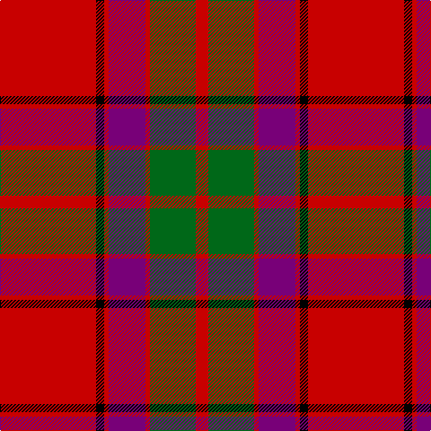

This page is one **sett** — a single exact thread-count. It belongs to the [tartan](/tartans/r107k9r5dp41r5g51r14/)
(the same proportion at any scale), whose colour order is pattern [RGRBRKR](/stripes/rgrbrkr/).

Sourced from register-of-tartans.  It is a [7 stripe tartan](/stripes/stripes7/).

Original link https://www.tartanregister.gov.uk/tartanDetails.aspx?ref=411

2 attestations — the source records this cloth was collapsed from (oldest owns this page)

<ul>
<li>01/01/1831 — Buccleuch (register-of-tartans, <a href="https://www.tartanregister.gov.uk/tartanDetails.aspx?ref=411">record</a>)</li>
<li>1831 — Buccleuch (Clan) (tartans-authority, <a href="http://www.tartansauthority.com/tartan-ferret/display/1505/">record</a>)</li>
</ul>

## Register references

External register numbers recorded for this tartan.

- Scottish Register of Tartans: [411](https://www.tartanregister.gov.uk/tartanDetails.aspx?ref=411)
- Scottish Tartans Authority (ITI): 1505
- Scottish Tartans World Register: 1505

## Thread count
R/107 K9 R5 P41 R5 G51 R/14

## Palette

Palette: <strong>Tartan Register</strong>
<table><thead><tr><th>Colour</th><th>Threads</th><th>Shade</th><th>Base</th><th>OKLCh</th></tr></thead><tbody><tr><td>R/</td><td style="text-align:right;font-variant-numeric:tabular-nums">107</td><td><code style="background-color:#C80000;">#C80000</code> <small style="color:#888">#C80000</small></td><td>R <code style="background-color:#CC0000;">#CC0000</code></td><td><small style="color:#888">oklch(52.3% 0.215 29.2)</small></td></tr><tr><td>K</td><td style="text-align:right;font-variant-numeric:tabular-nums">9</td><td><code style="background-color:#000000;">#000000</code> <small style="color:#888">#000000</small></td><td>K <code style="background-color:#000000;">#000000</code></td><td><small style="color:#888">oklch(0.0% 0.000 0.0)</small></td></tr><tr><td>R</td><td style="text-align:right;font-variant-numeric:tabular-nums">5</td><td><code style="background-color:#C80000;">#C80000</code> <small style="color:#888">#C80000</small></td><td>R <code style="background-color:#CC0000;">#CC0000</code></td><td><small style="color:#888">oklch(52.3% 0.215 29.2)</small></td></tr><tr><td>P</td><td style="text-align:right;font-variant-numeric:tabular-nums">41</td><td><code style="background-color:#780078;">#780078</code> <small style="color:#888">#780078</small></td><td>B <code style="background-color:#2A418A;">#2A418A</code></td><td><small style="color:#888">oklch(40.2% 0.185 328.4)</small></td></tr><tr><td>R</td><td style="text-align:right;font-variant-numeric:tabular-nums">5</td><td><code style="background-color:#C80000;">#C80000</code> <small style="color:#888">#C80000</small></td><td>R <code style="background-color:#CC0000;">#CC0000</code></td><td><small style="color:#888">oklch(52.3% 0.215 29.2)</small></td></tr><tr><td>G</td><td style="text-align:right;font-variant-numeric:tabular-nums">51</td><td><code style="background-color:#006818;">#006818</code> <small style="color:#888">#006818</small></td><td>G <code style="background-color:#006100;">#006100</code></td><td><small style="color:#888">oklch(45.0% 0.142 145.0)</small></td></tr><tr><td>R/</td><td style="text-align:right;font-variant-numeric:tabular-nums">14</td><td><code style="background-color:#C80000;">#C80000</code> <small style="color:#888">#C80000</small></td><td>R <code style="background-color:#CC0000;">#CC0000</code></td><td><small style="color:#888">oklch(52.3% 0.215 29.2)</small></td></tr></tbody></table>

# Sample pattern

## Nearest tartans

The nearest existing variants by ΔTartan distance, with this tartan at the top so the swatches line up against it.

ΔTartan

Tartan

Sett

—

<a href="/ttd/edit/#slug=r107k9r5dp41r5g51r14">Buccleuch</a> <a class="nn-out" href="/setts/s7/r107k9r5dp41r5g51r14/" title="open its dictionary page">↗</a>

0.76

<a href="/ttd/edit/#slug=r100k15g48db5r7db16~x2">Plummer (Personal)</a> <a class="nn-out" href="/setts/s6/r100k15g48db5r7db16~x2/" title="open its dictionary page">↗</a>

0.83

<a href="/ttd/edit/#slug=r107k9r5db41r5g51r14">Buccleuch</a> <a class="nn-out" href="/setts/s7/r107k9r5db41r5g51r14/" title="open its dictionary page">↗</a>

1.00

<a href="/ttd/edit/#slug=r2db12r2g12r24w1~x2">Fraser (1745)</a> <a class="nn-out" href="/setts/s6/r2db12r2g12r24w1~x2/" title="open its dictionary page">↗</a>

1.01

<a href="/ttd/edit/#slug=r2k3ly1k3r2db8r16k1~x4">Leslie Red (VS) (Clan)</a> <a class="nn-out" href="/setts/s8/r2k3ly1k3r2db8r16k1~x4/" title="open its dictionary page">↗</a>

1.03

<a href="/ttd/edit/#slug=r25k7r3g13y1k2~x4">MacPhail</a> <a class="nn-out" href="/setts/s6/r25k7r3g13y1k2~x4/" title="open its dictionary page">↗</a>

1.03

<a href="/ttd/edit/#slug=r6lb1r24dp6dg2dp1dg2dp1dg12r1">Chisholm D</a> <a class="nn-out" href="/setts/s10/r6lb1r24dp6dg2dp1dg2dp1dg12r1/" title="open its dictionary page">↗</a>

1.05

<a href="/ttd/edit/#slug=r12dp2lb1dp2r3dg8r3dp1">Chisholm</a> <a class="nn-out" href="/setts/s8/r12dp2lb1dp2r3dg8r3dp1/" title="open its dictionary page">↗</a>

1.09

<a href="/ttd/edit/#slug=r7w2r36db6dg3db3dg3db3dg12r4~x2">Chisholm of Strathglass</a> <a class="nn-out" href="/setts/s10/r7w2r36db6dg3db3dg3db3dg12r4~x2/" title="open its dictionary page">↗</a>

1.10

<a href="/ttd/edit/#slug=dg2r2db1r24t1db6r3dg12r4db1~x2">MacDonell of Keppoch</a> <a class="nn-out" href="/setts/s10/dg2r2db1r24t1db6r3dg12r4db1~x2/" title="open its dictionary page">↗</a>

1.12

<a href="/ttd/edit/#slug=r4dg8k6r8r6dg2r2dg2r24dg1r3~x2">MacDougall #8</a> <a class="nn-out" href="/setts/s11/r4dg8k6r8r6dg2r2dg2r24dg1r3~x2/" title="open its dictionary page">↗</a>

## Neighbour map

Every grey dot is one of 14299 variants placed by the first two principal components of the ΔTartan feature space (44% of its variance). Red is this tartan; blue dots are its nearest — click one to open its page.

<svg viewBox="0 0 640 380" role="img" style="max-width:100%;height:auto;border:1px solid #e0e0e0;border-radius:4px;display:block" xmlns="http://www.w3.org/2000/svg"><image href="/nn/cloud.v1.png" width="640" height="380"/><a href="/setts/s6/r100k15g48db5r7db16~x2/"><circle cx="356.2" cy="163.3" r="4" fill="#3465a4"><title>Plummer (Personal)</title></circle></a><a href="/setts/s7/r107k9r5db41r5g51r14/"><circle cx="352.2" cy="153.4" r="4" fill="#3465a4"><title>Buccleuch</title></circle></a><a href="/setts/s6/r2db12r2g12r24w1~x2/"><circle cx="333.4" cy="163.2" r="4" fill="#3465a4"><title>Fraser (1745)</title></circle></a><a href="/setts/s8/r2k3ly1k3r2db8r16k1~x4/"><circle cx="333.3" cy="151.0" r="4" fill="#3465a4"><title>Leslie Red (VS) (Clan)</title></circle></a><a href="/setts/s6/r25k7r3g13y1k2~x4/"><circle cx="351.6" cy="158.2" r="4" fill="#3465a4"><title>MacPhail</title></circle></a><a href="/setts/s10/r6lb1r24dp6dg2dp1dg2dp1dg12r1/"><circle cx="373.1" cy="125.5" r="4" fill="#3465a4"><title>Chisholm D</title></circle></a><a href="/setts/s8/r12dp2lb1dp2r3dg8r3dp1/"><circle cx="330.1" cy="178.1" r="4" fill="#3465a4"><title>Chisholm</title></circle></a><a href="/setts/s10/r7w2r36db6dg3db3dg3db3dg12r4~x2/"><circle cx="372.8" cy="130.4" r="4" fill="#3465a4"><title>Chisholm of Strathglass</title></circle></a><a href="/setts/s10/dg2r2db1r24t1db6r3dg12r4db1~x2/"><circle cx="400.5" cy="130.5" r="4" fill="#3465a4"><title>MacDonell of Keppoch</title></circle></a><a href="/setts/s11/r4dg8k6r8r6dg2r2dg2r24dg1r3~x2/"><circle cx="376.7" cy="131.1" r="4" fill="#3465a4"><title>MacDougall #8</title></circle></a><circle cx="363.9" cy="153.0" r="5" fill="#c00000"/></svg>

ID: /setts/s7/r107k9r5dp41r5g51r14/
