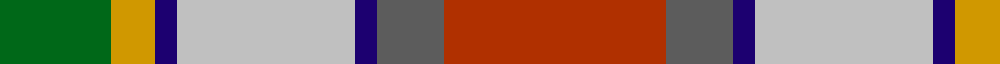
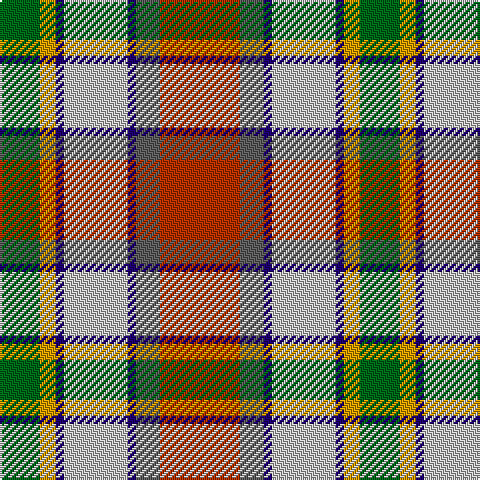

In pattern [GYBWBBR](/patterns/gybwbbr/).

This was sourced from register-of-tartans.  It is a [7 stripes tartan](/stripes/stripes7/).

Original link https://www.tartanregister.gov.uk/tartanDetails.aspx?ref=3356

## Attestations

This cloth appears in 2 source records; the oldest owns this page.

- 01/01/1980 — Porcupine City of (register-of-tartans, [record](https://www.tartanregister.gov.uk/tartanDetails.aspx?ref=3356))
- 1980 — Porcupine City of (District) (tartans-authority, [record](http://www.tartansauthority.com/tartan-ferret/display/5493/))

## Register references

External register numbers recorded for this tartan.

- Scottish Register of Tartans: [3356](https://www.tartanregister.gov.uk/tartanDetails.aspx?ref=3356)
- Scottish Tartans Authority (ITI): 5493

## Thread count
G/20 DY8 DB4 Na32 DB4 N12 R/40

## Palette
Each colour and its ΔE from the base-6 reference it is a variant of.

| Colour | Shade | Base | ΔE (OKLab) |
|---|---|---|---|
| DB | <code style="background-color:#1C0070;">#1C0070</code> `#1C0070` | B <code style="background-color:#2A418A;">#2A418A</code> | 0.14 |
| DY | <code style="background-color:#D09800;">#D09800</code> `#D09800` | Y <code style="background-color:#F2BF00;">#F2BF00</code> | 0.12 |
| G | <code style="background-color:#006818;">#006818</code> `#006818` | G <code style="background-color:#006100;">#006100</code> | 0.02 |
| N | <code style="background-color:#5C5C5C;">#5C5C5C</code> `#5C5C5C` | B <code style="background-color:#2A418A;">#2A418A</code> | 0.15 |
| Na | <code style="background-color:#C0C0C0;">#C0C0C0</code> `#C0C0C0` | W <code style="background-color:#F7F7F7;">#F7F7F7</code> | 0.17 |
| R | <code style="background-color:#B03000;">#B03000</code> `#B03000` | R <code style="background-color:#CC0000;">#CC0000</code> | 0.06 |

# Sample pattern

## Nearest tartans

The nearest existing variants by ΔTartan distance.

1. [Nicolson of Taransay (Personal)](/setts/s7/w6g10r22b16ga2ga4ga5~b2c2c80-g006818-ga289c18-rc80000-we0e0e0~x2/) — ΔT 0.73
1. [Brittany Hunting French Fancy Tartan Tartan Number: 5977. Earliest known date: 2003 For Richard and Anne-Marie Duclos of Le Coudray-Montceaux, France. Based on the Breton National at 3902. The term Randonnée (Walking) is used in the sense of the Scottish category, Hunting. See products available Copyright © Blair Urquhart, Comrie, 2015](/setts/s9/b4g27y8k4y8k4y8r11ya3~b4898c4-g60441c-k101010-rb03000-yc8b898-yae8c000~x2/) — ΔT 0.76
1. [Unnamed No 14](/setts/s9/r22b6ba10y4r4w4g22ba8y3~b5480b0-ba304080-g008000-rc00000-we0e0e0-yf0c000/) — ΔT 0.83
1. [Unnamed No 14 Tartan Tartan Number: 1326. Earliest known date: 1870 This sett is taken from the records of Messrs Bolingbroke and Jones of Norwich, who were weavers around 1870. Some of the tartans have been adopted or modified in recent times as the copyright of the designs is now in the public domain. See products available Copyright © Blair Urquhart, Comrie, 2015](/setts/s9/r22b6ba10y4r4w4g22ba8y3~b5c8ca8-ba2c2c80-g006818-rc80000-we0e0e0-ye8c000/) — ΔT 0.95
1. [Unidentified No 14](/setts/s9/r22b6ba10y4r4w4g22ba8y3~b3c82af-ba2c4084-g005020-rdc0000-we0e0e0-ye8c000/) — ΔT 0.97
1. [Derry Family (Personal)](/setts/s9/w6b36y12g19ga6r6ga6r28ga4~b2888c4-g289c18-ga006818-rc80000-we0e0e0-ybc8c00/) — ΔT 1.01
1. [Ball](/setts/s6/y13b8r5k3w2g1~b1474b4-g006818-k101010-rc80000-wfcfcfc-ydc943c~x4/) — ΔT 1.04
1. [Wilson's, No 121](/setts/s7/b4ba3g1ga9w1r8k1~b5480b0-ba800080-g30a010-ga008000-k000000-rc00000-we0e0e0~x4/) — ΔT 1.06
1. [Elystan Glodrydd (Name)](/setts/s7/w3g24r13ga4y11r8b2~b1c0070-g006818-ga048888-rc80000-we0e0e0-ybc8c00~x2/) — ΔT 1.07
1. [Ontario Northern Canadian District Tartan Tartan Number: 956. Earliest known date: 1967 The six colours represent the nickel bearing rocks (grey), the snow (white), the sky and the lakes (blue), gold, the forests and fields (green), and the Indian Nation (red brown). See products available Copyright © Blair Urquhart, Comrie, 2015](/setts/s7/g17r5b2w12b2y4ga7~b2c2c80-g604000-ga006818-r888888-we0e0e0-ye8c000~x2/) — ΔT 1.08

## Neighbour map

Every grey dot is one of 15726 variants placed by the first two principal components of the ΔTartan feature space (44% of its variance). Red is this tartan; blue dots are its nearest — click one to open its page.

<svg viewBox="0 0 640 380" role="img" style="max-width:100%;height:auto;border:1px solid #e0e0e0;border-radius:4px;display:block" xmlns="http://www.w3.org/2000/svg"><image href="/nn/cloud.v1.png" width="640" height="380"/><a href="/setts/s7/w6g10r22b16ga2ga4ga5~b2c2c80-g006818-ga289c18-rc80000-we0e0e0~x2/"><circle cx="103.5" cy="160.2" r="4" fill="#3465a4"><title>Nicolson of Taransay (Personal)</title></circle></a><a href="/setts/s9/b4g27y8k4y8k4y8r11ya3~b4898c4-g60441c-k101010-rb03000-yc8b898-yae8c000~x2/"><circle cx="117.6" cy="149.3" r="4" fill="#3465a4"><title>Brittany Hunting French Fancy Tartan Tartan Number: 5977. Earliest known date: 2003 For Richard and Anne-Marie Duclos of Le Coudray-Montceaux, France. Based on the Breton National at 3902. The term Randonnée (Walking) is used in the sense of the Scottish category, Hunting. See products available Copyright © Blair Urquhart, Comrie, 2015</title></circle></a><a href="/setts/s9/r22b6ba10y4r4w4g22ba8y3~b5480b0-ba304080-g008000-rc00000-we0e0e0-yf0c000/"><circle cx="87.5" cy="161.4" r="4" fill="#3465a4"><title>Unnamed No 14</title></circle></a><a href="/setts/s9/r22b6ba10y4r4w4g22ba8y3~b5c8ca8-ba2c2c80-g006818-rc80000-we0e0e0-ye8c000/"><circle cx="84.8" cy="160.1" r="4" fill="#3465a4"><title>Unnamed No 14 Tartan Tartan Number: 1326. Earliest known date: 1870 This sett is taken from the records of Messrs Bolingbroke and Jones of Norwich, who were weavers around 1870. Some of the tartans have been adopted or modified in recent times as the copyright of the designs is now in the public domain. See products available Copyright © Blair Urquhart, Comrie, 2015</title></circle></a><a href="/setts/s9/r22b6ba10y4r4w4g22ba8y3~b3c82af-ba2c4084-g005020-rdc0000-we0e0e0-ye8c000/"><circle cx="85.7" cy="159.6" r="4" fill="#3465a4"><title>Unidentified No 14</title></circle></a><a href="/setts/s9/w6b36y12g19ga6r6ga6r28ga4~b2888c4-g289c18-ga006818-rc80000-we0e0e0-ybc8c00/"><circle cx="94.0" cy="157.2" r="4" fill="#3465a4"><title>Derry Family (Personal)</title></circle></a><a href="/setts/s6/y13b8r5k3w2g1~b1474b4-g006818-k101010-rc80000-wfcfcfc-ydc943c~x4/"><circle cx="149.5" cy="152.3" r="4" fill="#3465a4"><title>Ball</title></circle></a><a href="/setts/s7/b4ba3g1ga9w1r8k1~b5480b0-ba800080-g30a010-ga008000-k000000-rc00000-we0e0e0~x4/"><circle cx="95.3" cy="147.6" r="4" fill="#3465a4"><title>Wilson's, No 121</title></circle></a><a href="/setts/s7/w3g24r13ga4y11r8b2~b1c0070-g006818-ga048888-rc80000-we0e0e0-ybc8c00~x2/"><circle cx="161.2" cy="163.6" r="4" fill="#3465a4"><title>Elystan Glodrydd (Name)</title></circle></a><a href="/setts/s7/g17r5b2w12b2y4ga7~b2c2c80-g604000-ga006818-r888888-we0e0e0-ye8c000~x2/"><circle cx="85.2" cy="165.5" r="4" fill="#3465a4"><title>Ontario Northern Canadian District Tartan Tartan Number: 956. Earliest known date: 1967 The six colours represent the nickel bearing rocks (grey), the snow (white), the sky and the lakes (blue), gold, the forests and fields (green), and the Indian Nation (red brown). See products available Copyright © Blair Urquhart, Comrie, 2015</title></circle></a><circle cx="114.8" cy="161.3" r="5" fill="#c00000"/></svg>

ID: /setts/s7/r10b3ba1w8ba1y2g5~b5c5c5c-ba1c0070-g006818-rb03000-wc0c0c0-yd09800~x4/
