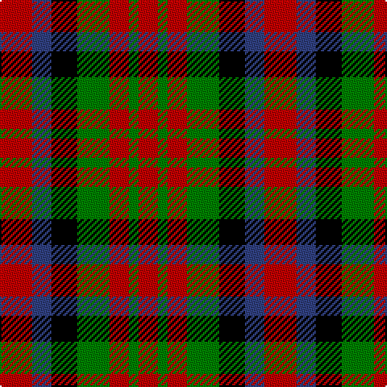

In pattern [RBKGRGR](/patterns/rbkgrgr/).

This was sourced from weddslist.  It is a [7 stripes tartan](/stripes/stripes7/).

Original link http://www.weddslist.com/cgi-bin/tartans/pg.pl?source=sts

## Thread count
R/20 B12 K16 G20 R12 G6 R/12

## Palette
Each colour and its ΔE from the base-6 reference it is a variant of.

| Colour | Shade | Base | ΔE (OKLab) |
|---|---|---|---|
| B | <code style="background-color:#304080;">#304080</code> `#304080` | B <code style="background-color:#2A418A;">#2A418A</code> | 0.02 |
| G | <code style="background-color:#008000;">#008000</code> `#008000` | G <code style="background-color:#006100;">#006100</code> | 0.10 |
| K | <code style="background-color:#000000;">#000000</code> `#000000` | K <code style="background-color:#000000;">#000000</code> | 0.00 |
| R | <code style="background-color:#C00000;">#C00000</code> `#C00000` | R <code style="background-color:#CC0000;">#CC0000</code> | 0.03 |

# Sample pattern

## Nearest tartans

The nearest existing variants by ΔTartan distance.

1. [MacDuff #3](/setts/s7/r10b6k8g10r6g3r6x2~b2c4084-g005020-k101010-rdc0000/) — ΔT 0.83
1. [Boxer Beauty](/setts/s7/k13g28y13g28k18w18k13x2~g603800-k101010-wffffff-ycc7f32/) — ΔT 0.98
1. [Boxer Beauty](/setts/s7/k13g28y13g28k18w18k13x2~g603800-k101010-wfcfcfc-ydc943c/) — ΔT 1.00
1. [Norwich No.028](/setts/s6/r6g5k5g5r6b1x4~b5c8ca8-g006818-k000000-rc80000/) — ΔT 1.05
1. [Duffus Hose, Lord](/setts/s7/y11r6k10y10k10g10r4x2~g604000-k101010-ra00048-ybc8c00/) — ΔT 1.07
1. [Tulsa](/setts/s6/r14k3r14g13b8g13x2~b304080-g008000-k000000-rc00000/) — ΔT 1.29
1. [MacNaughton (Logan)](/setts/s7/b5r17g16k10b10r17b5x2~b080848-g002814-k101010-rdc0000/) — ΔT 1.31
1. [Torana](/setts/s6/r13b13ra5y2b13y13x2~b1c1c1c-rc80000-rad87000-yd09800/) — ΔT 1.38
1. [Akins Dress (Clan)](/setts/s9/g6r4g5r13k13w5k13r13y6x2~g006818-k101010-rc80000-we0e0e0-ye8c000/) — ΔT 1.39
1. [Harazeen (Personal)](/setts/s8/r2g1w1k1r2g1w1k1x20~g00801c-k101010-rc80000-we0e0e0/) — ΔT 1.39

## Neighbour map

Every grey dot is one of 15726 variants placed by the first two principal components of the ΔTartan feature space (44% of its variance). Red is this tartan; blue dots are its nearest — click one to open its page.

<svg viewBox="0 0 640 380" role="img" style="max-width:100%;height:auto;border:1px solid #e0e0e0;border-radius:4px;display:block" xmlns="http://www.w3.org/2000/svg"><image href="/nn/cloud.v1.png" width="640" height="380"/><a href="/setts/s7/r10b6k8g10r6g3r6x2~b2c4084-g005020-k101010-rdc0000/"><circle cx="135.3" cy="290.9" r="4" fill="#3465a4"><title>MacDuff #3</title></circle></a><a href="/setts/s7/k13g28y13g28k18w18k13x2~g603800-k101010-wffffff-ycc7f32/"><circle cx="81.7" cy="300.9" r="4" fill="#3465a4"><title>Boxer Beauty</title></circle></a><a href="/setts/s7/k13g28y13g28k18w18k13x2~g603800-k101010-wfcfcfc-ydc943c/"><circle cx="80.3" cy="300.3" r="4" fill="#3465a4"><title>Boxer Beauty</title></circle></a><a href="/setts/s6/r6g5k5g5r6b1x4~b5c8ca8-g006818-k000000-rc80000/"><circle cx="148.8" cy="269.6" r="4" fill="#3465a4"><title>Norwich No.028</title></circle></a><a href="/setts/s7/y11r6k10y10k10g10r4x2~g604000-k101010-ra00048-ybc8c00/"><circle cx="60.6" cy="303.6" r="4" fill="#3465a4"><title>Duffus Hose, Lord</title></circle></a><a href="/setts/s6/r14k3r14g13b8g13x2~b304080-g008000-k000000-rc00000/"><circle cx="164.0" cy="283.0" r="4" fill="#3465a4"><title>Tulsa</title></circle></a><a href="/setts/s7/b5r17g16k10b10r17b5x2~b080848-g002814-k101010-rdc0000/"><circle cx="129.8" cy="275.0" r="4" fill="#3465a4"><title>MacNaughton (Logan)</title></circle></a><a href="/setts/s6/r13b13ra5y2b13y13x2~b1c1c1c-rc80000-rad87000-yd09800/"><circle cx="162.5" cy="248.7" r="4" fill="#3465a4"><title>Torana</title></circle></a><a href="/setts/s9/g6r4g5r13k13w5k13r13y6x2~g006818-k101010-rc80000-we0e0e0-ye8c000/"><circle cx="73.3" cy="236.7" r="4" fill="#3465a4"><title>Akins Dress (Clan)</title></circle></a><a href="/setts/s8/r2g1w1k1r2g1w1k1x20~g00801c-k101010-rc80000-we0e0e0/"><circle cx="53.8" cy="283.9" r="4" fill="#3465a4"><title>Harazeen (Personal)</title></circle></a><circle cx="114.3" cy="286.2" r="5" fill="#c00000"/></svg>

ID: /setts/s7/r10b6k8g10r6g3r6x2~b304080-g008000-k000000-rc00000/
