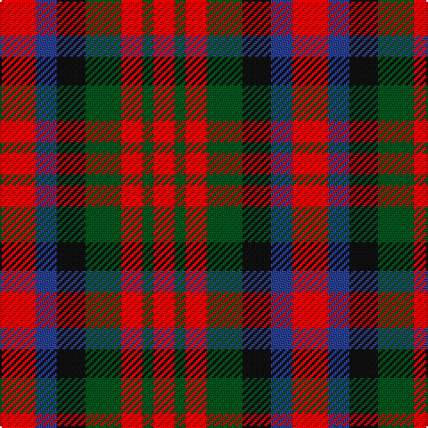

In pattern [RBKGRGR](/patterns/rbkgrgr/).

This was sourced from register-of-tartans.  It is a [7 stripes tartan](/stripes/stripes7/).

Original link https://www.tartanregister.gov.uk/tartanDetails.aspx?ref=2415

## Thread count
R/20 B12 K16 G20 R12 G6 R/12

## Palette
Each colour and its ΔE from the base-6 reference it is a variant of.

| Colour | Shade | Base | ΔE (OKLab) |
|---|---|---|---|
| B | <code style="background-color:#2C4084;">#2C4084</code> `#2C4084` | B <code style="background-color:#2A418A;">#2A418A</code> | 0.01 |
| G | <code style="background-color:#005020;">#005020</code> `#005020` | G <code style="background-color:#006100;">#006100</code> | 0.07 |
| K | <code style="background-color:#101010;">#101010</code> `#101010` | K <code style="background-color:#000000;">#000000</code> | 0.17 |
| R | <code style="background-color:#DC0000;">#DC0000</code> `#DC0000` | R <code style="background-color:#CC0000;">#CC0000</code> | 0.03 |

# Sample pattern

## Nearest tartans

The nearest existing variants by ΔTartan distance.

1. [MacDuff](/setts/s7/r10b6k8g10r6g3r6~b304080-g008000-k000000-rc00000~x2/) — ΔT 0.83
1. [Fiddes (Corrected)](/setts/s7/g12r11b12ra3b8g8b8~b780078-g289c18-rc80000-racc4438~x2/) — ΔT 0.98
1. [MacNaughton Clan Tartan Tartan Number: 404. Earliest known date: (1831) MacNaughtons once were found in Lochawe, Glenaray, Loch Fyne and Glenshira. Their stronghold was Dundarave castle. In 1878 the chief was restored as Sir Francis MacNaughton of Dunderawe of Bushmills in Ireland. Logan recorded the sett in his book, 'The Scottish Gael' in 1831. See products available Copyright © Blair Urquhart, Comrie, 2015](/setts/s7/b5r17g16k10b10r17b5~b202060-g003820-k101010-rc80000~x2/) — ΔT 1.05
1. [MacNaughton (Logan)](/setts/s7/b5r17g16k10b10r17b5~b080848-g002814-k101010-rdc0000~x2/) — ΔT 1.09
1. [Tulsa, City of](/setts/s6/g14b8g14r14k3r14~b2c2c80-g003820-k101010-rc80000~x2/) — ΔT 1.09
1. [Tulsa District Tartan Tartan Number: 712. Earliest known date: 1978 The tartan was designed by Richard Crawford, Chinnubbie McIntosh, and Bea Notley, and supported by the Mayor of Tulsa, Robert J. La Fortune who issued a proclamation to 'endorse and ordain the establishment of the Tulsa tartan'. Tulsa is situated on the Arkansas River in Oklahoma, a State much settled by Scots. See products available Copyright © Blair Urquhart, Comrie, 2015](/setts/s6/r14k3r14g13b8g13~b2c2c80-g006818-k101010-rc80000~x2/) — ΔT 1.17
1. [Duffus Hose, Lord](/setts/s7/y11r6k10y10k10g10r4~g604000-k101010-ra00048-ybc8c00~x2/) — ΔT 1.23
1. [Eastern Kentucky University](/setts/s6/r15ra9w4k12r15k5~k101010-rc80000-ra888888-wfcfcfc~x2/) — ΔT 1.35
1. [Eastern Kentucky University](/setts/s6/r15ra9w4k12r15k5~k101010-rc80000-ra888888-wffffff~x2/) — ΔT 1.36
1. [Tulsa](/setts/s6/r14k3r14g13b8g13~b304080-g008000-k000000-rc00000~x2/) — ΔT 1.39

## Neighbour map

Every grey dot is one of 15726 variants placed by the first two principal components of the ΔTartan feature space (44% of its variance). Red is this tartan; blue dots are its nearest — click one to open its page.

<svg viewBox="0 0 640 380" role="img" style="max-width:100%;height:auto;border:1px solid #e0e0e0;border-radius:4px;display:block" xmlns="http://www.w3.org/2000/svg"><image href="/nn/cloud.v1.png" width="640" height="380"/><a href="/setts/s7/r10b6k8g10r6g3r6~b304080-g008000-k000000-rc00000~x2/"><circle cx="114.3" cy="286.2" r="4" fill="#3465a4"><title>MacDuff</title></circle></a><a href="/setts/s7/g12r11b12ra3b8g8b8~b780078-g289c18-rc80000-racc4438~x2/"><circle cx="149.1" cy="282.8" r="4" fill="#3465a4"><title>Fiddes (Corrected)</title></circle></a><a href="/setts/s7/b5r17g16k10b10r17b5~b202060-g003820-k101010-rc80000~x2/"><circle cx="149.0" cy="282.8" r="4" fill="#3465a4"><title>MacNaughton Clan Tartan Tartan Number: 404. Earliest known date: (1831) MacNaughtons once were found in Lochawe, Glenaray, Loch Fyne and Glenshira. Their stronghold was Dundarave castle. In 1878 the chief was restored as Sir Francis MacNaughton of Dunderawe of Bushmills in Ireland. Logan recorded the sett in his book, 'The Scottish Gael' in 1831. See products available Copyright © Blair Urquhart, Comrie, 2015</title></circle></a><a href="/setts/s7/b5r17g16k10b10r17b5~b080848-g002814-k101010-rdc0000~x2/"><circle cx="129.8" cy="275.0" r="4" fill="#3465a4"><title>MacNaughton (Logan)</title></circle></a><a href="/setts/s6/g14b8g14r14k3r14~b2c2c80-g003820-k101010-rc80000~x2/"><circle cx="181.3" cy="289.9" r="4" fill="#3465a4"><title>Tulsa, City of</title></circle></a><a href="/setts/s6/r14k3r14g13b8g13~b2c2c80-g006818-k101010-rc80000~x2/"><circle cx="178.5" cy="287.8" r="4" fill="#3465a4"><title>Tulsa District Tartan Tartan Number: 712. Earliest known date: 1978 The tartan was designed by Richard Crawford, Chinnubbie McIntosh, and Bea Notley, and supported by the Mayor of Tulsa, Robert J. La Fortune who issued a proclamation to 'endorse and ordain the establishment of the Tulsa tartan'. Tulsa is situated on the Arkansas River in Oklahoma, a State much settled by Scots. See products available Copyright © Blair Urquhart, Comrie, 2015</title></circle></a><a href="/setts/s7/y11r6k10y10k10g10r4~g604000-k101010-ra00048-ybc8c00~x2/"><circle cx="60.6" cy="303.6" r="4" fill="#3465a4"><title>Duffus Hose, Lord</title></circle></a><a href="/setts/s6/r15ra9w4k12r15k5~k101010-rc80000-ra888888-wfcfcfc~x2/"><circle cx="173.6" cy="266.8" r="4" fill="#3465a4"><title>Eastern Kentucky University</title></circle></a><a href="/setts/s6/r15ra9w4k12r15k5~k101010-rc80000-ra888888-wffffff~x2/"><circle cx="173.2" cy="266.6" r="4" fill="#3465a4"><title>Eastern Kentucky University</title></circle></a><a href="/setts/s6/r14k3r14g13b8g13~b304080-g008000-k000000-rc00000~x2/"><circle cx="164.0" cy="283.0" r="4" fill="#3465a4"><title>Tulsa</title></circle></a><circle cx="135.3" cy="290.9" r="5" fill="#c00000"/></svg>

ID: /setts/s7/r10b6k8g10r6g3r6~b2c4084-g005020-k101010-rdc0000~x2/
