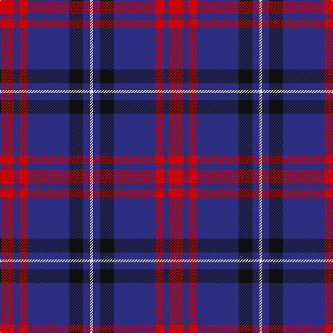

This page is one **sett** — a single exact thread-count. It belongs to the [tartan](/tartans/r10db4r6db30k10db5ln2/)
(the same proportion at any scale), whose colour order is pattern [RBRBKBW](/stripes/rbrbkbw/).

Sourced from tartans-authority.  It is a [7 stripe tartan](/stripes/stripes7/).

Original link http://www.tartansauthority.com/tartan-ferret/display/8281/

## Thread count
R/20 DB8 R12 DB60 K20 DB10 LN/4

## Palette
Each colour and the base-6 reference it is a variant of.

| Colour | Shade | Base |
|---|---|---|
| DB | <code style="background-color:#2C2C80;">#2C2C80</code> `oklch(35.0% 0.138 276.6)` <small>#2C2C80</small> | B <code style="background-color:#2A418A;">#2A418A</code> |
| K | <code style="background-color:#101010;">#101010</code> `oklch(17.3% 0.000 89.9)` <small>#101010</small> | K <code style="background-color:#000000;">#000000</code> |
| LN | <code style="background-color:#E0E0E0;">#E0E0E0</code> `oklch(90.7% 0.000 89.9)` <small>#E0E0E0</small> | W <code style="background-color:#F7F7F7;">#F7F7F7</code> |
| R | <code style="background-color:#C80000;">#C80000</code> `oklch(52.3% 0.215 29.2)` <small>#C80000</small> | R <code style="background-color:#CC0000;">#CC0000</code> |

# Sample pattern

## Nearest tartans

The nearest existing variants by ΔTartan distance, with this tartan at the top so the swatches line up against it.

ΔTartan

Tartan

Sett

—

<a href="/ttd/edit/#slug=r10db4r6db30k10db5w2~x2">Heritage of Wales (Fashion)</a> <a class="nn-out" href="/setts/s7/r10db4r6db30k10db5w2~x2/" title="open its dictionary page">↗</a>

0.78

<a href="/ttd/edit/#slug=r10db15g2db2w1db1w1~x4">Ikelman #4 (Personal)</a> <a class="nn-out" href="/setts/s7/r10db15g2db2w1db1w1~x4/" title="open its dictionary page">↗</a>

0.87

<a href="/ttd/edit/#slug=w2db15r3g3r3db1~x8">Lothian Buses (Corporate?)</a> <a class="nn-out" href="/setts/s6/w2db15r3g3r3db1~x8/" title="open its dictionary page">↗</a>

1.11

<a href="/ttd/edit/#slug=db2ly1db18g7r7db1g1~x2">Unnamed C20th - USA</a> <a class="nn-out" href="/setts/s7/db2ly1db18g7r7db1g1~x2/" title="open its dictionary page">↗</a>

1.13

<a href="/ttd/edit/#slug=o11db1o3db1db9r1~x4">Dege, of Saville Row</a> <a class="nn-out" href="/setts/s6/o11db1o3db1db9r1~x4/" title="open its dictionary page">↗</a>

1.14

<a href="/ttd/edit/#slug=dp6ly1dp20db6g19dp2~x4">Discover Islay (District)</a> <a class="nn-out" href="/setts/s6/dp6ly1dp20db6g19dp2~x4/" title="open its dictionary page">↗</a>

1.22

<a href="/ttd/edit/#slug=db18r9db2r3k1o1~x4">MacGregor, Modern</a> <a class="nn-out" href="/setts/s6/db18r9db2r3k1o1~x4/" title="open its dictionary page">↗</a>

1.25

<a href="/ttd/edit/#slug=lb9k16dg10k22dp67lo4">Widows Sons Scotland (MRA)</a> <a class="nn-out" href="/setts/s6/lb9k16dg10k22dp67lo4/" title="open its dictionary page">↗</a>

1.25

<a href="/ttd/edit/#slug=db30r2db2r4db9k26w2k4~x2">Murdoch Celebration (Personal)</a> <a class="nn-out" href="/setts/s8/db30r2db2r4db9k26w2k4~x2/" title="open its dictionary page">↗</a>

1.25

<a href="/ttd/edit/#slug=k21db8r4db2r2db23k4w2~x2">Murdoch Clebration (Personal)</a> <a class="nn-out" href="/setts/s8/k21db8r4db2r2db23k4w2~x2/" title="open its dictionary page">↗</a>

1.27

<a href="/ttd/edit/#slug=lb12dg16k12dg24dp75lo4">Widows Sons Scotland Dress</a> <a class="nn-out" href="/setts/s6/lb12dg16k12dg24dp75lo4/" title="open its dictionary page">↗</a>

## Neighbour map

Every grey dot is one of 14299 variants placed by the first two principal components of the ΔTartan feature space (44% of its variance). Red is this tartan; blue dots are its nearest — click one to open its page.

<svg viewBox="0 0 640 380" role="img" style="max-width:100%;height:auto;border:1px solid #e0e0e0;border-radius:4px;display:block" xmlns="http://www.w3.org/2000/svg"><image href="/nn/cloud.v1.png" width="640" height="380"/><a href="/setts/s7/r10db15g2db2w1db1w1~x4/"><circle cx="340.3" cy="169.8" r="4" fill="#3465a4"><title>Ikelman #4 (Personal)</title></circle></a><a href="/setts/s6/w2db15r3g3r3db1~x8/"><circle cx="342.0" cy="176.6" r="4" fill="#3465a4"><title>Lothian Buses (Corporate?)</title></circle></a><a href="/setts/s7/db2ly1db18g7r7db1g1~x2/"><circle cx="350.5" cy="172.9" r="4" fill="#3465a4"><title>Unnamed C20th - USA</title></circle></a><a href="/setts/s6/o11db1o3db1db9r1~x4/"><circle cx="329.2" cy="208.3" r="4" fill="#3465a4"><title>Dege, of Saville Row</title></circle></a><a href="/setts/s6/dp6ly1dp20db6g19dp2~x4/"><circle cx="337.3" cy="195.3" r="4" fill="#3465a4"><title>Discover Islay (District)</title></circle></a><a href="/setts/s6/db18r9db2r3k1o1~x4/"><circle cx="390.5" cy="175.4" r="4" fill="#3465a4"><title>MacGregor, Modern</title></circle></a><a href="/setts/s6/lb9k16dg10k22dp67lo4/"><circle cx="292.6" cy="166.0" r="4" fill="#3465a4"><title>Widows Sons Scotland (MRA)</title></circle></a><a href="/setts/s8/db30r2db2r4db9k26w2k4~x2/"><circle cx="334.5" cy="182.2" r="4" fill="#3465a4"><title>Murdoch Celebration (Personal)</title></circle></a><a href="/setts/s8/k21db8r4db2r2db23k4w2~x2/"><circle cx="308.9" cy="198.5" r="4" fill="#3465a4"><title>Murdoch Clebration (Personal)</title></circle></a><a href="/setts/s6/lb12dg16k12dg24dp75lo4/"><circle cx="292.3" cy="161.6" r="4" fill="#3465a4"><title>Widows Sons Scotland Dress</title></circle></a><circle cx="340.1" cy="187.2" r="5" fill="#c00000"/></svg>

ID: /setts/s7/r10db4r6db30k10db5w2~x2/
