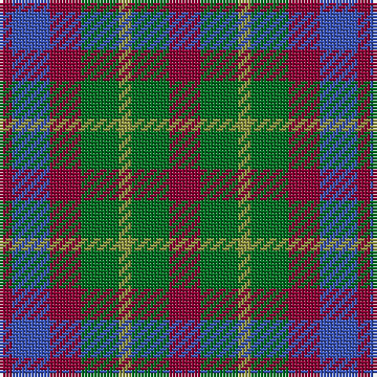

In pattern [RBRGYGR](/patterns/rbrgygr/).

This was sourced from register-of-tartans.  It is a [7 stripes tartan](/stripes/stripes7/).

Original link https://www.tartanregister.gov.uk/tartanDetails.aspx?ref=1412

## Thread count
DR/4 B12 DR10 G12 LT4 G12 DR/10

## Palette
Each colour and its ΔE from the base-6 reference it is a variant of.

| Colour | Shade | Base | ΔE (OKLab) |
|---|---|---|---|
| B | <code style="background-color:#3953B5;">#3953B5</code> `#3953B5` | B <code style="background-color:#2C4084;">#2C4084</code> | 0.09 |
| DR | <code style="background-color:#8C0034;">#8C0034</code> `#8C0034` | R <code style="background-color:#C80000;">#C80000</code> | 0.14 |
| G | <code style="background-color:#006E21;">#006E21</code> `#006E21` | G <code style="background-color:#006400;">#006400</code> | 0.03 |
| LT | <code style="background-color:#919441;">#919441</code> `#919441` | Y <code style="background-color:#E8C000;">#E8C000</code> | 0.19 |

# Sample pattern

ID: /setts/s7/r10g12y4g12r10b12r4-b3953b5-g006e21-r8c0034-y919441/
