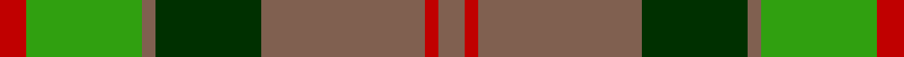
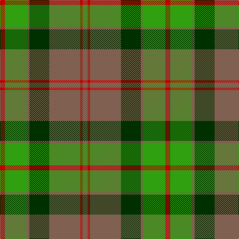

In pattern [RGRGRRR](/stripes/rgrgrrr/).

This was sourced from weddslist.  It is a [7 stripe tartan](/stripes/stripes7/).

Original link http://www.weddslist.com/cgi-bin/tartans/pg.pl?source=sts

## Thread count
R/10 G44 LT5 DG40 LT62 R5 LT/10

## Palette
Each colour and the base-6 reference it is a variant of.

| Colour | Shade | Base |
|---|---|---|
| DG | <code style="background-color:#003000;">#003000</code> `oklch(26.8% 0.091 142.5)` <small>#003000</small> | G <code style="background-color:#006100;">#006100</code> |
| G | <code style="background-color:#30A010;">#30A010</code> `oklch(61.9% 0.195 140.5)` <small>#30A010</small> | G <code style="background-color:#006100;">#006100</code> |
| LT | <code style="background-color:#806050;">#806050</code> `oklch(51.7% 0.049 47.8)` <small>#806050</small> | R <code style="background-color:#CC0000;">#CC0000</code> |
| R | <code style="background-color:#C00000;">#C00000</code> `oklch(50.7% 0.208 29.2)` <small>#C00000</small> | R <code style="background-color:#CC0000;">#CC0000</code> |

# Sample pattern

## Nearest tartans

The nearest existing variants by ΔTartan distance.

1. [Ballintrae Trade Tartan Tartan Number: 1541. Earliest known date: 1982 Many new designs have been given district names to promote their Scottish connections. However, these names should not be confused with the District tartans which have earned their title through 'use and wont' and not a little history. See products available Copyright © Blair Urquhart, Comrie, 2015](/setts/s7/dy10r5dy62dg40dy5g44r10/) — ΔT 0.72
1. [Ballantrae (Dalgety)](/setts/s7/dy5r3dy31dg20dy3g22r5~x2/) — ΔT 0.77
1. [Scott, hunting](/setts/s8/r3o14g8r2g2w2g2r1~x2/) — ΔT 1.09
1. [Crantock](/setts/s8/y24dp3y3dp3y3dp7dg20r3~x2/) — ΔT 1.10
1. [Unidentified Plaid 6](/setts/s10/r4t3r32db30r4g32r3g32r3g3~x2/) — ΔT 1.11
1. [McCook/Cook (Name)](/setts/s7/g12t6g6r15k1r1k2~x4/) — ΔT 1.18
1. [MacNeish Htg](/setts/s11/r6g3k3o24g4k10g4r2g24r6g2~x2/) — ΔT 1.20
1. [MacTavish Hunting Clan Tartan Tartan Number: 232. Earliest known date: pre 2003 See Lord Thomson See products available Copyright © Blair Urquhart, Comrie, 2015](/setts/s6/t3dy26g4t13k13t2~x2/) — ΔT 1.20
1. [Red Dirt Girl](/setts/s9/dy21r2g18r2g18r2dg8w6dy10~x2/) — ΔT 1.20
1. [Skene](/setts/s7/db6r3g1r3g12r3g1~x2/) — ΔT 1.23

## Neighbour map

Every grey dot is one of 14299 variants placed by the first two principal components of the ΔTartan feature space (44% of its variance). Red is this tartan; blue dots are its nearest — click one to open its page.

<svg viewBox="0 0 640 380" role="img" style="max-width:100%;height:auto;border:1px solid #e0e0e0;border-radius:4px;display:block" xmlns="http://www.w3.org/2000/svg"><image href="/nn/cloud.v1.png" width="640" height="380"/><a href="/setts/s7/dy10r5dy62dg40dy5g44r10/"><circle cx="270.3" cy="218.1" r="4" fill="#3465a4"><title>Ballintrae Trade Tartan Tartan Number: 1541. Earliest known date: 1982 Many new designs have been given district names to promote their Scottish connections. However, these names should not be confused with the District tartans which have earned their title through 'use and wont' and not a little history. See products available Copyright © Blair Urquhart, Comrie, 2015</title></circle></a><a href="/setts/s7/dy5r3dy31dg20dy3g22r5~x2/"><circle cx="261.7" cy="225.8" r="4" fill="#3465a4"><title>Ballantrae (Dalgety)</title></circle></a><a href="/setts/s8/r3o14g8r2g2w2g2r1~x2/"><circle cx="262.2" cy="178.4" r="4" fill="#3465a4"><title>Scott, hunting</title></circle></a><a href="/setts/s8/y24dp3y3dp3y3dp7dg20r3~x2/"><circle cx="268.4" cy="215.3" r="4" fill="#3465a4"><title>Crantock</title></circle></a><a href="/setts/s10/r4t3r32db30r4g32r3g32r3g3~x2/"><circle cx="261.3" cy="183.0" r="4" fill="#3465a4"><title>Unidentified Plaid 6</title></circle></a><a href="/setts/s7/g12t6g6r15k1r1k2~x4/"><circle cx="249.3" cy="188.7" r="4" fill="#3465a4"><title>McCook/Cook (Name)</title></circle></a><a href="/setts/s11/r6g3k3o24g4k10g4r2g24r6g2~x2/"><circle cx="234.9" cy="177.7" r="4" fill="#3465a4"><title>MacNeish Htg</title></circle></a><a href="/setts/s6/t3dy26g4t13k13t2~x2/"><circle cx="251.9" cy="214.7" r="4" fill="#3465a4"><title>MacTavish Hunting Clan Tartan Tartan Number: 232. Earliest known date: pre 2003 See Lord Thomson See products available Copyright © Blair Urquhart, Comrie, 2015</title></circle></a><a href="/setts/s9/dy21r2g18r2g18r2dg8w6dy10~x2/"><circle cx="200.6" cy="195.3" r="4" fill="#3465a4"><title>Red Dirt Girl</title></circle></a><a href="/setts/s7/db6r3g1r3g12r3g1~x2/"><circle cx="297.8" cy="216.5" r="4" fill="#3465a4"><title>Skene</title></circle></a><circle cx="254.3" cy="207.1" r="5" fill="#c00000"/></svg>

ID: /setts/s7/r10g44o5dg40o62r5o10/
