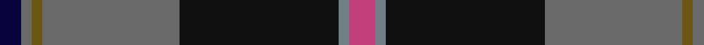
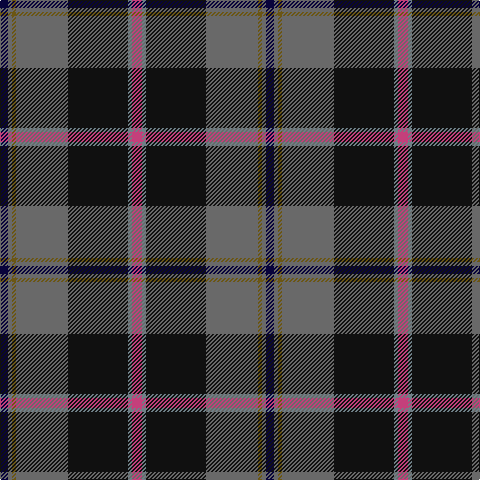

In pattern [KGGGKGR](/patterns/kgggkgr/).

This was sourced from register-of-tartans.  It is a [7 stripes tartan](/stripes/stripes7/).

Original link https://www.tartanregister.gov.uk/tartanDetails.aspx?ref=10066

## Thread count
DB/8 Na4 G4 Na52 K60 N4 P/10

## Palette
Each colour and its ΔE from the base-6 reference it is a variant of.

| Colour | Shade | Base | ΔE (OKLab) |
|---|---|---|---|
| DB | <code style="background-color:#08033B;">#08033B</code> `#08033B` | K <code style="background-color:#000000;">#000000</code> | 0.20 |
| G | <code style="background-color:#6B5613;">#6B5613</code> `#6B5613` | G <code style="background-color:#006400;">#006400</code> | 0.12 |
| K | <code style="background-color:#101010;">#101010</code> `#101010` | K <code style="background-color:#000000;">#000000</code> | 0.17 |
| N | <code style="background-color:#6E7F86;">#6E7F86</code> `#6E7F86` | G <code style="background-color:#006400;">#006400</code> | 0.21 |
| Na | <code style="background-color:#696969;">#696969</code> `#696969` | G <code style="background-color:#006400;">#006400</code> | 0.17 |
| P | <code style="background-color:#C33F7B;">#C33F7B</code> `#C33F7B` | R <code style="background-color:#C80000;">#C80000</code> | 0.13 |

# Sample pattern

ID: /setts/s7/r10g4k60ga52gb4ga4ka8-g6e7f86-ga696969-gb6b5613-k101010-ka08033b-rc33f7b/
