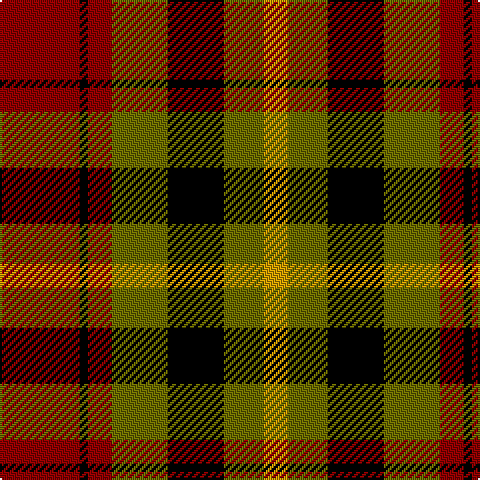

In pattern [RKRGKGY](/patterns/rkrgkgy/).

This was sourced from register-of-tartans.  It is a [7 stripes tartan](/stripes/stripes7/).

Original link https://www.tartanregister.gov.uk/tartanDetails.aspx?ref=4537

## Thread count
DR/40 K4 DR12 G28 K28 G20 DY/12

## Palette
Each colour and its ΔE from the base-6 reference it is a variant of.

| Colour | Shade | Base | ΔE (OKLab) |
|---|---|---|---|
| DR | <code style="background-color:#8C0000;">#8C0000</code> `#8C0000` | R <code style="background-color:#CC0000;">#CC0000</code> | 0.14 |
| DY | <code style="background-color:#C89800;">#C89800</code> `#C89800` | Y <code style="background-color:#F2BF00;">#F2BF00</code> | 0.12 |
| G | <code style="background-color:#6C6C00;">#6C6C00</code> `#6C6C00` | G <code style="background-color:#006100;">#006100</code> | 0.12 |
| K | <code style="background-color:#000000;">#000000</code> `#000000` | K <code style="background-color:#000000;">#000000</code> | 0.00 |

# Sample pattern

## Nearest tartans

The nearest existing variants by ΔTartan distance.

1. [Wcwm 1062](/setts/s7/g3r20g16k22y6k3g2x2~g006818-k101010-rc80000-yd09800/) — ΔT 1.13
1. [Blackstock Red (Dress)](/setts/s7/y2g7k6r11k1r1y2x4~g285800-k000000-rb00000-yc89800/) — ΔT 1.19
1. [Strathspey, Check](/setts/s6/g3r22b5g10k10g2x2~b5480b0-g008000-k000000-rc00000/) — ΔT 1.23
1. [Highland Village](/setts/s9/y2b1r10ra12b10y6r10b1y2x4~b3c2010-r640000-ra8c6428-yd8d898/) — ΔT 1.26
1. [Borthwick Hunting](/setts/s9/g12k2r12k3b12k16b12k3r6x2~b606060-g004c00-k000000-rc80000/) — ΔT 1.26
1. [Brough](/setts/s7/r20k14w2k14g9r3g11x2~g008000-k000030-rc00000-we0e0e0/) — ΔT 1.28
1. [Torana](/setts/s6/r13b13ra5y2b13y13x2~b1c1c1c-rc80000-rad87000-yd09800/) — ΔT 1.29
1. [Al Suwaidi of Abu Dhabi (Personal)](/setts/s8/w2r7g7k7r2g2k2w1x5~g005020-k101010-rdc0000-wffffff/) — ΔT 1.29
1. [Dickie](/setts/s8/g8r2g12k6g3b6r24k4x2~b00008c-g146400-k000000-rc82800/) — ΔT 1.33
1. [MacMillan - 2002 (Black - Unofficial](/setts/s6/g3k31r17g6y18k3x2~g004810-k101010-r880000-ybc8c00/) — ΔT 1.33

## Neighbour map

Every grey dot is one of 15726 variants placed by the first two principal components of the ΔTartan feature space (44% of its variance). Red is this tartan; blue dots are its nearest — click one to open its page.

<svg viewBox="0 0 640 380" role="img" style="max-width:100%;height:auto;border:1px solid #e0e0e0;border-radius:4px;display:block" xmlns="http://www.w3.org/2000/svg"><image href="/nn/cloud.v1.png" width="640" height="380"/><a href="/setts/s7/g3r20g16k22y6k3g2x2~g006818-k101010-rc80000-yd09800/"><circle cx="177.6" cy="197.1" r="4" fill="#3465a4"><title>Wcwm 1062</title></circle></a><a href="/setts/s7/y2g7k6r11k1r1y2x4~g285800-k000000-rb00000-yc89800/"><circle cx="186.9" cy="185.7" r="4" fill="#3465a4"><title>Blackstock Red (Dress)</title></circle></a><a href="/setts/s6/g3r22b5g10k10g2x2~b5480b0-g008000-k000000-rc00000/"><circle cx="196.3" cy="196.7" r="4" fill="#3465a4"><title>Strathspey, Check</title></circle></a><a href="/setts/s9/y2b1r10ra12b10y6r10b1y2x4~b3c2010-r640000-ra8c6428-yd8d898/"><circle cx="172.2" cy="183.2" r="4" fill="#3465a4"><title>Highland Village</title></circle></a><a href="/setts/s9/g12k2r12k3b12k16b12k3r6x2~b606060-g004c00-k000000-rc80000/"><circle cx="108.4" cy="218.3" r="4" fill="#3465a4"><title>Borthwick Hunting</title></circle></a><a href="/setts/s7/r20k14w2k14g9r3g11x2~g008000-k000030-rc00000-we0e0e0/"><circle cx="158.6" cy="220.0" r="4" fill="#3465a4"><title>Brough</title></circle></a><a href="/setts/s6/r13b13ra5y2b13y13x2~b1c1c1c-rc80000-rad87000-yd09800/"><circle cx="162.5" cy="248.7" r="4" fill="#3465a4"><title>Torana</title></circle></a><a href="/setts/s8/w2r7g7k7r2g2k2w1x5~g005020-k101010-rdc0000-wffffff/"><circle cx="109.3" cy="205.9" r="4" fill="#3465a4"><title>Al Suwaidi of Abu Dhabi (Personal)</title></circle></a><a href="/setts/s8/g8r2g12k6g3b6r24k4x2~b00008c-g146400-k000000-rc82800/"><circle cx="198.6" cy="182.2" r="4" fill="#3465a4"><title>Dickie</title></circle></a><a href="/setts/s6/g3k31r17g6y18k3x2~g004810-k101010-r880000-ybc8c00/"><circle cx="216.2" cy="211.2" r="4" fill="#3465a4"><title>MacMillan - 2002 (Black - Unofficial</title></circle></a><circle cx="155.6" cy="220.7" r="5" fill="#c00000"/></svg>

ID: /setts/s7/r10k1r3g7k7g5y3x4~g6c6c00-k000000-r8c0000-yc89800/
