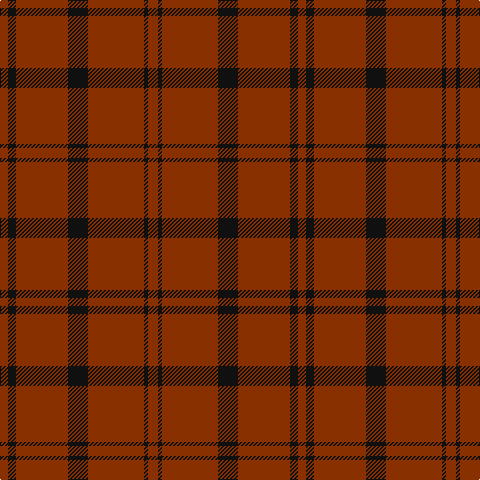

In pattern [RKRKRKR](/patterns/rkrkrkr/).

This was sourced from tartans-authority.  It is a [7 stripes tartan](/stripes/stripes7/).

Original link http://www.tartansauthority.com/tartan-ferret/display/4745/

## Thread count
R/8 K8 R52 K20 R56 K4 R/10

## Palette
Each colour and its ΔE from the base-6 reference it is a variant of.

| Colour | Shade | Base | ΔE (OKLab) |
|---|---|---|---|
| K | <code style="background-color:#101010;">#101010</code> `#101010` | K <code style="background-color:#000000;">#000000</code> | 0.17 |
| R | <code style="background-color:#883000;">#883000</code> `#883000` | R <code style="background-color:#C80000;">#C80000</code> | 0.13 |

# Sample pattern

## Nearest tartans

The nearest existing variants by ΔTartan distance.

1. [Brooks Brothers Tattersall Red](/setts/s5/b4r36b8r36y4-b202060-r880000-ya08858/) — ΔT 1.72
1. [Scott Htg (Error 2)](/setts/s8/r6g32g20r6g6w4g6r6-g604000-rc80000-wc0c0c0/) — ΔT 1.76
1. [MacDonald Lord of the Isles](/setts/s4/r76g4r10g32-g11450d-raa0000/) — ΔT 1.82
1. [MacDonald Lord of the Isles](/setts/s4/r38g2r5g16-g11450d-raa0000/) — ΔT 1.82
1. [Oman, Sultanate of..](/setts/s6/g18b6g12b6g40y4-b5480b0-g604000-yf0c000/) — ΔT 1.87
1. [Oman RAF, Sultanate of (Military)](/setts/s6/g18b6g12b6g40y4-b5c8ca8-g604000-ye8c000/) — ΔT 1.91
1. [Oman, Sultanate of / Oliver dress](/setts/s10/g18b6g12b6g40y4g40b6g12b6-b5c8ca8-g604000-ye8c000/) — ΔT 2.00
1. [Inverness Augustus](/setts/s7/r36g2k10g2k2g2r18-g005020-k101010-r781c38/) — ΔT 2.03
1. [Waverley Care Aids Trust (Corporate)](/setts/s6/r80g20r20k10r10g20-g006818-k101010-r880000/) — ΔT 2.06
1. [MacDonald of Sleat - 1810 (Clan)](/setts/s4/r72g4r10g32-g285800-rc80000/) — ΔT 2.23

## Neighbour map

Every grey dot is one of 15726 variants placed by the first two principal components of the ΔTartan feature space (44% of its variance). Red is this tartan; blue dots are its nearest — click one to open its page.

<svg viewBox="0 0 640 380" role="img" style="max-width:100%;height:auto;border:1px solid #e0e0e0;border-radius:4px;display:block" xmlns="http://www.w3.org/2000/svg"><image href="/nn/cloud.v1.png" width="640" height="380"/><a href="/setts/s5/b4r36b8r36y4-b202060-r880000-ya08858/"><circle cx="610.7" cy="270.5" r="4" fill="#3465a4"><title>Brooks Brothers Tattersall Red</title></circle></a><a href="/setts/s8/r6g32g20r6g6w4g6r6-g604000-rc80000-wc0c0c0/"><circle cx="513.9" cy="248.7" r="4" fill="#3465a4"><title>Scott Htg (Error 2)</title></circle></a><a href="/setts/s4/r76g4r10g32-g11450d-raa0000/"><circle cx="559.4" cy="248.9" r="4" fill="#3465a4"><title>MacDonald Lord of the Isles</title></circle></a><a href="/setts/s4/r38g2r5g16-g11450d-raa0000/"><circle cx="559.4" cy="248.9" r="4" fill="#3465a4"><title>MacDonald Lord of the Isles</title></circle></a><a href="/setts/s6/g18b6g12b6g40y4-b5480b0-g604000-yf0c000/"><circle cx="561.7" cy="253.8" r="4" fill="#3465a4"><title>Oman, Sultanate of..</title></circle></a><a href="/setts/s6/g18b6g12b6g40y4-b5c8ca8-g604000-ye8c000/"><circle cx="561.2" cy="253.5" r="4" fill="#3465a4"><title>Oman RAF, Sultanate of (Military)</title></circle></a><a href="/setts/s10/g18b6g12b6g40y4g40b6g12b6-b5c8ca8-g604000-ye8c000/"><circle cx="563.0" cy="236.5" r="4" fill="#3465a4"><title>Oman, Sultanate of / Oliver dress</title></circle></a><a href="/setts/s7/r36g2k10g2k2g2r18-g005020-k101010-r781c38/"><circle cx="588.7" cy="215.6" r="4" fill="#3465a4"><title>Inverness Augustus</title></circle></a><a href="/setts/s6/r80g20r20k10r10g20-g006818-k101010-r880000/"><circle cx="473.3" cy="251.0" r="4" fill="#3465a4"><title>Waverley Care Aids Trust (Corporate)</title></circle></a><a href="/setts/s4/r72g4r10g32-g285800-rc80000/"><circle cx="535.5" cy="241.2" r="4" fill="#3465a4"><title>MacDonald of Sleat - 1810 (Clan)</title></circle></a><circle cx="605.3" cy="248.1" r="5" fill="#c00000"/></svg>

ID: /setts/s7/r10k4r56k20r52k8r8-k101010-r883000/
