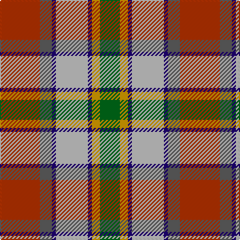

This page is one **sett** — a single exact thread-count. It belongs to the [tartan](/tartans/r10n3db1lb8db1lo2g5/)
(the same proportion at any scale), whose colour order is pattern [GYBWBBR](/stripes/gybwbbr/).

Sourced from register-of-tartans.  It is a [7 stripe tartan](/stripes/stripes7/).

Original link https://www.tartanregister.gov.uk/tartanDetails.aspx?ref=3356

2 attestations — the source records this cloth was collapsed from (oldest owns this page)

<ul>
<li>01/01/1980 — Porcupine City of (register-of-tartans, <a href="https://www.tartanregister.gov.uk/tartanDetails.aspx?ref=3356">record</a>)</li>
<li>1980 — Porcupine City of (District) (tartans-authority, <a href="http://www.tartansauthority.com/tartan-ferret/display/5493/">record</a>)</li>
</ul>

## Register references

External register numbers recorded for this tartan.

- Scottish Register of Tartans: [3356](https://www.tartanregister.gov.uk/tartanDetails.aspx?ref=3356)
- Scottish Tartans Authority (ITI): 5493

## Thread count
R/40 N12 DB4 Na32 DB4 DY8 G/20

## Palette

Palette: <strong>Tartan Register</strong> <small style="color:#888">(4 of 6 colours)</small>
<table><thead><tr><th>Colour</th><th>Threads</th><th>Shade</th><th>Base</th><th>OKLCh</th></tr></thead><tbody><tr><td>R/</td><td style="text-align:right;font-variant-numeric:tabular-nums">40</td><td><code style="background-color:#B03000;">#B03000</code> <small style="color:#888">#B03000</small></td><td>R <code style="background-color:#CC0000;">#CC0000</code></td><td><small style="color:#888">oklch(50.3% 0.171 36.3)</small></td></tr><tr><td>N</td><td style="text-align:right;font-variant-numeric:tabular-nums">12</td><td><code style="background-color:#5C5C5C;">#5C5C5C</code> <small style="color:#888">#5C5C5C</small></td><td>B <code style="background-color:#2A418A;">#2A418A</code></td><td><small style="color:#888">oklch(47.5% 0.000 89.9)</small></td></tr><tr><td>DB</td><td style="text-align:right;font-variant-numeric:tabular-nums">4</td><td><code style="background-color:#1C0070;">#1C0070</code> <small style="color:#888">#1C0070</small></td><td>B <code style="background-color:#2A418A;">#2A418A</code></td><td><small style="color:#888">oklch(26.3% 0.162 277.1)</small></td></tr><tr><td>Na</td><td style="text-align:right;font-variant-numeric:tabular-nums">32</td><td><code style="background-color:#C0C0C0;">#C0C0C0</code> <small style="color:#888">#C0C0C0</small></td><td>W <code style="background-color:#F7F7F7;">#F7F7F7</code></td><td><small style="color:#888">oklch(80.8% 0.000 89.9)</small></td></tr><tr><td>DB</td><td style="text-align:right;font-variant-numeric:tabular-nums">4</td><td><code style="background-color:#1C0070;">#1C0070</code> <small style="color:#888">#1C0070</small></td><td>B <code style="background-color:#2A418A;">#2A418A</code></td><td><small style="color:#888">oklch(26.3% 0.162 277.1)</small></td></tr><tr><td>DY</td><td style="text-align:right;font-variant-numeric:tabular-nums">8</td><td><code style="background-color:#D09800;">#D09800</code> <small style="color:#888">#D09800</small></td><td>Y <code style="background-color:#F2BF00;">#F2BF00</code></td><td><small style="color:#888">oklch(71.4% 0.147 82.1)</small></td></tr><tr><td>G/</td><td style="text-align:right;font-variant-numeric:tabular-nums">20</td><td><code style="background-color:#006818;">#006818</code> <small style="color:#888">#006818</small></td><td>G <code style="background-color:#006100;">#006100</code></td><td><small style="color:#888">oklch(45.0% 0.142 145.0)</small></td></tr></tbody></table>

# Sample pattern

## Nearest tartans

The nearest existing variants by ΔTartan distance, with this tartan at the top so the swatches line up against it.

ΔTartan

Tartan

Sett

—

<a href="/ttd/edit/#slug=r10n3db1lb8db1lo2g5~x4">Porcupine City of</a> <a class="nn-out" href="/setts/s7/r10n3db1lb8db1lo2g5~x4/" title="open its dictionary page">↗</a>

0.73

<a href="/ttd/edit/#slug=w6gi10r22db16g2g4g5~x2">Nicolson of Taransay (Personal)</a> <a class="nn-out" href="/setts/s7/w6gi10r22db16g2g4g5~x2/" title="open its dictionary page">↗</a>

0.76

<a href="/ttd/edit/#slug=t4dy27lr8k4lr8k4lr8r11ly3~x2">Brittany Hunting French Fancy Tartan Tartan Number: 5977. Earliest known date: 2003 For Richard and Anne-Marie Duclos of Le Coudray-Montceaux, France. Based on the Breton National at 3902. The term Randonnée (Walking) is used in the sense of the Scottish category, Hunting. See products available Copyright © Blair Urquhart, Comrie, 2015</a> <a class="nn-out" href="/setts/s9/t4dy27lr8k4lr8k4lr8r11ly3~x2/" title="open its dictionary page">↗</a>

0.83

<a href="/ttd/edit/#slug=r22t6db10ly4r4w4g22db8ly3">Unnamed No 14</a> <a class="nn-out" href="/setts/s9/r22t6db10ly4r4w4g22db8ly3/" title="open its dictionary page">↗</a>

0.97

<a href="/ttd/edit/#slug=r22t6db10ly4r4w4dg22db8ly3">Unidentified No 14</a> <a class="nn-out" href="/setts/s9/r22t6db10ly4r4w4dg22db8ly3/" title="open its dictionary page">↗</a>

1.01

<a href="/ttd/edit/#slug=w6t36lo12g19gi6r6gi6r28gi4">Derry Family (Personal)</a> <a class="nn-out" href="/setts/s9/w6t36lo12g19gi6r6gi6r28gi4/" title="open its dictionary page">↗</a>

1.03

<a href="/ttd/edit/#slug=lo13b8r5k3w2g1~x4">Ball</a> <a class="nn-out" href="/setts/s6/lo13b8r5k3w2g1~x4/" title="open its dictionary page">↗</a>

1.07

<a href="/ttd/edit/#slug=t4p3gi1g9w1r8k1~x4">Wilson's, No 121</a> <a class="nn-out" href="/setts/s7/t4p3gi1g9w1r8k1~x4/" title="open its dictionary page">↗</a>

1.07

<a href="/ttd/edit/#slug=w3g24r13gi4lo11r8db2~x2">Elystan Glodrydd (Name)</a> <a class="nn-out" href="/setts/s7/w3g24r13gi4lo11r8db2~x2/" title="open its dictionary page">↗</a>

1.08

<a href="/ttd/edit/#slug=dy17o5db2w12db2ly4g7~x2">Ontario Northern Canadian District Tartan Tartan Number: 956. Earliest known date: 1967 The six colours represent the nickel bearing rocks (grey), the snow (white), the sky and the lakes (blue), gold, the forests and fields (green), and the Indian Nation (red brown). See products available Copyright © Blair Urquhart, Comrie, 2015</a> <a class="nn-out" href="/setts/s7/dy17o5db2w12db2ly4g7~x2/" title="open its dictionary page">↗</a>

1.08

<a href="/ttd/edit/#slug=o17y5db2w12db2ly4g7~x2">Ontario, Northern</a> <a class="nn-out" href="/setts/s7/o17y5db2w12db2ly4g7~x2/" title="open its dictionary page">↗</a>

## Neighbour map

Every grey dot is one of 14359 variants placed by the first two principal components of the ΔTartan feature space (44% of its variance). Red is this tartan; blue dots are its nearest — click one to open its page.

<svg viewBox="0 0 640 380" role="img" style="max-width:100%;height:auto;border:1px solid #e0e0e0;border-radius:4px;display:block" xmlns="http://www.w3.org/2000/svg"><image href="/nn/cloud.v1.png" width="640" height="380"/><a href="/setts/s7/w6gi10r22db16g2g4g5~x2/"><circle cx="105.1" cy="162.2" r="4" fill="#3465a4"><title>Nicolson of Taransay (Personal)</title></circle></a><a href="/setts/s9/t4dy27lr8k4lr8k4lr8r11ly3~x2/"><circle cx="118.8" cy="151.3" r="4" fill="#3465a4"><title>Brittany Hunting French Fancy Tartan Tartan Number: 5977. Earliest known date: 2003 For Richard and Anne-Marie Duclos of Le Coudray-Montceaux, France. Based on the Breton National at 3902. The term Randonnée (Walking) is used in the sense of the Scottish category, Hunting. See products available Copyright © Blair Urquhart, Comrie, 2015</title></circle></a><a href="/setts/s9/r22t6db10ly4r4w4g22db8ly3/"><circle cx="89.1" cy="164.6" r="4" fill="#3465a4"><title>Unnamed No 14</title></circle></a><a href="/setts/s9/r22t6db10ly4r4w4dg22db8ly3/"><circle cx="87.3" cy="162.3" r="4" fill="#3465a4"><title>Unidentified No 14</title></circle></a><a href="/setts/s9/w6t36lo12g19gi6r6gi6r28gi4/"><circle cx="95.9" cy="162.6" r="4" fill="#3465a4"><title>Derry Family (Personal)</title></circle></a><a href="/setts/s6/lo13b8r5k3w2g1~x4/"><circle cx="150.2" cy="152.3" r="4" fill="#3465a4"><title>Ball</title></circle></a><a href="/setts/s7/t4p3gi1g9w1r8k1~x4/"><circle cx="96.9" cy="150.9" r="4" fill="#3465a4"><title>Wilson's, No 121</title></circle></a><a href="/setts/s7/w3g24r13gi4lo11r8db2~x2/"><circle cx="162.0" cy="166.9" r="4" fill="#3465a4"><title>Elystan Glodrydd (Name)</title></circle></a><a href="/setts/s7/dy17o5db2w12db2ly4g7~x2/"><circle cx="87.2" cy="167.4" r="4" fill="#3465a4"><title>Ontario Northern Canadian District Tartan Tartan Number: 956. Earliest known date: 1967 The six colours represent the nickel bearing rocks (grey), the snow (white), the sky and the lakes (blue), gold, the forests and fields (green), and the Indian Nation (red brown). See products available Copyright © Blair Urquhart, Comrie, 2015</title></circle></a><a href="/setts/s7/o17y5db2w12db2ly4g7~x2/"><circle cx="104.5" cy="174.6" r="4" fill="#3465a4"><title>Ontario, Northern</title></circle></a><circle cx="115.9" cy="164.2" r="5" fill="#c00000"/></svg>

ID: /setts/s7/r10n3db1lb8db1lo2g5~x4/
