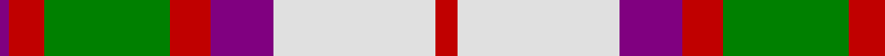
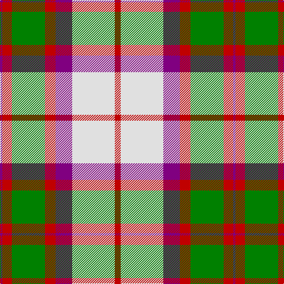

In pattern [BRGRBWR](/patterns/brgrbwr/).

This was sourced from weddslist.  It is a [7 stripes tartan](/stripes/stripes7/).

Original link http://www.weddslist.com/cgi-bin/tartans/pg.pl?source=sts

## Thread count
P/4 R16 G56 R18 P28 LN72 R/10

## Palette
Each colour and its ΔE from the base-6 reference it is a variant of.

| Colour | Shade | Base | ΔE (OKLab) |
|---|---|---|---|
| G | <code style="background-color:#008000;">#008000</code> `#008000` | G <code style="background-color:#006400;">#006400</code> | 0.09 |
| LN | <code style="background-color:#E0E0E0;">#E0E0E0</code> `#E0E0E0` | W <code style="background-color:#F4F4F0;">#F4F4F0</code> | 0.06 |
| P | <code style="background-color:#800080;">#800080</code> `#800080` | B <code style="background-color:#2C4084;">#2C4084</code> | 0.17 |
| R | <code style="background-color:#C00000;">#C00000</code> `#C00000` | R <code style="background-color:#C80000;">#C80000</code> | 0.02 |

# Sample pattern

## Nearest tartans

The nearest existing variants by ΔTartan distance.

1. [MacKintosh (Artefact)](/setts/s7/r10w72b28r18g56r16b4-b780078-g006818-r880000-we0e0e0/) — ΔT 0.49
1. [Bannockbane Orange Stripes](/setts/s8/b4y4b30y2w20ya30y4ya4-b441800-we0e0e0-yd87c00-yaa08858/) — ΔT 0.98
1. [MacDuff Dress #3](/setts/s10/r12g6w44r10w10k18g32r8k2r8-g005020-k101010-rdc0000-we0e0e0/) — ΔT 0.99
1. [MacDuff, dress](/setts/s10/r12g6w44r10w10k18g32r8k2r8-g008000-k000000-rc00000-we0e0e0/) — ΔT 1.17
1. [Dogwood Trade Tartan Tartan Number: 913. Earliest known date: 1968 The registered tartan of the Dinwiddie Clan. Dinwiddies are normally associated with the Maxwells, but Lord Lyon stated, in 1988, that Dinwiddies were a sept of no other clan. See products available Copyright © Blair Urquhart, Comrie, 2015](/setts/s8/g6r24g24y10r2w50g4r2-g006818-r880000-we0e0e0-ya08858/) — ΔT 1.20
1. [Catalunya Escocia](/setts/s10/y12r12y12r12y12k2b36w4b2w8-b2c4084-k101010-rdc0000-wffffff-yffd700/) — ΔT 1.20
1. [Bannock Bane M.405](/setts/s8/b8r6b42r4w28ra44r6ra8-b3c3c3c-rdc0000-rabe7832-we0e0e0/) — ΔT 1.21
1. [MacLachlan Dress Clan Tartan Tartan Number: 828. Earliest known date: 1990 Based on the MacLachlan pattern in Old And Rare See products available Copyright © Blair Urquhart, Comrie, 2015](/setts/s7/r68w6g8ga46w48k6g8-g006428-ga006818-k101010-rd05054-we0e0e0/) — ΔT 1.21
1. [MacLean Dress (Lumsden)](/setts/s6/r4w48g24r32wa12y4-g006818-ra40000-wf8ece0-waa8ace8-yd09800/) — ΔT 1.21
1. [Bannockbane, Dark Tan](/setts/s8/b8y4b26y2w16ba26y4ba8-b401000-ba5480b0-we0e0e0-yf0c000/) — ΔT 1.23

## Neighbour map

Every grey dot is one of 15726 variants placed by the first two principal components of the ΔTartan feature space (44% of its variance). Red is this tartan; blue dots are its nearest — click one to open its page.

<svg viewBox="0 0 640 380" role="img" style="max-width:100%;height:auto;border:1px solid #e0e0e0;border-radius:4px;display:block" xmlns="http://www.w3.org/2000/svg"><image href="/nn/cloud.v1.png" width="640" height="380"/><a href="/setts/s7/r10w72b28r18g56r16b4-b780078-g006818-r880000-we0e0e0/"><circle cx="164.5" cy="158.2" r="4" fill="#3465a4"><title>MacKintosh (Artefact)</title></circle></a><a href="/setts/s8/b4y4b30y2w20ya30y4ya4-b441800-we0e0e0-yd87c00-yaa08858/"><circle cx="183.4" cy="152.4" r="4" fill="#3465a4"><title>Bannockbane Orange Stripes</title></circle></a><a href="/setts/s10/r12g6w44r10w10k18g32r8k2r8-g005020-k101010-rdc0000-we0e0e0/"><circle cx="164.9" cy="130.6" r="4" fill="#3465a4"><title>MacDuff Dress #3</title></circle></a><a href="/setts/s10/r12g6w44r10w10k18g32r8k2r8-g008000-k000000-rc00000-we0e0e0/"><circle cx="157.6" cy="130.1" r="4" fill="#3465a4"><title>MacDuff, dress</title></circle></a><a href="/setts/s8/g6r24g24y10r2w50g4r2-g006818-r880000-we0e0e0-ya08858/"><circle cx="220.4" cy="126.0" r="4" fill="#3465a4"><title>Dogwood Trade Tartan Tartan Number: 913. Earliest known date: 1968 The registered tartan of the Dinwiddie Clan. Dinwiddies are normally associated with the Maxwells, but Lord Lyon stated, in 1988, that Dinwiddies were a sept of no other clan. See products available Copyright © Blair Urquhart, Comrie, 2015</title></circle></a><a href="/setts/s10/y12r12y12r12y12k2b36w4b2w8-b2c4084-k101010-rdc0000-wffffff-yffd700/"><circle cx="133.1" cy="118.7" r="4" fill="#3465a4"><title>Catalunya Escocia</title></circle></a><a href="/setts/s8/b8r6b42r4w28ra44r6ra8-b3c3c3c-rdc0000-rabe7832-we0e0e0/"><circle cx="183.8" cy="171.9" r="4" fill="#3465a4"><title>Bannock Bane M.405</title></circle></a><a href="/setts/s7/r68w6g8ga46w48k6g8-g006428-ga006818-k101010-rd05054-we0e0e0/"><circle cx="152.2" cy="156.2" r="4" fill="#3465a4"><title>MacLachlan Dress Clan Tartan Tartan Number: 828. Earliest known date: 1990 Based on the MacLachlan pattern in Old And Rare See products available Copyright © Blair Urquhart, Comrie, 2015</title></circle></a><a href="/setts/s6/r4w48g24r32wa12y4-g006818-ra40000-wf8ece0-waa8ace8-yd09800/"><circle cx="148.1" cy="161.5" r="4" fill="#3465a4"><title>MacLean Dress (Lumsden)</title></circle></a><a href="/setts/s8/b8y4b26y2w16ba26y4ba8-b401000-ba5480b0-we0e0e0-yf0c000/"><circle cx="161.3" cy="171.9" r="4" fill="#3465a4"><title>Bannockbane, Dark Tan</title></circle></a><circle cx="168.0" cy="156.6" r="5" fill="#c00000"/></svg>

ID: /setts/s7/r10w72b28r18g56r16b4-b800080-g008000-rc00000-we0e0e0/
