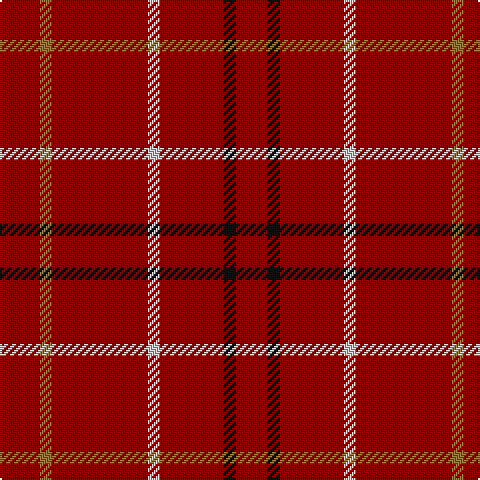

In pattern [RGRWRKR](/stripes/rgrwrkr/).

This was sourced from register-of-tartans.  It is a [7 stripe tartan](/stripes/stripes7/).

Original link https://www.tartanregister.gov.uk/tartanDetails.aspx?ref=3465

## Register references

External register numbers recorded for this tartan.

- Scottish Register of Tartans: [3465](https://www.tartanregister.gov.uk/tartanDetails.aspx?ref=3465)
- Scottish Tartans Authority (ITI): 5438

## Thread count
DR/20 LT6 DR48 N6 DR32 K6 DR/16

## Palette
Each colour and its ΔE from the base-6 reference it is a variant of.

| Colour | Shade | Base | ΔE (OKLab) |
|---|---|---|---|
| DR | <code style="background-color:#880000;">#880000</code> `#880000` | R <code style="background-color:#CC0000;">#CC0000</code> | 0.15 |
| K | <code style="background-color:#101010;">#101010</code> `#101010` | K <code style="background-color:#000000;">#000000</code> | 0.17 |
| LT | <code style="background-color:#8C7038;">#8C7038</code> `#8C7038` | G <code style="background-color:#006100;">#006100</code> | 0.18 |
| N | <code style="background-color:#C0C0C0;">#C0C0C0</code> `#C0C0C0` | W <code style="background-color:#F7F7F7;">#F7F7F7</code> | 0.17 |

# Sample pattern

## Nearest tartans

The nearest existing variants by ΔTartan distance.

1. [Brooks Brothers Tattersall Red](/setts/s5/db1r9db2r9lo1~x4/) — ΔT 1.65
1. [Killiechassie](/setts/s6/r2dy1r4r1r12lo1~x2/) — ΔT 2.12
1. [Dunbar, John Telfer (Personal)](/setts/s7/o5k2o28k10o26k4o4~x2/) — ΔT 2.38
1. [Fernie (Personal)](/setts/s6/r25dt5o2r12o1w1~x2/) — ΔT 2.63
1. [Scott Htg (Error 2)](/setts/s8/r3dy16dy10r3dy3lb2dy3r3~x2/) — ΔT 2.64
1. [Rose](/setts/s9/dg2r28db6r5db2r2db2r11lr2~x2/) — ΔT 2.71
1. [Rose](/setts/s9/dg2r28db6r5db2r2db2r11lr2/) — ΔT 2.71
1. [Highland Spring (1988)](/setts/s6/dp3g1dp9r3~x4/) — ΔT 2.75
1. [University of Chicago (Corporate)](/setts/s8/r32k2r4k2r2k8r30lb3~x2/) — ΔT 2.77
1. [Oman RAF, Sultanate of (Military)](/setts/s6/dy9t3dy6t3dy20ly2~x2/) — ΔT 2.80

## Neighbour map

Every grey dot is one of 14299 variants placed by the first two principal components of the ΔTartan feature space (44% of its variance). Red is this tartan; blue dots are its nearest — click one to open its page.

<svg viewBox="0 0 640 380" role="img" style="max-width:100%;height:auto;border:1px solid #e0e0e0;border-radius:4px;display:block" xmlns="http://www.w3.org/2000/svg"><image href="/nn/cloud.v1.png" width="640" height="380"/><a href="/setts/s5/db1r9db2r9lo1~x4/"><circle cx="606.7" cy="273.8" r="4" fill="#3465a4"><title>Brooks Brothers Tattersall Red</title></circle></a><a href="/setts/s6/r2dy1r4r1r12lo1~x2/"><circle cx="626.0" cy="232.3" r="4" fill="#3465a4"><title>Killiechassie</title></circle></a><a href="/setts/s7/o5k2o28k10o26k4o4~x2/"><circle cx="602.2" cy="250.8" r="4" fill="#3465a4"><title>Dunbar, John Telfer (Personal)</title></circle></a><a href="/setts/s6/r25dt5o2r12o1w1~x2/"><circle cx="573.5" cy="161.4" r="4" fill="#3465a4"><title>Fernie (Personal)</title></circle></a><a href="/setts/s8/r3dy16dy10r3dy3lb2dy3r3~x2/"><circle cx="511.7" cy="252.2" r="4" fill="#3465a4"><title>Scott Htg (Error 2)</title></circle></a><a href="/setts/s9/dg2r28db6r5db2r2db2r11lr2~x2/"><circle cx="507.9" cy="156.5" r="4" fill="#3465a4"><title>Rose</title></circle></a><a href="/setts/s9/dg2r28db6r5db2r2db2r11lr2/"><circle cx="507.9" cy="156.5" r="4" fill="#3465a4"><title>Rose</title></circle></a><a href="/setts/s6/dp3g1dp9r3~x4/"><circle cx="551.8" cy="265.0" r="4" fill="#3465a4"><title>Highland Spring (1988)</title></circle></a><a href="/setts/s8/r32k2r4k2r2k8r30lb3~x2/"><circle cx="564.6" cy="175.0" r="4" fill="#3465a4"><title>University of Chicago (Corporate)</title></circle></a><a href="/setts/s6/dy9t3dy6t3dy20ly2~x2/"><circle cx="559.0" cy="256.1" r="4" fill="#3465a4"><title>Oman RAF, Sultanate of (Military)</title></circle></a><circle cx="590.1" cy="243.9" r="5" fill="#c00000"/></svg>

ID: /setts/s7/r10y3r24lb3r16k3r8~x2/
