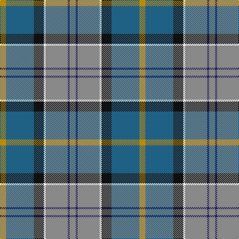

In pattern [RBRWKBY](/patterns/rbrwkby/).

This was sourced from register-of-tartans.  It is a [7 stripes tartan](/stripes/stripes7/).

Original link https://www.tartanregister.gov.uk/tartanDetails.aspx?ref=1384

## Attestations

This cloth appears in 2 source records; the oldest owns this page.

- 01/01/1984 — Glen Lyon (Fashion) (register-of-tartans, [record](https://www.tartanregister.gov.uk/tartanDetails.aspx?ref=1384))
- pre 1984 — Glen Lyon (Fashion) (tartans-authority, [record](http://www.tartansauthority.com/tartan-ferret/display/5013/))

## Thread count
DY/12 B56 K20 W4 N44 DB4 N/12

## Palette
Each colour and its ΔE from the base-6 reference it is a variant of.

| Colour | Shade | Base | ΔE (OKLab) |
|---|---|---|---|
| B | <code style="background-color:#206084;">#206084</code> `#206084` | B <code style="background-color:#2C4084;">#2C4084</code> | 0.09 |
| DB | <code style="background-color:#1C1C50;">#1C1C50</code> `#1C1C50` | B <code style="background-color:#2C4084;">#2C4084</code> | 0.14 |
| DY | <code style="background-color:#BC8C00;">#BC8C00</code> `#BC8C00` | Y <code style="background-color:#E8C000;">#E8C000</code> | 0.16 |
| K | <code style="background-color:#101010;">#101010</code> `#101010` | K <code style="background-color:#000000;">#000000</code> | 0.17 |
| N | <code style="background-color:#888888;">#888888</code> `#888888` | R <code style="background-color:#C80000;">#C80000</code> | 0.24 |
| W | <code style="background-color:#FCFCFC;">#FCFCFC</code> `#FCFCFC` | W <code style="background-color:#F4F4F0;">#F4F4F0</code> | 0.03 |

# Sample pattern

ID: /setts/s7/r12b4r44w4k20ba56y12-b1c1c50-ba206084-k101010-r888888-wfcfcfc-ybc8c00/
