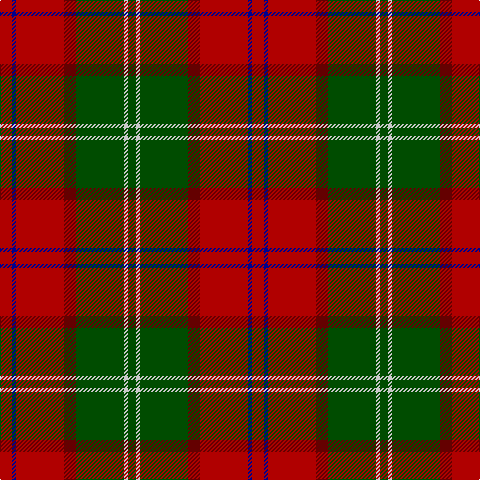

In pattern [GWGRRBR](/patterns/gwgrrbr/).

This was sourced from register-of-tartans.  It is a [7 stripes tartan](/stripes/stripes7/).

Original link https://www.tartanregister.gov.uk/tartanDetails.aspx?ref=2078

## Attestations

This cloth appears in 2 source records; the oldest owns this page.

- 01/01/1988 — Leckie (Personal) (register-of-tartans, [record](https://www.tartanregister.gov.uk/tartanDetails.aspx?ref=2078))
- 1988 — Leckie (Personal) (tartans-authority, [record](http://www.tartansauthority.com/tartan-ferret/display/5405/))

## Thread count
DR/12 DB4 DR48 DRa12 G48 N4 G/8

## Palette
Each colour and its ΔE from the base-6 reference it is a variant of.

| Colour | Shade | Base | ΔE (OKLab) |
|---|---|---|---|
| DB | <code style="background-color:#00008C;">#00008C</code> `#00008C` | B <code style="background-color:#2C4084;">#2C4084</code> | 0.13 |
| DR | <code style="background-color:#B00000;">#B00000</code> `#B00000` | R <code style="background-color:#C80000;">#C80000</code> | 0.05 |
| DRa | <code style="background-color:#640000;">#640000</code> `#640000` | R <code style="background-color:#C80000;">#C80000</code> | 0.22 |
| G | <code style="background-color:#004C00;">#004C00</code> `#004C00` | G <code style="background-color:#006400;">#006400</code> | 0.08 |
| N | <code style="background-color:#C8C8C8;">#C8C8C8</code> `#C8C8C8` | W <code style="background-color:#F4F4F0;">#F4F4F0</code> | 0.13 |

# Sample pattern

## Nearest tartans

The nearest existing variants by ΔTartan distance.

1. [Spragg, Andrew](/setts/s7/r4g32ra2r4ra24y2ga2-g165041-ga547c73-ra62a2a-racc1100-yffe600/) — ΔT 0.98
1. [Wellmont Foundation (Corporate)](/setts/s7/b24w4b26g6ga4r48ga6-b14283c-g003820-ga006818-ra40000-wfcfcfc/) — ΔT 1.10
1. [Lennox](/setts/s7/g8y4g40r8ra40r4ra8-g006818-r880000-rac80000-yb8b8b8/) — ΔT 1.11
1. [Turnbull Dress](/setts/s5/k12b6g60r60y6-b2c2c80-g006818-k101010-rc80000-yd8b000/) — ΔT 1.12
1. [Plummer Family Personal Tartan Tartan Number: 2778. Earliest known date: 2001 From a D C Dalgliesh swatch in 2001 via Phil Smith June 2004. See products available Copyright © Blair Urquhart, Comrie, 2015](/setts/s6/r60k16g60b8r6b4-b1860a8-g005028-k101010-rc80000/) — ΔT 1.13
1. [Lennox District Tartan Tartan Number: 935. Earliest known date: pre 1600 Families with the surname 'Lennox' are usually considered related to Clans Stewart or MacFarlane. Some of this surname also choose to wear the distinctive and ancient 'Lennox' tartan. D W Stewart reproduced the sett from a 'lost' portrait of the Countess of Lennox dating from the 16th century. See products available Copyright © Blair Urquhart, Comrie, 2015](/setts/s7/g4w2g20r4ra20r2ra4-g006818-r880000-rac80000-we0e0e0/) — ΔT 1.14
1. [Ulster Ancestry (Fashion)](/setts/s9/b94r16k44r14w6r48b18r20y6-b5c5c5c-k101010-rc80000-we8ccb8-ybc8c00/) — ΔT 1.17
1. [Bronte](/setts/s5/g48b4r50y4k6-b1870a4-g408060-k101010-rc80000-ye8c000/) — ΔT 1.17
1. [MacNab 6](/setts/s7/g56r14ra14g28ra14r96k8-g008000-k000000-rc00000-ra802040/) — ΔT 1.18
1. [MacDuff](/setts/s7/r96b16g34ga48r18k6r9-b304080-g003000-ga008000-k000000-rc00000/) — ΔT 1.19

## Neighbour map

Every grey dot is one of 15726 variants placed by the first two principal components of the ΔTartan feature space (44% of its variance). Red is this tartan; blue dots are its nearest — click one to open its page.

<svg viewBox="0 0 640 380" role="img" style="max-width:100%;height:auto;border:1px solid #e0e0e0;border-radius:4px;display:block" xmlns="http://www.w3.org/2000/svg"><image href="/nn/cloud.v1.png" width="640" height="380"/><a href="/setts/s7/r4g32ra2r4ra24y2ga2-g165041-ga547c73-ra62a2a-racc1100-yffe600/"><circle cx="300.3" cy="151.7" r="4" fill="#3465a4"><title>Spragg, Andrew</title></circle></a><a href="/setts/s7/b24w4b26g6ga4r48ga6-b14283c-g003820-ga006818-ra40000-wfcfcfc/"><circle cx="246.0" cy="177.7" r="4" fill="#3465a4"><title>Wellmont Foundation (Corporate)</title></circle></a><a href="/setts/s7/g8y4g40r8ra40r4ra8-g006818-r880000-rac80000-yb8b8b8/"><circle cx="284.2" cy="196.5" r="4" fill="#3465a4"><title>Lennox</title></circle></a><a href="/setts/s5/k12b6g60r60y6-b2c2c80-g006818-k101010-rc80000-yd8b000/"><circle cx="234.6" cy="193.6" r="4" fill="#3465a4"><title>Turnbull Dress</title></circle></a><a href="/setts/s6/r60k16g60b8r6b4-b1860a8-g005028-k101010-rc80000/"><circle cx="278.9" cy="186.1" r="4" fill="#3465a4"><title>Plummer Family Personal Tartan Tartan Number: 2778. Earliest known date: 2001 From a D C Dalgliesh swatch in 2001 via Phil Smith June 2004. See products available Copyright © Blair Urquhart, Comrie, 2015</title></circle></a><a href="/setts/s7/g4w2g20r4ra20r2ra4-g006818-r880000-rac80000-we0e0e0/"><circle cx="276.4" cy="193.0" r="4" fill="#3465a4"><title>Lennox District Tartan Tartan Number: 935. Earliest known date: pre 1600 Families with the surname 'Lennox' are usually considered related to Clans Stewart or MacFarlane. Some of this surname also choose to wear the distinctive and ancient 'Lennox' tartan. D W Stewart reproduced the sett from a 'lost' portrait of the Countess of Lennox dating from the 16th century. See products available Copyright © Blair Urquhart, Comrie, 2015</title></circle></a><a href="/setts/s9/b94r16k44r14w6r48b18r20y6-b5c5c5c-k101010-rc80000-we8ccb8-ybc8c00/"><circle cx="251.7" cy="154.0" r="4" fill="#3465a4"><title>Ulster Ancestry (Fashion)</title></circle></a><a href="/setts/s5/g48b4r50y4k6-b1870a4-g408060-k101010-rc80000-ye8c000/"><circle cx="283.0" cy="181.7" r="4" fill="#3465a4"><title>Bronte</title></circle></a><a href="/setts/s7/g56r14ra14g28ra14r96k8-g008000-k000000-rc00000-ra802040/"><circle cx="288.9" cy="186.7" r="4" fill="#3465a4"><title>MacNab 6</title></circle></a><a href="/setts/s7/r96b16g34ga48r18k6r9-b304080-g003000-ga008000-k000000-rc00000/"><circle cx="292.7" cy="159.3" r="4" fill="#3465a4"><title>MacDuff</title></circle></a><circle cx="273.2" cy="178.7" r="5" fill="#c00000"/></svg>

ID: /setts/s7/r12b4r48ra12g48w4g8-b00008c-g004c00-rb00000-ra640000-wc8c8c8/
