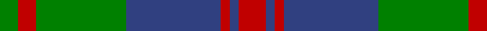

In pattern [GRGBRBR](/patterns/grgbrbr/).

This was sourced from weddslist.  It is a [7 stripes tartan](/stripes/stripes7/).

Original link http://www.weddslist.com/cgi-bin/tartans/pg.pl?source=sts

## Thread count
G/8 R8 G40 B42 R4 B4 R/12

## Palette
Each colour and its ΔE from the base-6 reference it is a variant of.

| Colour | Shade | Base | ΔE (OKLab) |
|---|---|---|---|
| B | <code style="background-color:#304080;">#304080</code> `#304080` | B <code style="background-color:#2C4084;">#2C4084</code> | 0.01 |
| G | <code style="background-color:#008000;">#008000</code> `#008000` | G <code style="background-color:#006400;">#006400</code> | 0.09 |
| R | <code style="background-color:#C00000;">#C00000</code> `#C00000` | R <code style="background-color:#C80000;">#C80000</code> | 0.02 |

# Sample pattern

## Nearest tartans

The nearest existing variants by ΔTartan distance.

1. [Logan](/setts/s7/b32r12b4r12g56r12b4-b304080-g008000-rc00000/) — ΔT 0.65
1. [Robertson of Struan](/setts/s7/r12b4r4b42g40r8g8-b2c4084-g005020-rdc0000/) — ΔT 0.89
1. [Logan, or Skene](/setts/s7/b18r6b2r6g18r6b2-b304080-g008000-rc00000/) — ΔT 0.95
1. [Logan](/setts/s7/b32r12b4r12g56r12b4-b2c4084-g005020-rdc0000/) — ΔT 0.96
1. [Chindecella Gorse (Personal)](/setts/s8/y14b8y4b8y46ba38b38ba8-b1c1c50-ba5c5c5c-ybc8c00/) — ΔT 1.06
1. [Skene - 1831 (Clan)](/setts/s7/b24r12g4r12g48r12g4-b202060-g006818-rc80000/) — ΔT 1.07
1. [Heil, Rudiger (Personal)](/setts/s8/y12b4y4b4y36b26ba26b4-b5c5c5c-ba003c64-ybc8c00/) — ΔT 1.08
1. [Skene](/setts/s7/b12r6g2r6g24r6g2-b304080-g008000-rc00000/) — ΔT 1.08
1. [Logan #5](/setts/s6/b18r6b2g18r6b2-b2c2c80-g006818-rc80000/) — ΔT 1.12
1. [Kildonan Green (Fashion)](/setts/s9/g44ga6g6ga6g6ga18y56ga6y12-g006818-ga003820-ya0a0a0/) — ΔT 1.13

## Neighbour map

Every grey dot is one of 15726 variants placed by the first two principal components of the ΔTartan feature space (44% of its variance). Red is this tartan; blue dots are its nearest — click one to open its page.

<svg viewBox="0 0 640 380" role="img" style="max-width:100%;height:auto;border:1px solid #e0e0e0;border-radius:4px;display:block" xmlns="http://www.w3.org/2000/svg"><image href="/nn/cloud.v1.png" width="640" height="380"/><a href="/setts/s7/b32r12b4r12g56r12b4-b304080-g008000-rc00000/"><circle cx="277.8" cy="204.0" r="4" fill="#3465a4"><title>Logan</title></circle></a><a href="/setts/s7/r12b4r4b42g40r8g8-b2c4084-g005020-rdc0000/"><circle cx="282.1" cy="224.7" r="4" fill="#3465a4"><title>Robertson of Struan</title></circle></a><a href="/setts/s7/b18r6b2r6g18r6b2-b304080-g008000-rc00000/"><circle cx="234.1" cy="230.9" r="4" fill="#3465a4"><title>Logan, or Skene</title></circle></a><a href="/setts/s7/b32r12b4r12g56r12b4-b2c4084-g005020-rdc0000/"><circle cx="286.7" cy="206.8" r="4" fill="#3465a4"><title>Logan</title></circle></a><a href="/setts/s8/y14b8y4b8y46ba38b38ba8-b1c1c50-ba5c5c5c-ybc8c00/"><circle cx="230.2" cy="209.2" r="4" fill="#3465a4"><title>Chindecella Gorse (Personal)</title></circle></a><a href="/setts/s7/b24r12g4r12g48r12g4-b202060-g006818-rc80000/"><circle cx="297.5" cy="214.9" r="4" fill="#3465a4"><title>Skene - 1831 (Clan)</title></circle></a><a href="/setts/s8/y12b4y4b4y36b26ba26b4-b5c5c5c-ba003c64-ybc8c00/"><circle cx="278.1" cy="224.6" r="4" fill="#3465a4"><title>Heil, Rudiger (Personal)</title></circle></a><a href="/setts/s7/b12r6g2r6g24r6g2-b304080-g008000-rc00000/"><circle cx="296.5" cy="214.7" r="4" fill="#3465a4"><title>Skene</title></circle></a><a href="/setts/s6/b18r6b2g18r6b2-b2c2c80-g006818-rc80000/"><circle cx="258.9" cy="240.1" r="4" fill="#3465a4"><title>Logan #5</title></circle></a><a href="/setts/s9/g44ga6g6ga6g6ga18y56ga6y12-g006818-ga003820-ya0a0a0/"><circle cx="256.7" cy="204.4" r="4" fill="#3465a4"><title>Kildonan Green (Fashion)</title></circle></a><circle cx="266.9" cy="218.5" r="5" fill="#c00000"/></svg>

ID: /setts/s7/r12b4r4b42g40r8g8-b304080-g008000-rc00000/
