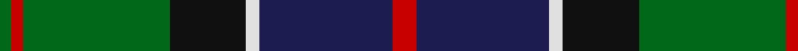
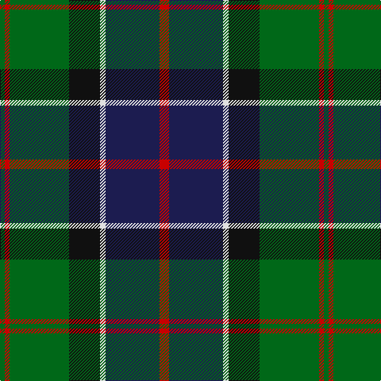

In pattern [GRGKWBR](/patterns/grgkwbr/).

This was sourced from tartans-authority.  It is a [7 stripes tartan](/stripes/stripes7/).

Original link http://www.tartansauthority.com/tartan-ferret/display/8144/

## Thread count
G/6 R6 G75 K39 LN7 DB68 R/12

## Palette
Each colour and its ΔE from the base-6 reference it is a variant of.

| Colour | Shade | Base | ΔE (OKLab) |
|---|---|---|---|
| DB | <code style="background-color:#1C1C50;">#1C1C50</code> `#1C1C50` | B <code style="background-color:#2A418A;">#2A418A</code> | 0.14 |
| G | <code style="background-color:#006818;">#006818</code> `#006818` | G <code style="background-color:#006100;">#006100</code> | 0.02 |
| K | <code style="background-color:#101010;">#101010</code> `#101010` | K <code style="background-color:#000000;">#000000</code> | 0.17 |
| LN | <code style="background-color:#E0E0E0;">#E0E0E0</code> `#E0E0E0` | W <code style="background-color:#F7F7F7;">#F7F7F7</code> | 0.07 |
| R | <code style="background-color:#C80000;">#C80000</code> `#C80000` | R <code style="background-color:#CC0000;">#CC0000</code> | 0.01 |

# Sample pattern

## Nearest tartans

The nearest existing variants by ΔTartan distance.

1. [Tait #1](/setts/s8/r5k2b19g4k19g28k2y5~b2c2c80-g006818-k101010-rc80000-ye8c000~x2/) — ΔT 0.48
1. [Genet, Citizen (Commem)](/setts/s7/r2k9g12b8r1b1w1~b1c0070-g006818-k101010-rc80000-we0e0e0~x4/) — ΔT 0.54
1. [Paterson (Personal)](/setts/s7/g3b12w1k12g13r2g2~b2c2c80-g006818-k101010-rc80000-wfcfcfc~x2/) — ΔT 0.56
1. [Mantle (Personal)](/setts/s8/g3b16w2k14g18r3g2r3~b2c2c80-g006818-k101010-r880000-we0e0e0~x2/) — ΔT 0.66
1. [MacLeod Clan Tartan Tartan Number: 1583. Earliest known date: 1831 This design appears in many early collections including Logans 'The Scottish Gael'(1831) and Smibert (1850). The sett has its source in the MacKenzie tartan used in 1777 by John MacKenzie called Lord MacLeod when he raised a regiment called 'Lord MacLeod's Highlanders'. The family claimed to be heirs of the last chief of Lewis, Roderick, who had died in 1595. (Tartans of Clan MacLeod. Rhuairidh MacLeod (1990).) This tartan was approved by Chief Norman Magnus, 26th Chief, in 1910, and has been the usual modern sett since then. The present Chief, John MacLeod, lives in Dunvegan Castle, Skye. See products available Copyright © Blair Urquhart, Comrie, 2015](/setts/s7/r3k2g15k10b20k2y2~b2c2c80-g006818-k101010-rc80000-ye8c000~x2/) — ΔT 0.68
1. [MacWilliams Wedding Personal Tartan Tartan Number: 7667. Earliest known date: 2008 Designed by Bisell McWilliams for his wedding. Details from Matt Newsome. See products available Copyright © Blair Urquhart, Comrie, 2015](/setts/s9/g2b1k1b14ka2b1k12g10r2~b506878-g006818-k101010-ka000000-rd40000~x2/) — ΔT 0.71
1. [Guelph, City Of](/setts/s8/g12k1g2r1g2k10b10y1~b1c0070-g006818-k101010-r880000-yd09800~x4/) — ΔT 0.71
1. [Colquhoun (Clan)](/setts/s7/b5k10b48k72w12g48r5~b1c1c50-g285800-k101010-rc80000-wfcfcfc/) — ΔT 0.73
1. [MacLeod Small Clan Tartan Tartan Number: 15833. Earliest known date: See products available Copyright © Blair Urquhart, Comrie, 2015](/setts/s7/r1k1g7k5b10k1y1~b2c2c80-g006818-k101010-rc80000-ye8c000~x2/) — ΔT 0.75
1. [MacCaskill Family Tartan Tartan Number: 1152. Earliest known date: 1951 Miss M.MacDougal of the Inverness Museum wrote (7th September 1951) :- ''Herewith pattern of the MacAskill which Messrs Pringle made at the request of an old man of this name. As you can see it is a variant of the MacLeod...?" . . . wherein the colors of stripes and their guards are reversed. Designed for a farmer - Kenneth MacAskill, Milton of Leys. See products available Copyright © Blair Urquhart, Comrie, 2015](/setts/s7/k2r1g15k15b15y1k2~b2c2c80-g006818-k101010-rc80000-ye8c000~x2/) — ΔT 0.76

## Neighbour map

Every grey dot is one of 15726 variants placed by the first two principal components of the ΔTartan feature space (44% of its variance). Red is this tartan; blue dots are its nearest — click one to open its page.

<svg viewBox="0 0 640 380" role="img" style="max-width:100%;height:auto;border:1px solid #e0e0e0;border-radius:4px;display:block" xmlns="http://www.w3.org/2000/svg"><image href="/nn/cloud.v1.png" width="640" height="380"/><a href="/setts/s8/r5k2b19g4k19g28k2y5~b2c2c80-g006818-k101010-rc80000-ye8c000~x2/"><circle cx="181.2" cy="168.9" r="4" fill="#3465a4"><title>Tait #1</title></circle></a><a href="/setts/s7/r2k9g12b8r1b1w1~b1c0070-g006818-k101010-rc80000-we0e0e0~x4/"><circle cx="167.4" cy="180.1" r="4" fill="#3465a4"><title>Genet, Citizen (Commem)</title></circle></a><a href="/setts/s7/g3b12w1k12g13r2g2~b2c2c80-g006818-k101010-rc80000-wfcfcfc~x2/"><circle cx="197.5" cy="190.6" r="4" fill="#3465a4"><title>Paterson (Personal)</title></circle></a><a href="/setts/s8/g3b16w2k14g18r3g2r3~b2c2c80-g006818-k101010-r880000-we0e0e0~x2/"><circle cx="171.3" cy="191.2" r="4" fill="#3465a4"><title>Mantle (Personal)</title></circle></a><a href="/setts/s7/r3k2g15k10b20k2y2~b2c2c80-g006818-k101010-rc80000-ye8c000~x2/"><circle cx="181.3" cy="190.8" r="4" fill="#3465a4"><title>MacLeod Clan Tartan Tartan Number: 1583. Earliest known date: 1831 This design appears in many early collections including Logans 'The Scottish Gael'(1831) and Smibert (1850). The sett has its source in the MacKenzie tartan used in 1777 by John MacKenzie called Lord MacLeod when he raised a regiment called 'Lord MacLeod's Highlanders'. The family claimed to be heirs of the last chief of Lewis, Roderick, who had died in 1595. (Tartans of Clan MacLeod. Rhuairidh MacLeod (1990).) This tartan was approved by Chief Norman Magnus, 26th Chief, in 1910, and has been the usual modern sett since then. The present Chief, John MacLeod, lives in Dunvegan Castle, Skye. See products available Copyright © Blair Urquhart, Comrie, 2015</title></circle></a><a href="/setts/s9/g2b1k1b14ka2b1k12g10r2~b506878-g006818-k101010-ka000000-rd40000~x2/"><circle cx="196.5" cy="161.2" r="4" fill="#3465a4"><title>MacWilliams Wedding Personal Tartan Tartan Number: 7667. Earliest known date: 2008 Designed by Bisell McWilliams for his wedding. Details from Matt Newsome. See products available Copyright © Blair Urquhart, Comrie, 2015</title></circle></a><a href="/setts/s8/g12k1g2r1g2k10b10y1~b1c0070-g006818-k101010-r880000-yd09800~x4/"><circle cx="216.6" cy="182.9" r="4" fill="#3465a4"><title>Guelph, City Of</title></circle></a><a href="/setts/s7/b5k10b48k72w12g48r5~b1c1c50-g285800-k101010-rc80000-wfcfcfc/"><circle cx="204.4" cy="178.9" r="4" fill="#3465a4"><title>Colquhoun (Clan)</title></circle></a><a href="/setts/s7/r1k1g7k5b10k1y1~b2c2c80-g006818-k101010-rc80000-ye8c000~x2/"><circle cx="192.9" cy="190.3" r="4" fill="#3465a4"><title>MacLeod Small Clan Tartan Tartan Number: 15833. Earliest known date: See products available Copyright © Blair Urquhart, Comrie, 2015</title></circle></a><a href="/setts/s7/k2r1g15k15b15y1k2~b2c2c80-g006818-k101010-rc80000-ye8c000~x2/"><circle cx="219.2" cy="182.3" r="4" fill="#3465a4"><title>MacCaskill Family Tartan Tartan Number: 1152. Earliest known date: 1951 Miss M.MacDougal of the Inverness Museum wrote (7th September 1951) :- ''Herewith pattern of the MacAskill which Messrs Pringle made at the request of an old man of this name. As you can see it is a variant of the MacLeod...?&quot; . . . wherein the colors of stripes and their guards are reversed. Designed for a farmer - Kenneth MacAskill, Milton of Leys. See products available Copyright © Blair Urquhart, Comrie, 2015</title></circle></a><circle cx="193.7" cy="179.5" r="5" fill="#c00000"/></svg>

ID: /setts/s7/r12b68w7k39g75r6g6~b1c1c50-g006818-k101010-rc80000-we0e0e0/
