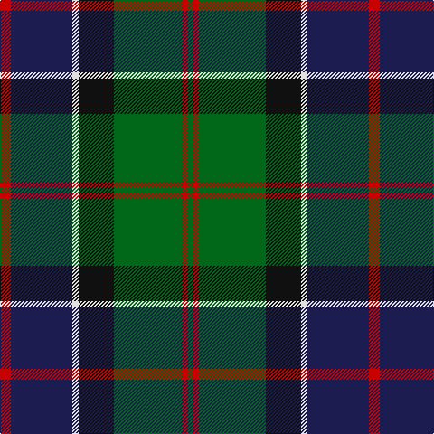

In pattern [GRGKWBR](/stripes/grgkwbr/).

This was sourced from tartans-authority.  It is a [7 stripe tartan](/stripes/stripes7/).

Original link http://www.tartansauthority.com/tartan-ferret/display/8144/

## Thread count
R/12 DB68 LN7 K39 G75 R6 G/6

## Palette
Each colour and the base-6 reference it is a variant of.

| Colour | Shade | Base |
|---|---|---|
| DB | <code style="background-color:#1C1C50;">#1C1C50</code> `oklch(26.2% 0.093 277.9)` <small>#1C1C50</small> | B <code style="background-color:#2A418A;">#2A418A</code> |
| G | <code style="background-color:#006818;">#006818</code> `oklch(45.0% 0.142 145.0)` <small>#006818</small> | G <code style="background-color:#006100;">#006100</code> |
| K | <code style="background-color:#101010;">#101010</code> `oklch(17.3% 0.000 89.9)` <small>#101010</small> | K <code style="background-color:#000000;">#000000</code> |
| LN | <code style="background-color:#E0E0E0;">#E0E0E0</code> `oklch(90.7% 0.000 89.9)` <small>#E0E0E0</small> | W <code style="background-color:#F7F7F7;">#F7F7F7</code> |
| R | <code style="background-color:#C80000;">#C80000</code> `oklch(52.3% 0.215 29.2)` <small>#C80000</small> | R <code style="background-color:#CC0000;">#CC0000</code> |

# Sample pattern

## Nearest tartans

The nearest existing variants by ΔTartan distance.

1. [Tait #1](/setts/s8/r5k2db19g4k19g28k2ly5~x2/) — ΔT 0.48
1. [Genet, Citizen (Commem)](/setts/s7/r2k9g12db8r1db1w1~x4/) — ΔT 0.54
1. [Paterson (Personal)](/setts/s7/g3db12w1k12g13r2g2~x2/) — ΔT 0.56
1. [Mantle (Personal)](/setts/s8/r3g2r3g18k14w2db16g3~x2/) — ΔT 0.66
1. [MacWilliams Wedding Personal Tartan Tartan Number: 7667. Earliest known date: 2008 Designed by Bisell McWilliams for his wedding. Details from Matt Newsome. See products available Copyright © Blair Urquhart, Comrie, 2015](/setts/s9/r2g10k12n1k2n14k1n1g2~x2/) — ΔT 0.71
1. [Guelph, City Of](/setts/s8/g12k1g2r1g2k10db10lo1~x4/) — ΔT 0.71
1. [Colquhoun (Clan)](/setts/s7/db5k10db48k72w12dg48r5/) — ΔT 0.73
1. [MacLeod Small Clan Tartan Tartan Number: 15833. Earliest known date: See products available Copyright © Blair Urquhart, Comrie, 2015](/setts/s7/r1k1g7k5db10k1ly1~x2/) — ΔT 0.74
1. [Scotch House 2000 Original](/setts/s8/db22r3db2r3db2k17g18lo4~x2/) — ΔT 0.78
1. [Greenock](/setts/s7/g2k2g17k16r2db17ly2~x2/) — ΔT 0.80

## Neighbour map

Every grey dot is one of 14299 variants placed by the first two principal components of the ΔTartan feature space (44% of its variance). Red is this tartan; blue dots are its nearest — click one to open its page.

<svg viewBox="0 0 640 380" role="img" style="max-width:100%;height:auto;border:1px solid #e0e0e0;border-radius:4px;display:block" xmlns="http://www.w3.org/2000/svg"><image href="/nn/cloud.v1.png" width="640" height="380"/><a href="/setts/s8/r5k2db19g4k19g28k2ly5~x2/"><circle cx="184.4" cy="172.1" r="4" fill="#3465a4"><title>Tait #1</title></circle></a><a href="/setts/s7/r2k9g12db8r1db1w1~x4/"><circle cx="170.9" cy="183.2" r="4" fill="#3465a4"><title>Genet, Citizen (Commem)</title></circle></a><a href="/setts/s7/g3db12w1k12g13r2g2~x2/"><circle cx="200.8" cy="194.5" r="4" fill="#3465a4"><title>Paterson (Personal)</title></circle></a><a href="/setts/s8/r3g2r3g18k14w2db16g3~x2/"><circle cx="174.6" cy="195.8" r="4" fill="#3465a4"><title>Mantle (Personal)</title></circle></a><a href="/setts/s9/r2g10k12n1k2n14k1n1g2~x2/"><circle cx="199.7" cy="166.4" r="4" fill="#3465a4"><title>MacWilliams Wedding Personal Tartan Tartan Number: 7667. Earliest known date: 2008 Designed by Bisell McWilliams for his wedding. Details from Matt Newsome. See products available Copyright © Blair Urquhart, Comrie, 2015</title></circle></a><a href="/setts/s8/g12k1g2r1g2k10db10lo1~x4/"><circle cx="220.1" cy="187.8" r="4" fill="#3465a4"><title>Guelph, City Of</title></circle></a><a href="/setts/s7/db5k10db48k72w12dg48r5/"><circle cx="207.6" cy="181.8" r="4" fill="#3465a4"><title>Colquhoun (Clan)</title></circle></a><a href="/setts/s7/r1k1g7k5db10k1ly1~x2/"><circle cx="196.3" cy="194.4" r="4" fill="#3465a4"><title>MacLeod Small Clan Tartan Tartan Number: 15833. Earliest known date: See products available Copyright © Blair Urquhart, Comrie, 2015</title></circle></a><a href="/setts/s8/db22r3db2r3db2k17g18lo4~x2/"><circle cx="188.4" cy="189.3" r="4" fill="#3465a4"><title>Scotch House 2000 Original</title></circle></a><a href="/setts/s7/g2k2g17k16r2db17ly2~x2/"><circle cx="166.9" cy="204.0" r="4" fill="#3465a4"><title>Greenock</title></circle></a><circle cx="196.9" cy="183.3" r="5" fill="#c00000"/></svg>

ID: /setts/s7/r12db68w7k39g75r6g6/
