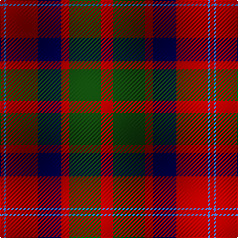

In pattern [RBRBRGR](/patterns/rbrbrgr/).

This was sourced from weddslist.  It is a [7 stripes tartan](/stripes/stripes7/).

Original link http://www.weddslist.com/cgi-bin/tartans/pg.pl?source=tinsel

## Thread count
DR/4 B2 DR32 DB24 DR8 DG32 DR/12

## Palette
Each colour and its ΔE from the base-6 reference it is a variant of.

| Colour | Shade | Base | ΔE (OKLab) |
|---|---|---|---|
| B | <code style="background-color:#4367AE;">#4367AE</code> `#4367AE` | B <code style="background-color:#2A418A;">#2A418A</code> | 0.12 |
| DB | <code style="background-color:#000052;">#000052</code> `#000052` | B <code style="background-color:#2A418A;">#2A418A</code> | 0.20 |
| DG | <code style="background-color:#11450D;">#11450D</code> `#11450D` | G <code style="background-color:#006100;">#006100</code> | 0.09 |
| DR | <code style="background-color:#AA0000;">#AA0000</code> `#AA0000` | R <code style="background-color:#CC0000;">#CC0000</code> | 0.07 |

# Sample pattern

## Nearest tartans

The nearest existing variants by ΔTartan distance.

1. [MacQuarrie LO](/setts/s7/r6g16r4b12r16ba1r2-b000052-ba4367ae-g11450d-raa0000/) — ΔT 0.00
1. [MacQuarrie LO](/setts/s7/r12g32r8b24r32w2r4-b000064-g004c00-rc80000-wd0d0d0/) — ΔT 0.82
1. [Finlaggan](/setts/s6/g14w2g36b12r36g4-b2c2c80-g003820-rc80000-we0e0e0/) — ΔT 0.82
1. [Fraser VS](/setts/s6/r2b12r2g12r24y2-b000052-g11450d-raa0000-yaaaaaa/) — ΔT 0.88
1. [Carrick (Strathmore) District Tartan Tartan Number: 3216. Earliest known date: c.1999 Sales help Princess Diana Memorial Trust See products available Copyright © Blair Urquhart, Comrie, 2015](/setts/s7/r56b24r6g40ba4g4r14-b202060-ba5c8ca8-g003820-rc80000/) — ΔT 0.89
1. [MacQuarrie #6](/setts/s7/r12g32r8b24r32ba2r4-b2c4084-ba3c82af-g005020-rdc0000/) — ΔT 0.94
1. [Fraser Green](/setts/s6/w8b48g24b4ba24b4-b4c0000-ba5c5c5c-g447438-wc0c0c0/) — ΔT 0.97
1. [Wyeth (Personal)](/setts/s8/b72r72ba8g48b4g48ba8r72-b2c2c80-ba780078-g006818-rc80000/) — ΔT 0.97
1. [MacBean/MacElvain](/setts/s7/k4r24b12r6g24r8b2-b2c4084-g005020-k101010-rdc0000/) — ΔT 0.98
1. [Finnlaggan](/setts/s6/g14w2g36b12r36g4-b304080-g003000-rc00000-we0e0e0/) — ΔT 1.01

## Neighbour map

Every grey dot is one of 15726 variants placed by the first two principal components of the ΔTartan feature space (44% of its variance). Red is this tartan; blue dots are its nearest — click one to open its page.

<svg viewBox="0 0 640 380" role="img" style="max-width:100%;height:auto;border:1px solid #e0e0e0;border-radius:4px;display:block" xmlns="http://www.w3.org/2000/svg"><image href="/nn/cloud.v1.png" width="640" height="380"/><a href="/setts/s7/r6g16r4b12r16ba1r2-b000052-ba4367ae-g11450d-raa0000/"><circle cx="288.5" cy="198.9" r="4" fill="#3465a4"><title>MacQuarrie LO</title></circle></a><a href="/setts/s7/r12g32r8b24r32w2r4-b000064-g004c00-rc80000-wd0d0d0/"><circle cx="267.5" cy="186.6" r="4" fill="#3465a4"><title>MacQuarrie LO</title></circle></a><a href="/setts/s6/g14w2g36b12r36g4-b2c2c80-g003820-rc80000-we0e0e0/"><circle cx="316.3" cy="195.7" r="4" fill="#3465a4"><title>Finlaggan</title></circle></a><a href="/setts/s6/r2b12r2g12r24y2-b000052-g11450d-raa0000-yaaaaaa/"><circle cx="298.0" cy="196.3" r="4" fill="#3465a4"><title>Fraser VS</title></circle></a><a href="/setts/s7/r56b24r6g40ba4g4r14-b202060-ba5c8ca8-g003820-rc80000/"><circle cx="308.2" cy="184.6" r="4" fill="#3465a4"><title>Carrick (Strathmore) District Tartan Tartan Number: 3216. Earliest known date: c.1999 Sales help Princess Diana Memorial Trust See products available Copyright © Blair Urquhart, Comrie, 2015</title></circle></a><a href="/setts/s7/r12g32r8b24r32ba2r4-b2c4084-ba3c82af-g005020-rdc0000/"><circle cx="284.8" cy="190.0" r="4" fill="#3465a4"><title>MacQuarrie #6</title></circle></a><a href="/setts/s6/w8b48g24b4ba24b4-b4c0000-ba5c5c5c-g447438-wc0c0c0/"><circle cx="287.0" cy="209.8" r="4" fill="#3465a4"><title>Fraser Green</title></circle></a><a href="/setts/s8/b72r72ba8g48b4g48ba8r72-b2c2c80-ba780078-g006818-rc80000/"><circle cx="250.5" cy="187.2" r="4" fill="#3465a4"><title>Wyeth (Personal)</title></circle></a><a href="/setts/s7/k4r24b12r6g24r8b2-b2c4084-g005020-k101010-rdc0000/"><circle cx="259.5" cy="198.0" r="4" fill="#3465a4"><title>MacBean/MacElvain</title></circle></a><a href="/setts/s6/g14w2g36b12r36g4-b304080-g003000-rc00000-we0e0e0/"><circle cx="314.8" cy="196.2" r="4" fill="#3465a4"><title>Finnlaggan</title></circle></a><circle cx="288.5" cy="198.9" r="5" fill="#c00000"/></svg>

ID: /setts/s7/r12g32r8b24r32ba2r4-b000052-ba4367ae-g11450d-raa0000/
