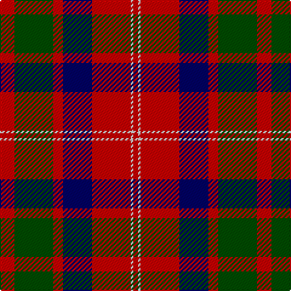

In pattern [RGRBRWR](/patterns/rgrbrwr/).

This was sourced from weddslist.  It is a [7 stripes tartan](/stripes/stripes7/).

Original link http://www.weddslist.com/cgi-bin/tartans/pg.pl?source=rb

## Thread count
R/12 G32 R8 DB24 R32 N2 R/4

## Palette
Each colour and its ΔE from the base-6 reference it is a variant of.

| Colour | Shade | Base | ΔE (OKLab) |
|---|---|---|---|
| DB | <code style="background-color:#000064;">#000064</code> `#000064` | B <code style="background-color:#2C4084;">#2C4084</code> | 0.17 |
| G | <code style="background-color:#004C00;">#004C00</code> `#004C00` | G <code style="background-color:#006400;">#006400</code> | 0.08 |
| N | <code style="background-color:#D0D0D0;">#D0D0D0</code> `#D0D0D0` | W <code style="background-color:#F4F4F0;">#F4F4F0</code> | 0.11 |
| R | <code style="background-color:#C80000;">#C80000</code> `#C80000` | R <code style="background-color:#C80000;">#C80000</code> | 0.00 |

# Sample pattern

## Nearest tartans

The nearest existing variants by ΔTartan distance.

1. [MacBean/MacElvain](/setts/s7/k4r24b12r6g24r8b2-b2c4084-g005020-k101010-rdc0000/) — ΔT 0.77
1. [MacQuarrie #6](/setts/s7/r12g32r8b24r32ba2r4-b2c4084-ba3c82af-g005020-rdc0000/) — ΔT 0.80
1. [Ruthven (V.S.) (Name)](/setts/s6/w12g30b36r60g4r8-b202060-g006818-rc80000-we0e0e0/) — ΔT 0.81
1. [MacQuarrie LO](/setts/s7/r12g32r8b24r32ba2r4-b000052-ba4367ae-g11450d-raa0000/) — ΔT 0.82
1. [MacQuarrie LO](/setts/s7/r6g16r4b12r16ba1r2-b000052-ba4367ae-g11450d-raa0000/) — ΔT 0.82
1. [James of Glencarr (Personal)](/setts/s8/b16r16g34w6r70b20g30w6-b2c2c80-g003820-rc80000-we0e0e0/) — ΔT 0.86
1. [New Glasgow (Canada)](/setts/s8/g56r8b50w10r44g54r8b4-b440044-g285800-rc80000-wfcfcfc/) — ΔT 0.86
1. [Fraser VS](/setts/s6/r1b6r1g6r12w1-b000064-g004c00-rc80000-wd0d0d0/) — ΔT 0.86
1. [MacBean, MacElvain](/setts/s7/k4r24b12r6g24r8b2-b304080-g008000-k000000-rc00000/) — ΔT 0.87
1. [Ruthven (V.S.)](/setts/s6/w12g30b36r60g4r8-b2c2c80-g006818-rc80000-we0e0e0/) — ΔT 0.90

## Neighbour map

Every grey dot is one of 15726 variants placed by the first two principal components of the ΔTartan feature space (44% of its variance). Red is this tartan; blue dots are its nearest — click one to open its page.

<svg viewBox="0 0 640 380" role="img" style="max-width:100%;height:auto;border:1px solid #e0e0e0;border-radius:4px;display:block" xmlns="http://www.w3.org/2000/svg"><image href="/nn/cloud.v1.png" width="640" height="380"/><a href="/setts/s7/k4r24b12r6g24r8b2-b2c4084-g005020-k101010-rdc0000/"><circle cx="259.5" cy="198.0" r="4" fill="#3465a4"><title>MacBean/MacElvain</title></circle></a><a href="/setts/s7/r12g32r8b24r32ba2r4-b2c4084-ba3c82af-g005020-rdc0000/"><circle cx="284.8" cy="190.0" r="4" fill="#3465a4"><title>MacQuarrie #6</title></circle></a><a href="/setts/s6/w12g30b36r60g4r8-b202060-g006818-rc80000-we0e0e0/"><circle cx="238.3" cy="184.7" r="4" fill="#3465a4"><title>Ruthven (V.S.) (Name)</title></circle></a><a href="/setts/s7/r12g32r8b24r32ba2r4-b000052-ba4367ae-g11450d-raa0000/"><circle cx="288.5" cy="198.9" r="4" fill="#3465a4"><title>MacQuarrie LO</title></circle></a><a href="/setts/s7/r6g16r4b12r16ba1r2-b000052-ba4367ae-g11450d-raa0000/"><circle cx="288.5" cy="198.9" r="4" fill="#3465a4"><title>MacQuarrie LO</title></circle></a><a href="/setts/s8/b16r16g34w6r70b20g30w6-b2c2c80-g003820-rc80000-we0e0e0/"><circle cx="226.7" cy="185.2" r="4" fill="#3465a4"><title>James of Glencarr (Personal)</title></circle></a><a href="/setts/s8/g56r8b50w10r44g54r8b4-b440044-g285800-rc80000-wfcfcfc/"><circle cx="248.2" cy="188.1" r="4" fill="#3465a4"><title>New Glasgow (Canada)</title></circle></a><a href="/setts/s6/r1b6r1g6r12w1-b000064-g004c00-rc80000-wd0d0d0/"><circle cx="280.9" cy="185.6" r="4" fill="#3465a4"><title>Fraser VS</title></circle></a><a href="/setts/s7/k4r24b12r6g24r8b2-b304080-g008000-k000000-rc00000/"><circle cx="249.6" cy="196.8" r="4" fill="#3465a4"><title>MacBean, MacElvain</title></circle></a><a href="/setts/s6/w12g30b36r60g4r8-b2c2c80-g006818-rc80000-we0e0e0/"><circle cx="241.0" cy="185.5" r="4" fill="#3465a4"><title>Ruthven (V.S.)</title></circle></a><circle cx="267.5" cy="186.6" r="5" fill="#c00000"/></svg>

ID: /setts/s7/r12g32r8b24r32w2r4-b000064-g004c00-rc80000-wd0d0d0/
