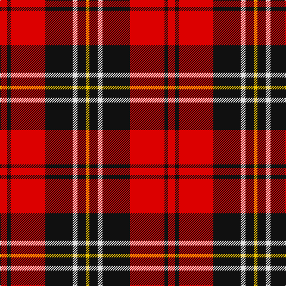

In pattern [RKRKWKY](/patterns/rkrkwky/).

This was sourced from register-of-tartans.  It is a [7 stripes tartan](/stripes/stripes7/).

Original link https://www.tartanregister.gov.uk/tartanDetails.aspx?ref=2725

## Thread count
R/12 K6 R58 K46 LN8 K14 Y/6

## Palette
Each colour and its ΔE from the base-6 reference it is a variant of.

| Colour | Shade | Base | ΔE (OKLab) |
|---|---|---|---|
| K | <code style="background-color:#101010;">#101010</code> `#101010` | K <code style="background-color:#000000;">#000000</code> | 0.17 |
| LN | <code style="background-color:#E0E0E0;">#E0E0E0</code> `#E0E0E0` | W <code style="background-color:#F4F4F0;">#F4F4F0</code> | 0.06 |
| R | <code style="background-color:#DC0000;">#DC0000</code> `#DC0000` | R <code style="background-color:#C80000;">#C80000</code> | 0.04 |
| Y | <code style="background-color:#E8C000;">#E8C000</code> `#E8C000` | Y <code style="background-color:#E8C000;">#E8C000</code> | 0.00 |

# Sample pattern

## Nearest tartans

The nearest existing variants by ΔTartan distance.

1. [Dunbar #2](/setts/s6/k8r52k8w4k26y8-k101010-rdc0000-we0e0e0-ye8c000/) — ΔT 0.65
1. [Nakayama (Personal)](/setts/s8/b6r6k12r42k42r6k12w6-b2c4084-k101010-rdc0000-we0e0e0/) — ΔT 0.86
1. [Cetoloni (Personal)](/setts/s6/b4r48k24y4k24b4-b2c2c80-k101010-rc80000-ye8c000/) — ΔT 0.93
1. [MacIver (Clan)](/setts/s9/w4r24k6r6k32r6k6r24y4-k101010-rc80000-wfcfcfc-yd8b000/) — ΔT 0.94
1. [Dunbar](/setts/s6/k8r52k8w4k26y8-k000000-rc00000-we0e0e0-yf0c000/) — ΔT 0.95
1. [MacPherson, Red Cluny](/setts/s7/r12k6r58k46w8k14y6-k000000-rc00000-we0e0e0-yf0c000/) — ΔT 0.96
1. [Nakayama (Fashion)](/setts/s8/b6r6k12r42k42r6k12w6-b3850c8-k101010-rc80000-we0e0e0/) — ΔT 1.04
1. [Ramsay Red Clan Tartan Tartan Number: 1238. Earliest known date: 1842 Ramsay was one of the names adopted by members of the Clan MacGregor when their own was proscribed. It is not surprising then that an early MacGregor sett was used as a basis for the Ramsay tartan. It is possible that the tartan was in existance long before the earliest recorded date given. See products available Copyright © Blair Urquhart, Comrie, 2015](/setts/s6/r10ra4r60k56w4k8-k101010-rc80000-raa00048-we0e0e0/) — ΔT 1.08
1. [MacIver Clan Tartan Tartan Number: 1855. Earliest known date: 1906 Kith and Kin lists MacIvers in Argyll associated with Campbell, in Ross and Lewis with MacKenzie, and in Perthshire with Robertson. H. Whyte introduced tartans for many clan septs in his book, 'The Tartans of the Clans and Septs of Scotland' published by W & A.K. Johnston, Edinburgh, in 1906. There is no 'hunting' MacIver though the 'MacArthur' is sometimes mistakenly worn as such. If a hunting version were devised it would probably retain the yellow and white stripes unlike the MacArthur which has no white. See products available Copyright © Blair Urquhart, Comrie, 2015](/setts/s9/w4r36k8r8k48r8k8r36y4-k101010-rc80000-we0e0e0-ye8c000/) — ΔT 1.10
1. [Scoepaig, fragment](/setts/s10/k20b2k2r20b2k2b2r20g12r4-b5480b0-g008000-k000000-rc00000/) — ΔT 1.13

## Neighbour map

Every grey dot is one of 15726 variants placed by the first two principal components of the ΔTartan feature space (44% of its variance). Red is this tartan; blue dots are its nearest — click one to open its page.

<svg viewBox="0 0 640 380" role="img" style="max-width:100%;height:auto;border:1px solid #e0e0e0;border-radius:4px;display:block" xmlns="http://www.w3.org/2000/svg"><image href="/nn/cloud.v1.png" width="640" height="380"/><a href="/setts/s6/k8r52k8w4k26y8-k101010-rdc0000-we0e0e0-ye8c000/"><circle cx="281.7" cy="168.7" r="4" fill="#3465a4"><title>Dunbar #2</title></circle></a><a href="/setts/s8/b6r6k12r42k42r6k12w6-b2c4084-k101010-rdc0000-we0e0e0/"><circle cx="262.0" cy="190.9" r="4" fill="#3465a4"><title>Nakayama (Personal)</title></circle></a><a href="/setts/s6/b4r48k24y4k24b4-b2c2c80-k101010-rc80000-ye8c000/"><circle cx="272.8" cy="188.6" r="4" fill="#3465a4"><title>Cetoloni (Personal)</title></circle></a><a href="/setts/s9/w4r24k6r6k32r6k6r24y4-k101010-rc80000-wfcfcfc-yd8b000/"><circle cx="283.5" cy="184.8" r="4" fill="#3465a4"><title>MacIver (Clan)</title></circle></a><a href="/setts/s6/k8r52k8w4k26y8-k000000-rc00000-we0e0e0-yf0c000/"><circle cx="272.2" cy="170.6" r="4" fill="#3465a4"><title>Dunbar</title></circle></a><a href="/setts/s7/r12k6r58k46w8k14y6-k000000-rc00000-we0e0e0-yf0c000/"><circle cx="252.4" cy="179.7" r="4" fill="#3465a4"><title>MacPherson, Red Cluny</title></circle></a><a href="/setts/s8/b6r6k12r42k42r6k12w6-b3850c8-k101010-rc80000-we0e0e0/"><circle cx="265.2" cy="193.9" r="4" fill="#3465a4"><title>Nakayama (Fashion)</title></circle></a><a href="/setts/s6/r10ra4r60k56w4k8-k101010-rc80000-raa00048-we0e0e0/"><circle cx="325.3" cy="170.3" r="4" fill="#3465a4"><title>Ramsay Red Clan Tartan Tartan Number: 1238. Earliest known date: 1842 Ramsay was one of the names adopted by members of the Clan MacGregor when their own was proscribed. It is not surprising then that an early MacGregor sett was used as a basis for the Ramsay tartan. It is possible that the tartan was in existance long before the earliest recorded date given. See products available Copyright © Blair Urquhart, Comrie, 2015</title></circle></a><a href="/setts/s9/w4r36k8r8k48r8k8r36y4-k101010-rc80000-we0e0e0-ye8c000/"><circle cx="321.7" cy="167.2" r="4" fill="#3465a4"><title>MacIver Clan Tartan Tartan Number: 1855. Earliest known date: 1906 Kith and Kin lists MacIvers in Argyll associated with Campbell, in Ross and Lewis with MacKenzie, and in Perthshire with Robertson. H. Whyte introduced tartans for many clan septs in his book, 'The Tartans of the Clans and Septs of Scotland' published by W &amp; A.K. Johnston, Edinburgh, in 1906. There is no 'hunting' MacIver though the 'MacArthur' is sometimes mistakenly worn as such. If a hunting version were devised it would probably retain the yellow and white stripes unlike the MacArthur which has no white. See products available Copyright © Blair Urquhart, Comrie, 2015</title></circle></a><a href="/setts/s10/k20b2k2r20b2k2b2r20g12r4-b5480b0-g008000-k000000-rc00000/"><circle cx="247.1" cy="162.9" r="4" fill="#3465a4"><title>Scoepaig, fragment</title></circle></a><circle cx="261.4" cy="177.4" r="5" fill="#c00000"/></svg>

ID: /setts/s7/r12k6r58k46w8k14y6-k101010-rdc0000-we0e0e0-ye8c000/
