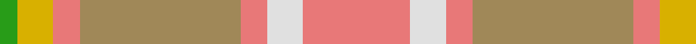

In pattern [GYRYRWR](/patterns/gyryrwr/).

This was sourced from register-of-tartans.  It is a [7 stripes tartan](/stripes/stripes7/).

Original link https://www.tartanregister.gov.uk/tartanDetails.aspx?ref=1446

## Attestations

This cloth appears in 2 source records; the oldest owns this page.

- 01/01/1972 — Golden Pheasant (register-of-tartans, [record](https://www.tartanregister.gov.uk/tartanDetails.aspx?ref=1446))
- pre 1972 — Golden Pheasant (Fashion) (tartans-authority, [record](http://www.tartansauthority.com/tartan-ferret/display/5052/))

## Thread count
G/4 Y8 LR6 LT36 LR6 LN8 LR/24

## Palette
Each colour and its ΔE from the base-6 reference it is a variant of.

| Colour | Shade | Base | ΔE (OKLab) |
|---|---|---|---|
| G | <code style="background-color:#289C18;">#289C18</code> `#289C18` | G <code style="background-color:#006100;">#006100</code> | 0.19 |
| LN | <code style="background-color:#E0E0E0;">#E0E0E0</code> `#E0E0E0` | W <code style="background-color:#F7F7F7;">#F7F7F7</code> | 0.07 |
| LR | <code style="background-color:#E87878;">#E87878</code> `#E87878` | R <code style="background-color:#CC0000;">#CC0000</code> | 0.19 |
| LT | <code style="background-color:#A08858;">#A08858</code> `#A08858` | Y <code style="background-color:#F2BF00;">#F2BF00</code> | 0.21 |
| N | <code style="background-color:#406054;">#406054</code> `#406054` | G <code style="background-color:#006100;">#006100</code> | 0.11 |
| Na | <code style="background-color:#A0A0A0;">#A0A0A0</code> `#A0A0A0` | Y <code style="background-color:#F2BF00;">#F2BF00</code> | 0.21 |
| T | <code style="background-color:#98481C;">#98481C</code> `#98481C` | R <code style="background-color:#CC0000;">#CC0000</code> | 0.11 |
| Y | <code style="background-color:#D8B000;">#D8B000</code> `#D8B000` | Y <code style="background-color:#F2BF00;">#F2BF00</code> | 0.06 |

# Sample pattern

## Nearest tartans

The nearest existing variants by ΔTartan distance.

1. [Susan G Komen 06](/setts/s7/w6y27b6r40ya44w8r4~b581c24-rc46864-wfcf8e0-ya89480-yae09ca0/) — ΔT 1.52
1. [Jardine of Castlemilk Family Tartan Tartan Number: 1432. Earliest known date: c.1978 The chiefly house is Jardine of Applegirth, a baronetcy created in 1672. The Jardines of Castlemilk in Dumfriesshire settled there in the early fourteenth century. The tartan is approved by Col Jardine. The darker brown is recorded as "J.Br", and the lighter as "Olive Br" in the Lyon Books. See products available Copyright © Blair Urquhart, Comrie, 2015](/setts/s8/r9ra9g9rb1b1ra9b1rb1~b5494bc-g686868-r88582c-rab87c00-rb7c0000~x4/) — ΔT 1.61
1. [Unidentified from Winnipeg](/setts/s8/r24y8b2y8b2y8ra15g2~b401000-g008000-ra08060-ra806050-yff8500~x2/) — ΔT 1.73
1. [Golden Heather, The](/setts/s10/r2y20ra2y2r3ya3r3yb6yc24y2~ra00000-rab84c00-yc8bc94-yaf47420-ybcc8024-ycd87c00~x2/) — ΔT 1.80
1. [Tasmanian](/setts/s11/r5w2g24y2g2y2g6y8r6y8ya4~g8c7038-r901c38-wf4c4c4-ya0a0a0-yac4bc68~x2/) — ΔT 1.84
1. [Cladish](/setts/s8/g10y5g54y2w32ya54b4ya10~b1474b4-g8c7038-we8ccb8-ydc943c-yaa08858/) — ΔT 1.95
1. [Unidentified, Sett](/setts/s9/y2r1ra10rb12r10y6ra10r1y2~r806050-rac00000-rb906030-yb0b0b0~x2/) — ΔT 1.98
1. [O'Monaghan (Personal)](/setts/s10/g25w2b4y7b4w2ya25w2b4y7~b2888c4-g789484-wfcfcfc-yd87c00-yabc8c00~x2/) — ΔT 2.04
1. [Trinity Bicycles](/setts/s5/g4y11g14r30ra4~g6b4226-r8b7355-racd0000-y6ca6cd~x2/) — ΔT 2.07
1. [Froach's Grian](/setts/s8/y2r24ya14y25ya14y25yb20y2~r9c68a4-y94acc4-yaa08858-ybe8c000~x2/) — ΔT 2.11

## Neighbour map

Every grey dot is one of 15726 variants placed by the first two principal components of the ΔTartan feature space (44% of its variance). Red is this tartan; blue dots are its nearest — click one to open its page.

<svg viewBox="0 0 640 380" role="img" style="max-width:100%;height:auto;border:1px solid #e0e0e0;border-radius:4px;display:block" xmlns="http://www.w3.org/2000/svg"><image href="/nn/cloud.v1.png" width="640" height="380"/><a href="/setts/s7/w6y27b6r40ya44w8r4~b581c24-rc46864-wfcf8e0-ya89480-yae09ca0/"><circle cx="219.3" cy="187.3" r="4" fill="#3465a4"><title>Susan G Komen 06</title></circle></a><a href="/setts/s8/r9ra9g9rb1b1ra9b1rb1~b5494bc-g686868-r88582c-rab87c00-rb7c0000~x4/"><circle cx="316.3" cy="226.5" r="4" fill="#3465a4"><title>Jardine of Castlemilk Family Tartan Tartan Number: 1432. Earliest known date: c.1978 The chiefly house is Jardine of Applegirth, a baronetcy created in 1672. The Jardines of Castlemilk in Dumfriesshire settled there in the early fourteenth century. The tartan is approved by Col Jardine. The darker brown is recorded as &quot;J.Br&quot;, and the lighter as &quot;Olive Br&quot; in the Lyon Books. See products available Copyright © Blair Urquhart, Comrie, 2015</title></circle></a><a href="/setts/s8/r24y8b2y8b2y8ra15g2~b401000-g008000-ra08060-ra806050-yff8500~x2/"><circle cx="230.5" cy="180.9" r="4" fill="#3465a4"><title>Unidentified from Winnipeg</title></circle></a><a href="/setts/s10/r2y20ra2y2r3ya3r3yb6yc24y2~ra00000-rab84c00-yc8bc94-yaf47420-ybcc8024-ycd87c00~x2/"><circle cx="253.4" cy="136.7" r="4" fill="#3465a4"><title>Golden Heather, The</title></circle></a><a href="/setts/s11/r5w2g24y2g2y2g6y8r6y8ya4~g8c7038-r901c38-wf4c4c4-ya0a0a0-yac4bc68~x2/"><circle cx="292.8" cy="167.7" r="4" fill="#3465a4"><title>Tasmanian</title></circle></a><a href="/setts/s8/g10y5g54y2w32ya54b4ya10~b1474b4-g8c7038-we8ccb8-ydc943c-yaa08858/"><circle cx="321.7" cy="163.1" r="4" fill="#3465a4"><title>Cladish</title></circle></a><a href="/setts/s9/y2r1ra10rb12r10y6ra10r1y2~r806050-rac00000-rb906030-yb0b0b0~x2/"><circle cx="261.4" cy="211.0" r="4" fill="#3465a4"><title>Unidentified, Sett</title></circle></a><a href="/setts/s10/g25w2b4y7b4w2ya25w2b4y7~b2888c4-g789484-wfcfcfc-yd87c00-yabc8c00~x2/"><circle cx="211.5" cy="160.1" r="4" fill="#3465a4"><title>O'Monaghan (Personal)</title></circle></a><a href="/setts/s5/g4y11g14r30ra4~g6b4226-r8b7355-racd0000-y6ca6cd~x2/"><circle cx="317.1" cy="261.5" r="4" fill="#3465a4"><title>Trinity Bicycles</title></circle></a><a href="/setts/s8/y2r24ya14y25ya14y25yb20y2~r9c68a4-y94acc4-yaa08858-ybe8c000~x2/"><circle cx="267.0" cy="234.5" r="4" fill="#3465a4"><title>Froach's Grian</title></circle></a><circle cx="284.1" cy="208.7" r="5" fill="#c00000"/></svg>

ID: /setts/s7/r12w4r3y18r3ya4g2~g289c18-re87878-we0e0e0-ya08858-yad8b000~x2/
