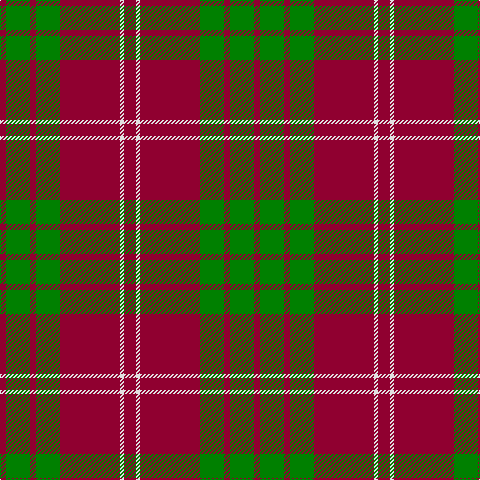

In pattern [RGRGRWR](/patterns/rgrgrwr/).

This was sourced from weddslist.  It is a [7 stripes tartan](/stripes/stripes7/).

Original link http://www.weddslist.com/cgi-bin/tartans/pg.pl?source=sts

## Thread count
DR/6 G24 DR6 G24 DR60 LN4 DR/12

## Palette
Each colour and its ΔE from the base-6 reference it is a variant of.

| Colour | Shade | Base | ΔE (OKLab) |
|---|---|---|---|
| DR | <code style="background-color:#900030;">#900030</code> `#900030` | R <code style="background-color:#CC0000;">#CC0000</code> | 0.14 |
| G | <code style="background-color:#008000;">#008000</code> `#008000` | G <code style="background-color:#006100;">#006100</code> | 0.10 |
| LN | <code style="background-color:#E0E0E0;">#E0E0E0</code> `#E0E0E0` | W <code style="background-color:#F7F7F7;">#F7F7F7</code> | 0.07 |

# Sample pattern

## Nearest tartans

The nearest existing variants by ΔTartan distance.

1. [Crawford (Clan)](/setts/s7/r12w4r60g24r6g24r6-g006818-ra00048-we0e0e0/) — ΔT 0.70
1. [Crawford](/setts/s7/r12w4r60g24r6g24r6-g006818-ra00048-wc0c0c0/) — ΔT 0.80
1. [Crawford](/setts/s7/r6w2r30g12r3g12r3-g004c00-rc80000-wd0d0d0/) — ΔT 0.90
1. [Cameron Clan D](/setts/s6/r2g12r2g12r30y2-g004c00-rc80000-yffc800/) — ΔT 0.97
1. [Cameron](/setts/s6/r4g12r4g12r32y2-g004c00-rc80000-yffc800/) — ΔT 0.99
1. [Cameron (Clan)](/setts/s6/r8g24r8g24r64y4-g006818-rc80000-ye8c000/) — ΔT 1.05
1. [Cameron Clan Tartan Tartan Number: 1538. Earliest known date: 1842 First illustrated in the 'Vestiarium Scoticum' this sett is known as the Cameron Clan tartan. It may be derived from the tartan worn by the MacFees who also had a close association with Lochaber. The sett was recorded by Lord Lyon in the Public Register of All Arms and Bearings in 1947. See products available Copyright © Blair Urquhart, Comrie, 2015](/setts/s6/r4g12r4g12r32y2-g006818-rc80000-ye8c000/) — ΔT 1.05
1. [Auld Lang Syne (red) Tartan Tartan Number: 2402. Earliest known date: Threadcount and colours aren't 100% original. Generated manually. See products available Copyright © Blair Urquhart, Comrie, 2015](/setts/s7/r8g28r10k12r48g4r8-g006818-k101010-rc80000/) — ΔT 1.06
1. [MacKintosh, Plaid](/setts/s6/r32b12r4g12r4b2-b304080-g008000-rc00000/) — ΔT 1.09
1. [Robertson 6](/setts/s6/g4r72b16r4g40r4-b304080-g008000-rc00000/) — ΔT 1.10

## Neighbour map

Every grey dot is one of 15726 variants placed by the first two principal components of the ΔTartan feature space (44% of its variance). Red is this tartan; blue dots are its nearest — click one to open its page.

<svg viewBox="0 0 640 380" role="img" style="max-width:100%;height:auto;border:1px solid #e0e0e0;border-radius:4px;display:block" xmlns="http://www.w3.org/2000/svg"><image href="/nn/cloud.v1.png" width="640" height="380"/><a href="/setts/s7/r12w4r60g24r6g24r6-g006818-ra00048-we0e0e0/"><circle cx="421.5" cy="199.8" r="4" fill="#3465a4"><title>Crawford (Clan)</title></circle></a><a href="/setts/s7/r12w4r60g24r6g24r6-g006818-ra00048-wc0c0c0/"><circle cx="427.4" cy="202.5" r="4" fill="#3465a4"><title>Crawford</title></circle></a><a href="/setts/s7/r6w2r30g12r3g12r3-g004c00-rc80000-wd0d0d0/"><circle cx="418.8" cy="194.2" r="4" fill="#3465a4"><title>Crawford</title></circle></a><a href="/setts/s6/r2g12r2g12r30y2-g004c00-rc80000-yffc800/"><circle cx="395.5" cy="196.0" r="4" fill="#3465a4"><title>Cameron Clan D</title></circle></a><a href="/setts/s6/r4g12r4g12r32y2-g004c00-rc80000-yffc800/"><circle cx="416.2" cy="199.4" r="4" fill="#3465a4"><title>Cameron</title></circle></a><a href="/setts/s6/r8g24r8g24r64y4-g006818-rc80000-ye8c000/"><circle cx="423.5" cy="202.4" r="4" fill="#3465a4"><title>Cameron (Clan)</title></circle></a><a href="/setts/s6/r4g12r4g12r32y2-g006818-rc80000-ye8c000/"><circle cx="423.5" cy="202.4" r="4" fill="#3465a4"><title>Cameron Clan Tartan Tartan Number: 1538. Earliest known date: 1842 First illustrated in the 'Vestiarium Scoticum' this sett is known as the Cameron Clan tartan. It may be derived from the tartan worn by the MacFees who also had a close association with Lochaber. The sett was recorded by Lord Lyon in the Public Register of All Arms and Bearings in 1947. See products available Copyright © Blair Urquhart, Comrie, 2015</title></circle></a><a href="/setts/s7/r8g28r10k12r48g4r8-g006818-k101010-rc80000/"><circle cx="396.5" cy="206.7" r="4" fill="#3465a4"><title>Auld Lang Syne (red) Tartan Tartan Number: 2402. Earliest known date: Threadcount and colours aren't 100% original. Generated manually. See products available Copyright © Blair Urquhart, Comrie, 2015</title></circle></a><a href="/setts/s6/r32b12r4g12r4b2-b304080-g008000-rc00000/"><circle cx="403.8" cy="201.4" r="4" fill="#3465a4"><title>MacKintosh, Plaid</title></circle></a><a href="/setts/s6/g4r72b16r4g40r4-b304080-g008000-rc00000/"><circle cx="398.0" cy="185.9" r="4" fill="#3465a4"><title>Robertson 6</title></circle></a><circle cx="411.6" cy="198.0" r="5" fill="#c00000"/></svg>

ID: /setts/s7/r12w4r60g24r6g24r6-g008000-r900030-we0e0e0/
