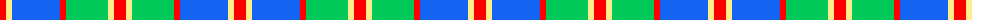
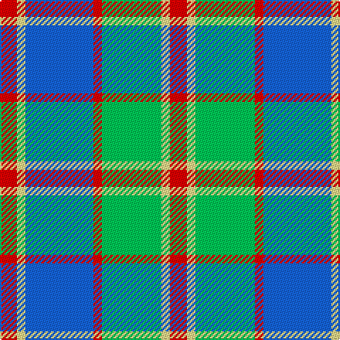

In pattern [RWBRYWR](/patterns/rwbrywr/).

This was sourced from register-of-tartans.  It is a [7 stripes tartan](/stripes/stripes7/).

Original link https://www.tartanregister.gov.uk/tartanDetails.aspx?ref=10392

## Thread count
R/12 LY6 B48 R6 Ba42 LY6 R/12

## Palette
Each colour and its ΔE from the base-6 reference it is a variant of.

| Colour | Shade | Base | ΔE (OKLab) |
|---|---|---|---|
| B | <code style="background-color:#1464F4;">#1464F4</code> `#1464F4` | B <code style="background-color:#2C4084;">#2C4084</code> | 0.19 |
| Ba | <code style="background-color:#00C957;">#00C957</code> `#00C957` | Y <code style="background-color:#E8C000;">#E8C000</code> | 0.20 |
| LY | <code style="background-color:#FFEC8B;">#FFEC8B</code> `#FFEC8B` | W <code style="background-color:#F4F4F0;">#F4F4F0</code> | 0.12 |
| R | <code style="background-color:#FF0000;">#FF0000</code> `#FF0000` | R <code style="background-color:#C80000;">#C80000</code> | 0.11 |

# Sample pattern

ID: /setts/s7/r12w6b48r6y42w6r12-b1464f4-rff0000-wffec8b-y00c957/
