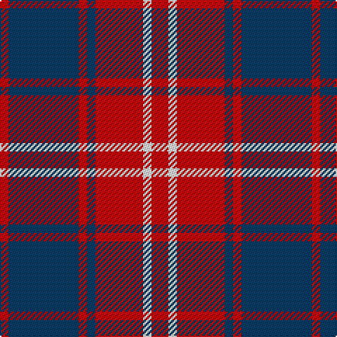

In pattern [RBRBRWR](/patterns/rbrbrwr/).

This was sourced from register-of-tartans.  It is a [7 stripes tartan](/stripes/stripes7/).

Original link https://www.tartanregister.gov.uk/tartanDetails.aspx?ref=307

## Thread count
R/6 DB50 R6 DB6 R34 W6 R/12

## Palette
Each colour and its ΔE from the base-6 reference it is a variant of.

| Colour | Shade | Base | ΔE (OKLab) |
|---|---|---|---|
| DB | <code style="background-color:#003C64;">#003C64</code> `#003C64` | B <code style="background-color:#2A418A;">#2A418A</code> | 0.08 |
| R | <code style="background-color:#C80000;">#C80000</code> `#C80000` | R <code style="background-color:#CC0000;">#CC0000</code> | 0.01 |
| W | <code style="background-color:#FFFFFF;">#FFFFFF</code> `#FFFFFF` | W <code style="background-color:#F7F7F7;">#F7F7F7</code> | 0.02 |

# Sample pattern

## Nearest tartans

The nearest existing variants by ΔTartan distance.

1. [Bon Accord (District)](/setts/s7/r12w6r34b6r6b50r6-b003c64-rc80000-wfcfcfc/) — ΔT 0.02
1. [Edinburgh Marketing Corporate Tartan Tartan Number: 2106. Earliest known date: 1991 The tartan was based on the Drummond tartan after the famous Lord Provost of Edinburgh, Lord Drummond, who is regarded as the father of the New Town and the "bridge" between the Old town of Edinburgh and the New Town. The colours are the corporate colours of Edinburgh Marketing, Navy, Red and White. The tartan was designed by Messrs. Kinloch Anderson of Leith, Edinburgh. See products available Copyright © Blair Urquhart, Comrie, 2015](/setts/s8/b38r6b6r9w5r12b8r16-b202060-rc80000-we0e0e0/) — ΔT 0.93
1. [Matthews (Personal)](/setts/s6/b6r48b6r6b50w6-b2c2c80-rc80000-we0e0e0/) — ΔT 0.94
1. [Bon Accord Corporate Com Tartan Tartan Number: 2229. Earliest known date: 1995 Designed by Michael King of Philip King Ltd. A tartan for the City of Aberdeen. Approved by the City council, launched at the Aberdeen Highland Games in June 1995. See products available Copyright © Blair Urquhart, Comrie, 2015](/setts/s12/b50r6b6r34w6r12w6r34b6r6b50r6-b003c64-rc80000-wfcfcfc/) — ΔT 1.14
1. [Butler](/setts/s6/b96r36b12r26y8r28-b2c2c80-rc80000-ye8c000/) — ΔT 1.16
1. [Bon Accord](/setts/s7/r12w6r34k6r6k50r6-k000030-rc00000-we0e0e0/) — ΔT 1.17
1. [O'Long (Personal)](/setts/s7/g44b44g6b22w6b8w6-b780078-g006818-we0e0e0/) — ΔT 1.18
1. [Pink MacLeod (Personal)](/setts/s9/k8r8k38r18k18r38k4r4w4-k101010-re87878-wf8f8f8/) — ΔT 1.19
1. [British European](/setts/s6/r24b4r24b34w4r4-b2c2c80-ra00000-wfcfcfc/) — ΔT 1.23
1. [British European (Corporate)](/setts/s6/r48b8r48b68w8r8-b2c2c80-ra00000-wfcfcfc/) — ΔT 1.23

## Neighbour map

Every grey dot is one of 15726 variants placed by the first two principal components of the ΔTartan feature space (44% of its variance). Red is this tartan; blue dots are its nearest — click one to open its page.

<svg viewBox="0 0 640 380" role="img" style="max-width:100%;height:auto;border:1px solid #e0e0e0;border-radius:4px;display:block" xmlns="http://www.w3.org/2000/svg"><image href="/nn/cloud.v1.png" width="640" height="380"/><a href="/setts/s7/r12w6r34b6r6b50r6-b003c64-rc80000-wfcfcfc/"><circle cx="310.8" cy="206.6" r="4" fill="#3465a4"><title>Bon Accord (District)</title></circle></a><a href="/setts/s8/b38r6b6r9w5r12b8r16-b202060-rc80000-we0e0e0/"><circle cx="308.3" cy="216.4" r="4" fill="#3465a4"><title>Edinburgh Marketing Corporate Tartan Tartan Number: 2106. Earliest known date: 1991 The tartan was based on the Drummond tartan after the famous Lord Provost of Edinburgh, Lord Drummond, who is regarded as the father of the New Town and the &quot;bridge&quot; between the Old town of Edinburgh and the New Town. The colours are the corporate colours of Edinburgh Marketing, Navy, Red and White. The tartan was designed by Messrs. Kinloch Anderson of Leith, Edinburgh. See products available Copyright © Blair Urquhart, Comrie, 2015</title></circle></a><a href="/setts/s6/b6r48b6r6b50w6-b2c2c80-rc80000-we0e0e0/"><circle cx="331.9" cy="211.9" r="4" fill="#3465a4"><title>Matthews (Personal)</title></circle></a><a href="/setts/s12/b50r6b6r34w6r12w6r34b6r6b50r6-b003c64-rc80000-wfcfcfc/"><circle cx="300.9" cy="186.3" r="4" fill="#3465a4"><title>Bon Accord Corporate Com Tartan Tartan Number: 2229. Earliest known date: 1995 Designed by Michael King of Philip King Ltd. A tartan for the City of Aberdeen. Approved by the City council, launched at the Aberdeen Highland Games in June 1995. See products available Copyright © Blair Urquhart, Comrie, 2015</title></circle></a><a href="/setts/s6/b96r36b12r26y8r28-b2c2c80-rc80000-ye8c000/"><circle cx="349.0" cy="213.5" r="4" fill="#3465a4"><title>Butler</title></circle></a><a href="/setts/s7/r12w6r34k6r6k50r6-k000030-rc00000-we0e0e0/"><circle cx="295.6" cy="203.5" r="4" fill="#3465a4"><title>Bon Accord</title></circle></a><a href="/setts/s7/g44b44g6b22w6b8w6-b780078-g006818-we0e0e0/"><circle cx="304.9" cy="223.3" r="4" fill="#3465a4"><title>O'Long (Personal)</title></circle></a><a href="/setts/s9/k8r8k38r18k18r38k4r4w4-k101010-re87878-wf8f8f8/"><circle cx="281.6" cy="191.8" r="4" fill="#3465a4"><title>Pink MacLeod (Personal)</title></circle></a><a href="/setts/s6/r24b4r24b34w4r4-b2c2c80-ra00000-wfcfcfc/"><circle cx="348.8" cy="235.2" r="4" fill="#3465a4"><title>British European</title></circle></a><a href="/setts/s6/r48b8r48b68w8r8-b2c2c80-ra00000-wfcfcfc/"><circle cx="348.8" cy="235.2" r="4" fill="#3465a4"><title>British European (Corporate)</title></circle></a><circle cx="310.2" cy="206.4" r="5" fill="#c00000"/></svg>

ID: /setts/s7/r12w6r34b6r6b50r6-b003c64-rc80000-wffffff/
