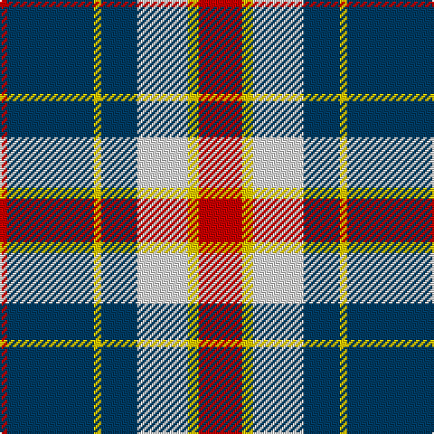

In pattern [RBYBWYR](/patterns/rbybwyr/).

This was sourced from tartans-authority.  It is a [7 stripes tartan](/stripes/stripes7/).

Original link http://www.tartansauthority.com/tartan-ferret/display/10455/

## Thread count
R/4 DB48 Y4 DB20 LN28 Y6 R/24

## Palette
Each colour and its ΔE from the base-6 reference it is a variant of.

| Colour | Shade | Base | ΔE (OKLab) |
|---|---|---|---|
| DB | <code style="background-color:#003C64;">#003C64</code> `#003C64` | B <code style="background-color:#2A418A;">#2A418A</code> | 0.08 |
| LN | <code style="background-color:#E0E0E0;">#E0E0E0</code> `#E0E0E0` | W <code style="background-color:#F7F7F7;">#F7F7F7</code> | 0.07 |
| R | <code style="background-color:#C80000;">#C80000</code> `#C80000` | R <code style="background-color:#CC0000;">#CC0000</code> | 0.01 |
| Y | <code style="background-color:#FCCC00;">#FCCC00</code> `#FCCC00` | Y <code style="background-color:#F2BF00;">#F2BF00</code> | 0.04 |

# Sample pattern

## Nearest tartans

The nearest existing variants by ΔTartan distance.

1. [Yusra (Malay) (Personal)](/setts/s7/r12y3w14b10y2b24r2x2~b003c64-rc80000-we0e0e0-ye8c000/) — ΔT 0.05
1. [Yusra Personal Tartan Tartan Number: 10455. Earliest known date: 6th April 2011 The colours used in the design are based on the colours of the Malaysian flag (blue/navy, red, yellow and white/cream) to represent the country of origin of part of the Yusra family. A woven sample of this tartan has been received by the Scottish Register of Tartans for permanent preservation in the National Archives of Scotland. See products available Copyright © Blair Urquhart, Comrie, 2015](/setts/s7/r12k3w14b10k2b24r2x2~b003c64-k000000-rc80000-we0e0e0/) — ΔT 0.62
1. [Downside (Corporate)](/setts/s6/r4ra41k5w14k18r4x2~k101010-rc80000-ra888888-we0e0e0/) — ΔT 0.75
1. [Yale College of Wrexham (Corporate)](/setts/s8/r9w5b57k5b9r29k18w9~b2888c4-k101010-rc80000-we0e0e0/) — ΔT 0.87
1. [Thompson Grey Family Tartan Tartan Number: 1611. Earliest known date: pre 2003 Designed for Lord Thomson of Fleet in 1958 based on a sample in the Moy Hall collection dating from the mid 19th century. The tartan is also suitable for MacTavishs and Thompsons, who claim descent from the Clan MacIntosh. See products available Copyright © Blair Urquhart, Comrie, 2015](/setts/s6/r2ra20k5w10k10r2x2~k101010-rc80000-ra888888-we0e0e0/) — ΔT 1.02
1. [MacMillan](/setts/s9/k6r2k12g3k6w16g3w16k2x2~g8c7038-k101010-r980044-wc0c0c0/) — ΔT 1.08
1. [Tiree Grey](/setts/s6/w3k3w3k3r15ra1x4~k101010-r888888-ra880000-wc0c0c0/) — ΔT 1.16
1. [Oban Grey (Fashion)](/setts/s5/k4w4k4r15ra2x4~k101010-r888888-ra880000-wc0c0c0/) — ΔT 1.17
1. [Thomson Camel](/setts/s6/r4y30k6w13k13w3x2~k101010-rc80000-we0e0e0-ya08858/) — ΔT 1.20
1. [Burberry Grey (Original)](/setts/s5/k5w7k5g20b1x4~b2c2c80-g7c7c7c-k101010-we0e0e0/) — ΔT 1.20

## Neighbour map

Every grey dot is one of 15726 variants placed by the first two principal components of the ΔTartan feature space (44% of its variance). Red is this tartan; blue dots are its nearest — click one to open its page.

<svg viewBox="0 0 640 380" role="img" style="max-width:100%;height:auto;border:1px solid #e0e0e0;border-radius:4px;display:block" xmlns="http://www.w3.org/2000/svg"><image href="/nn/cloud.v1.png" width="640" height="380"/><a href="/setts/s7/r12y3w14b10y2b24r2x2~b003c64-rc80000-we0e0e0-ye8c000/"><circle cx="227.9" cy="184.4" r="4" fill="#3465a4"><title>Yusra (Malay) (Personal)</title></circle></a><a href="/setts/s7/r12k3w14b10k2b24r2x2~b003c64-k000000-rc80000-we0e0e0/"><circle cx="225.6" cy="186.6" r="4" fill="#3465a4"><title>Yusra Personal Tartan Tartan Number: 10455. Earliest known date: 6th April 2011 The colours used in the design are based on the colours of the Malaysian flag (blue/navy, red, yellow and white/cream) to represent the country of origin of part of the Yusra family. A woven sample of this tartan has been received by the Scottish Register of Tartans for permanent preservation in the National Archives of Scotland. See products available Copyright © Blair Urquhart, Comrie, 2015</title></circle></a><a href="/setts/s6/r4ra41k5w14k18r4x2~k101010-rc80000-ra888888-we0e0e0/"><circle cx="222.1" cy="185.3" r="4" fill="#3465a4"><title>Downside (Corporate)</title></circle></a><a href="/setts/s8/r9w5b57k5b9r29k18w9~b2888c4-k101010-rc80000-we0e0e0/"><circle cx="223.7" cy="169.1" r="4" fill="#3465a4"><title>Yale College of Wrexham (Corporate)</title></circle></a><a href="/setts/s6/r2ra20k5w10k10r2x2~k101010-rc80000-ra888888-we0e0e0/"><circle cx="172.2" cy="195.7" r="4" fill="#3465a4"><title>Thompson Grey Family Tartan Tartan Number: 1611. Earliest known date: pre 2003 Designed for Lord Thomson of Fleet in 1958 based on a sample in the Moy Hall collection dating from the mid 19th century. The tartan is also suitable for MacTavishs and Thompsons, who claim descent from the Clan MacIntosh. See products available Copyright © Blair Urquhart, Comrie, 2015</title></circle></a><a href="/setts/s9/k6r2k12g3k6w16g3w16k2x2~g8c7038-k101010-r980044-wc0c0c0/"><circle cx="206.2" cy="191.4" r="4" fill="#3465a4"><title>MacMillan</title></circle></a><a href="/setts/s6/w3k3w3k3r15ra1x4~k101010-r888888-ra880000-wc0c0c0/"><circle cx="289.5" cy="173.4" r="4" fill="#3465a4"><title>Tiree Grey</title></circle></a><a href="/setts/s5/k4w4k4r15ra2x4~k101010-r888888-ra880000-wc0c0c0/"><circle cx="240.5" cy="220.9" r="4" fill="#3465a4"><title>Oban Grey (Fashion)</title></circle></a><a href="/setts/s6/r4y30k6w13k13w3x2~k101010-rc80000-we0e0e0-ya08858/"><circle cx="188.6" cy="191.0" r="4" fill="#3465a4"><title>Thomson Camel</title></circle></a><a href="/setts/s5/k5w7k5g20b1x4~b2c2c80-g7c7c7c-k101010-we0e0e0/"><circle cx="278.4" cy="179.8" r="4" fill="#3465a4"><title>Burberry Grey (Original)</title></circle></a><circle cx="226.7" cy="183.7" r="5" fill="#c00000"/></svg>

ID: /setts/s7/r12y3w14b10y2b24r2x2~b003c64-rc80000-we0e0e0-yfccc00/
