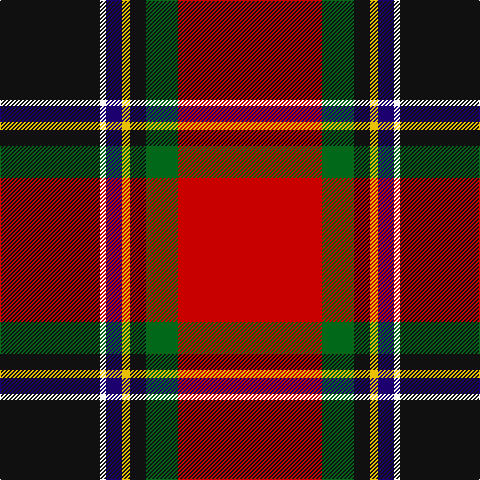

In pattern [KWBYKGR](/patterns/kwbykgr/).

This was sourced from tartans-authority.  It is a [7 stripes tartan](/stripes/stripes7/).

Original link http://www.tartansauthority.com/tartan-ferret/display/7754/

## Attestations

This cloth appears in 2 source records; the oldest owns this page.

- 2008 — Stewart, Anthony C (Personal) (tartans-authority, [record](http://www.tartansauthority.com/tartan-ferret/display/7754/))
- undated — Stewart, Anthony C (Personal) (register-of-tartans, [record](https://www.tartanregister.gov.uk/tartanDetails.aspx?ref=5734))

## Thread count
K/100 W6 DB16 Y8 K16 G32 R/144

## Palette
Each colour and its ΔE from the base-6 reference it is a variant of.

| Colour | Shade | Base | ΔE (OKLab) |
|---|---|---|---|
| DB | <code style="background-color:#1C0070;">#1C0070</code> `#1C0070` | B <code style="background-color:#2C4084;">#2C4084</code> | 0.14 |
| G | <code style="background-color:#006818;">#006818</code> `#006818` | G <code style="background-color:#006400;">#006400</code> | 0.02 |
| K | <code style="background-color:#101010;">#101010</code> `#101010` | K <code style="background-color:#000000;">#000000</code> | 0.17 |
| R | <code style="background-color:#C80000;">#C80000</code> `#C80000` | R <code style="background-color:#C80000;">#C80000</code> | 0.00 |
| W | <code style="background-color:#F8F8F8;">#F8F8F8</code> `#F8F8F8` | W <code style="background-color:#F4F4F0;">#F4F4F0</code> | 0.01 |
| Y | <code style="background-color:#E8C000;">#E8C000</code> `#E8C000` | Y <code style="background-color:#E8C000;">#E8C000</code> | 0.00 |

# Sample pattern

## Nearest tartans

The nearest existing variants by ΔTartan distance.

1. [Rei Okamoto (Personal)](/setts/s6/r120k80y6b10ba6g24-b783080-ba944cb8-g005448-k101010-rc80000-yd0b404/) — ΔT 0.78
1. [MacNiven](/setts/s9/g18ga2b5r45ba3b18ba3r5w2-b000050-ba304080-g008000-ga30a010-rc00000-we0e0e0/) — ΔT 0.94
1. [Hyland Evening (Personal)](/setts/s8/b6y4r38ra8ba12k72ba4y6-b440044-ba780078-k101010-rc8002c-rab03000-ydc943c/) — ΔT 1.10
1. [MacNiven Family Tartan Tartan Number: 752. Earliest known date: 1986 Based in part on the MacNaughton of which the MacNivens are a Sept. The name in Mr Cannonito's family was spelt, MacKniffen. Other members of the family have dropped the 'Mac' since arriving in America in 1650. This clan tartan was accredited by the Scottish Tartans Society in 1988. See products available Copyright © Blair Urquhart, Comrie, 2015](/setts/s9/g18ga2b5r45ba3b18ba3r5w2-b202060-ba2c2c80-g006818-ga289c18-rc80000-we0e0e0/) — ΔT 1.14
1. [Hewitt (Name)](/setts/s7/r60b24k6g24y4g6w4-b2c2c80-g006818-k101010-rc80000-we0e0e0-ye8c000/) — ΔT 1.18
1. [Hewitt](/setts/s7/r60b24k12g24y4g6w4-b2c4084-g005020-k101010-rdc0000-we0e0e0-ye8c000/) — ΔT 1.19
1. [Bombeiros Voluntarios De Galicia (Co](/setts/s7/r6b4r50ra24k50w4wa4-b5c5c5c-k101010-rc80000-ra888888-we0e0e0-waa8ace8/) — ΔT 1.22
1. [Bombeiros Voluntarios De Galicia](/setts/s7/r6b4r50ra24k50w4wa4-b5c5c5c-k101010-rc80000-ra888888-wffffff-waa8ace8/) — ΔT 1.23
1. [Gordon of Abergeldie (Portrait)](/setts/s6/r126w8k8b36y8g100-b780078-g005830-k101010-rc80000-wfcfcfc-yd8b000/) — ΔT 1.27
1. [Rikaco Holiday (Fashion)](/setts/s10/k10b10k4r94k36w4k10g18b14w6-b202060-g003820-k101010-rc80000-we0e0e0/) — ΔT 1.27

## Neighbour map

Every grey dot is one of 15726 variants placed by the first two principal components of the ΔTartan feature space (44% of its variance). Red is this tartan; blue dots are its nearest — click one to open its page.

<svg viewBox="0 0 640 380" role="img" style="max-width:100%;height:auto;border:1px solid #e0e0e0;border-radius:4px;display:block" xmlns="http://www.w3.org/2000/svg"><image href="/nn/cloud.v1.png" width="640" height="380"/><a href="/setts/s6/r120k80y6b10ba6g24-b783080-ba944cb8-g005448-k101010-rc80000-yd0b404/"><circle cx="272.9" cy="126.7" r="4" fill="#3465a4"><title>Rei Okamoto (Personal)</title></circle></a><a href="/setts/s9/g18ga2b5r45ba3b18ba3r5w2-b000050-ba304080-g008000-ga30a010-rc00000-we0e0e0/"><circle cx="253.9" cy="94.2" r="4" fill="#3465a4"><title>MacNiven</title></circle></a><a href="/setts/s8/b6y4r38ra8ba12k72ba4y6-b440044-ba780078-k101010-rc8002c-rab03000-ydc943c/"><circle cx="251.0" cy="112.1" r="4" fill="#3465a4"><title>Hyland Evening (Personal)</title></circle></a><a href="/setts/s9/g18ga2b5r45ba3b18ba3r5w2-b202060-ba2c2c80-g006818-ga289c18-rc80000-we0e0e0/"><circle cx="271.1" cy="98.7" r="4" fill="#3465a4"><title>MacNiven Family Tartan Tartan Number: 752. Earliest known date: 1986 Based in part on the MacNaughton of which the MacNivens are a Sept. The name in Mr Cannonito's family was spelt, MacKniffen. Other members of the family have dropped the 'Mac' since arriving in America in 1650. This clan tartan was accredited by the Scottish Tartans Society in 1988. See products available Copyright © Blair Urquhart, Comrie, 2015</title></circle></a><a href="/setts/s7/r60b24k6g24y4g6w4-b2c2c80-g006818-k101010-rc80000-we0e0e0-ye8c000/"><circle cx="228.6" cy="129.5" r="4" fill="#3465a4"><title>Hewitt (Name)</title></circle></a><a href="/setts/s7/r60b24k12g24y4g6w4-b2c4084-g005020-k101010-rdc0000-we0e0e0-ye8c000/"><circle cx="205.4" cy="131.5" r="4" fill="#3465a4"><title>Hewitt</title></circle></a><a href="/setts/s7/r6b4r50ra24k50w4wa4-b5c5c5c-k101010-rc80000-ra888888-we0e0e0-waa8ace8/"><circle cx="183.9" cy="136.0" r="4" fill="#3465a4"><title>Bombeiros Voluntarios De Galicia (Co</title></circle></a><a href="/setts/s7/r6b4r50ra24k50w4wa4-b5c5c5c-k101010-rc80000-ra888888-wffffff-waa8ace8/"><circle cx="181.6" cy="135.0" r="4" fill="#3465a4"><title>Bombeiros Voluntarios De Galicia</title></circle></a><a href="/setts/s6/r126w8k8b36y8g100-b780078-g005830-k101010-rc80000-wfcfcfc-yd8b000/"><circle cx="240.4" cy="140.5" r="4" fill="#3465a4"><title>Gordon of Abergeldie (Portrait)</title></circle></a><a href="/setts/s10/k10b10k4r94k36w4k10g18b14w6-b202060-g003820-k101010-rc80000-we0e0e0/"><circle cx="260.9" cy="99.5" r="4" fill="#3465a4"><title>Rikaco Holiday (Fashion)</title></circle></a><circle cx="245.5" cy="109.0" r="5" fill="#c00000"/></svg>

ID: /setts/s7/r144g32k16y8b16w6k100-b1c0070-g006818-k101010-rc80000-wf8f8f8-ye8c000/
