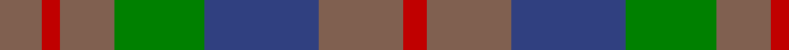
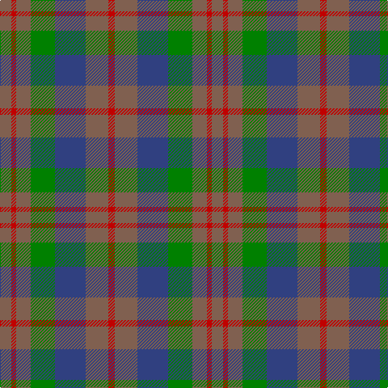

In pattern [RRBGRRR](/patterns/rrbgrrr/).

This was sourced from weddslist.  It is a [7 stripes tartan](/stripes/stripes7/).

Original link http://www.weddslist.com/cgi-bin/tartans/pg.pl?source=sts

## Thread count
LT/14 R6 LT18 G30 B38 LT28 R/8

## Palette
Each colour and its ΔE from the base-6 reference it is a variant of.

| Colour | Shade | Base | ΔE (OKLab) |
|---|---|---|---|
| B | <code style="background-color:#304080;">#304080</code> `#304080` | B <code style="background-color:#2C4084;">#2C4084</code> | 0.01 |
| G | <code style="background-color:#008000;">#008000</code> `#008000` | G <code style="background-color:#006400;">#006400</code> | 0.09 |
| LT | <code style="background-color:#806050;">#806050</code> `#806050` | R <code style="background-color:#C80000;">#C80000</code> | 0.17 |
| R | <code style="background-color:#C00000;">#C00000</code> `#C00000` | R <code style="background-color:#C80000;">#C80000</code> | 0.02 |

# Sample pattern

## Nearest tartans

The nearest existing variants by ΔTartan distance.

1. [Dorward/Dogwood](/setts/s7/g14r6g18ga30b38g28r8-b2c2c80-g604000-ga006818-rc80000/) — ΔT 0.67
1. [Fraser Hunting](/setts/s6/r2b6r2g6r8ra2-b304080-g008000-r806050-rac00000/) — ΔT 0.88
1. [Tennant (Yules)](/setts/s7/r8b56g56b56g56ga56r8-b2c2c80-g006818-ga604000-rc80000/) — ΔT 1.19
1. [Gleneagles Group Corporate Tartan Tartan Number: 2107. Earliest known date: 1989 Designed for a range of tartan goods called the Gleneagles Collection. See products available Copyright © Blair Urquhart, Comrie, 2015](/setts/s7/b10g12ga2g12b10ba12b2-b680028-ba2c2c80-g006818-ga604000/) — ΔT 1.20
1. [MacKay - 1800 (Reay Coat) (Artefact)](/setts/s7/g18ga18y4ga18g18b18g6-b1474b4-g604000-ga408060-ye8c000/) — ΔT 1.20
1. [Styrian](/setts/s8/r32g58b38ga16b38g58r32ra8-b5c5c5c-g003820-ga006818-r888888-ra880000/) — ΔT 1.28
1. [Buchanan, hunting](/setts/s11/b6r28g28r4b28r4b28r4g28r28ra6-b304080-g008000-r806050-rac00000/) — ΔT 1.32
1. [Dewar (WCWM)](/setts/s6/b4g4b28g20ga28y4-b084848-g604000-ga8c7038-yb8b8b8/) — ΔT 1.36
1. [Bristol Gramar School Check (School)](/setts/s6/r4b3ba12bb8b2r4-b447084-ba5c5c5c-bb1c1c50-rc80000/) — ΔT 1.42
1. [Styrian (Fashion)](/setts/s5/g16b38ga58r32ra8-b5c5c5c-g006818-ga003820-r888888-ra880000/) — ΔT 1.46

## Neighbour map

Every grey dot is one of 15726 variants placed by the first two principal components of the ΔTartan feature space (44% of its variance). Red is this tartan; blue dots are its nearest — click one to open its page.

<svg viewBox="0 0 640 380" role="img" style="max-width:100%;height:auto;border:1px solid #e0e0e0;border-radius:4px;display:block" xmlns="http://www.w3.org/2000/svg"><image href="/nn/cloud.v1.png" width="640" height="380"/><a href="/setts/s7/g14r6g18ga30b38g28r8-b2c2c80-g604000-ga006818-rc80000/"><circle cx="227.9" cy="273.7" r="4" fill="#3465a4"><title>Dorward/Dogwood</title></circle></a><a href="/setts/s6/r2b6r2g6r8ra2-b304080-g008000-r806050-rac00000/"><circle cx="241.6" cy="296.7" r="4" fill="#3465a4"><title>Fraser Hunting</title></circle></a><a href="/setts/s7/r8b56g56b56g56ga56r8-b2c2c80-g006818-ga604000-rc80000/"><circle cx="205.8" cy="274.5" r="4" fill="#3465a4"><title>Tennant (Yules)</title></circle></a><a href="/setts/s7/b10g12ga2g12b10ba12b2-b680028-ba2c2c80-g006818-ga604000/"><circle cx="211.3" cy="278.5" r="4" fill="#3465a4"><title>Gleneagles Group Corporate Tartan Tartan Number: 2107. Earliest known date: 1989 Designed for a range of tartan goods called the Gleneagles Collection. See products available Copyright © Blair Urquhart, Comrie, 2015</title></circle></a><a href="/setts/s7/g18ga18y4ga18g18b18g6-b1474b4-g604000-ga408060-ye8c000/"><circle cx="210.0" cy="306.9" r="4" fill="#3465a4"><title>MacKay - 1800 (Reay Coat) (Artefact)</title></circle></a><a href="/setts/s8/r32g58b38ga16b38g58r32ra8-b5c5c5c-g003820-ga006818-r888888-ra880000/"><circle cx="192.3" cy="259.8" r="4" fill="#3465a4"><title>Styrian</title></circle></a><a href="/setts/s11/b6r28g28r4b28r4b28r4g28r28ra6-b304080-g008000-r806050-rac00000/"><circle cx="211.4" cy="239.8" r="4" fill="#3465a4"><title>Buchanan, hunting</title></circle></a><a href="/setts/s6/b4g4b28g20ga28y4-b084848-g604000-ga8c7038-yb8b8b8/"><circle cx="253.7" cy="264.6" r="4" fill="#3465a4"><title>Dewar (WCWM)</title></circle></a><a href="/setts/s6/r4b3ba12bb8b2r4-b447084-ba5c5c5c-bb1c1c50-rc80000/"><circle cx="195.7" cy="260.9" r="4" fill="#3465a4"><title>Bristol Gramar School Check (School)</title></circle></a><a href="/setts/s5/g16b38ga58r32ra8-b5c5c5c-g006818-ga003820-r888888-ra880000/"><circle cx="191.9" cy="266.3" r="4" fill="#3465a4"><title>Styrian (Fashion)</title></circle></a><circle cx="228.7" cy="272.1" r="5" fill="#c00000"/></svg>

ID: /setts/s7/r14ra6r18g30b38r28ra8-b304080-g008000-r806050-rac00000/
