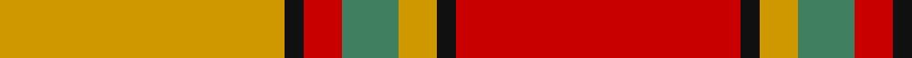

**Bands:** [RKYGRKY](/stripes/rkygrky/) · **Stripes:** [R K LO G R K LO](/stripes/stripes7/) R K LO G R K LO

This was sourced from tartans-authority.  It is a [7 band tartan](/bands/bands7/).

Original link http://www.tartansauthority.com/tartan-ferret/display/1627/

## Thread count
DY/90 K6 R12 G18 DY12 K6 R/90

## Palette
Each colour and its ΔE from the base-6 reference it is a variant of.

| Colour | Shade | Base | ΔE (OKLab) |
|---|---|---|---|
| DY | <code style="background-color:#D09800;">#D09800</code> `#D09800` | Y <code style="background-color:#F2BF00;">#F2BF00</code> | 0.12 |
| G | <code style="background-color:#408060;">#408060</code> `#408060` | G <code style="background-color:#006100;">#006100</code> | 0.14 |
| K | <code style="background-color:#101010;">#101010</code> `#101010` | K <code style="background-color:#000000;">#000000</code> | 0.17 |
| R | <code style="background-color:#C80000;">#C80000</code> `#C80000` | R <code style="background-color:#CC0000;">#CC0000</code> | 0.01 |

# Sample pattern

## Nearest tartans

The nearest existing variants by ΔTartan distance.

1. [Scrymgeour](/setts/s7/r15k1y2db3r2k1y15~x6/) — ΔT 0.90
1. [Loch Rannoch #2](/setts/s8/dy24g2dy5o14g2o5lo17dy2~x2/) — ΔT 1.36
1. [Scrymgeour](/setts/s12/r15k1lo2g3r2k1lo15~x6/) — ΔT 1.40
1. [MacNab 5](/setts/s7/g6r2r2g4r2r12k1~x2/) — ΔT 1.42
1. [MacNab 6](/setts/s7/g28r7m7g14m7r48k4~x2/) — ΔT 1.46
1. [Lennox](/setts/s7/r2r1r10r2g10lr1g2~x4/) — ΔT 1.49
1. [MacNab #3](/setts/s7/dg6r2r2dg4r2r12k1~x2/) — ΔT 1.49
1. [Fernandes (Personal)](/setts/s7/g5ly5g5ly35r44r3r3~x2/) — ΔT 1.50
1. [MacNab (Crimson)](/setts/s7/dg28r7m7dg14m7r48k4~x2/) — ΔT 1.52
1. [Wilson's, No 5](/setts/s6/r32t5g17r4g5w2~x2/) — ΔT 1.52

## Neighbour map

Every grey dot is one of 14299 variants placed by the first two principal components of the ΔTartan feature space (44% of its variance). Red is this tartan; blue dots are its nearest — click one to open its page.

<svg viewBox="0 0 640 380" role="img" style="max-width:100%;height:auto;border:1px solid #e0e0e0;border-radius:4px;display:block" xmlns="http://www.w3.org/2000/svg"><image href="/nn/cloud.v1.png" width="640" height="380"/><a href="/setts/s7/r15k1y2db3r2k1y15~x6/"><circle cx="305.7" cy="166.4" r="4" fill="#3465a4"><title>Scrymgeour</title></circle></a><a href="/setts/s8/dy24g2dy5o14g2o5lo17dy2~x2/"><circle cx="268.8" cy="188.2" r="4" fill="#3465a4"><title>Loch Rannoch #2</title></circle></a><a href="/setts/s12/r15k1lo2g3r2k1lo15~x6/"><circle cx="264.3" cy="124.2" r="4" fill="#3465a4"><title>Scrymgeour</title></circle></a><a href="/setts/s7/g6r2r2g4r2r12k1~x2/"><circle cx="288.0" cy="190.4" r="4" fill="#3465a4"><title>MacNab 5</title></circle></a><a href="/setts/s7/g28r7m7g14m7r48k4~x2/"><circle cx="289.3" cy="186.9" r="4" fill="#3465a4"><title>MacNab 6</title></circle></a><a href="/setts/s7/r2r1r10r2g10lr1g2~x4/"><circle cx="285.0" cy="198.1" r="4" fill="#3465a4"><title>Lennox</title></circle></a><a href="/setts/s7/dg6r2r2dg4r2r12k1~x2/"><circle cx="297.8" cy="191.4" r="4" fill="#3465a4"><title>MacNab #3</title></circle></a><a href="/setts/s7/g5ly5g5ly35r44r3r3~x2/"><circle cx="284.6" cy="143.2" r="4" fill="#3465a4"><title>Fernandes (Personal)</title></circle></a><a href="/setts/s7/dg28r7m7dg14m7r48k4~x2/"><circle cx="298.1" cy="187.8" r="4" fill="#3465a4"><title>MacNab (Crimson)</title></circle></a><a href="/setts/s6/r32t5g17r4g5w2~x2/"><circle cx="352.5" cy="177.7" r="4" fill="#3465a4"><title>Wilson's, No 5</title></circle></a><circle cx="310.7" cy="161.3" r="5" fill="#c00000"/></svg>

ID: /setts/s7/r15k1lo2g3r2k1lo15~x6/
