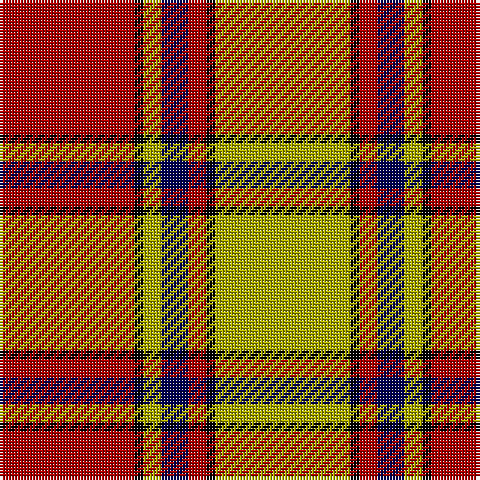

In pattern [RKYBRKY](/stripes/rkybrky/).

This was sourced from weddslist.  It is a [7 stripe tartan](/stripes/stripes7/).

Original link http://www.weddslist.com/cgi-bin/tartans/pg.pl?source=x

## Register references

External register numbers recorded for this tartan.

- Scottish Register of Tartans: [1166](https://www.tartanregister.gov.uk/tartanDetails.aspx?ref=1166)
- Scottish Register of Tartans: [1758](https://www.tartanregister.gov.uk/tartanDetails.aspx?ref=1758)
- Scottish Register of Tartans: [2307](https://www.tartanregister.gov.uk/tartanDetails.aspx?ref=2307)
- Scottish Register of Tartans: [2540](https://www.tartanregister.gov.uk/tartanDetails.aspx?ref=2540)
- Scottish Register of Tartans: [2625](https://www.tartanregister.gov.uk/tartanDetails.aspx?ref=2625)
- Scottish Register of Tartans: [2862](https://www.tartanregister.gov.uk/tartanDetails.aspx?ref=2862)
- Scottish Register of Tartans: [982](https://www.tartanregister.gov.uk/tartanDetails.aspx?ref=982)
- Scottish Tartans Authority (ITI): 1429
- Scottish Tartans Authority (ITI): 218
- Scottish Tartans World Register: 1042
- Scottish Tartans World Register: 127
- Scottish Tartans World Register: 1429
- Scottish Tartans World Register: 218
- Scottish Tartans World Register: 2218
- Scottish Tartans World Register: 737
- Scottish Tartans World Register: 897

## Thread count
DR/45 K3 LG6 DB9 DR6 K3 LG/45

## Palette
Each colour and its ΔE from the base-6 reference it is a variant of.

| Colour | Shade | Base | ΔE (OKLab) |
|---|---|---|---|
| DB | <code style="background-color:#000052;">#000052</code> `#000052` | B <code style="background-color:#2A418A;">#2A418A</code> | 0.20 |
| DR | <code style="background-color:#AA0000;">#AA0000</code> `#AA0000` | R <code style="background-color:#CC0000;">#CC0000</code> | 0.07 |
| K | <code style="background-color:#000000;">#000000</code> `#000000` | K <code style="background-color:#000000;">#000000</code> | 0.00 |
| LG | <code style="background-color:#AAAA00;">#AAAA00</code> `#AAAA00` | Y <code style="background-color:#F2BF00;">#F2BF00</code> | 0.13 |

# Sample pattern

## Nearest tartans

The nearest existing variants by ΔTartan distance.

1. [Scrymgeour](/setts/s7/r15k1ly2db3r2k1ly15~x6/) — ΔT 0.00
1. [Scrymgeour Family Tartan Tartan Number: 1627. Earliest known date: 1971 Yellow ochre. A note in STS files says "Not Adopted" with no explanation. The STS research report reads, "The tartan detailed above was displayed at a gathering of Scrymgeours held at Dudhope Castle, Dundee, in 1971 and was later adopted as the official tartan. The sett was designed by Donald C Stewart, author of 'The Setts of the Scottish Tartans' in 1970." See products available Copyright © Blair Urquhart, Comrie, 2015](/setts/s7/o15k1ly2db3o2k1ly15~x4/) — ΔT 0.67
1. [Fernandes (Personal)](/setts/s7/g5ly5g5ly35r44r3r3~x2/) — ΔT 0.81
1. [Brisbane (Artefact)](/setts/s8/g18w3ly1r2ly1r3ly1r10~x4/) — ΔT 0.91
1. [Starr (1978) (Name)](/setts/s7/k2r4w1r10g12r2w2~x4/) — ΔT 0.92
1. [Denny, hunting](/setts/s6/k1g6k1g6r16db1~x2/) — ΔT 1.05
1. [Pittsburgh St Andrew's Society](/setts/s8/t1r1lo1k15lo15r1t1lo1~x4/) — ΔT 1.10
1. [Brisbane (Artefact)](/setts/s8/g18lb3ly1r2ly1r3ly1r10~x4/) — ΔT 1.17
1. [Scrymgeour](/setts/s7/r46k3ly6db8r6k3ly46/) — ΔT 1.25
1. [MacAulay](/setts/s6/k2r16g6r3g8w1~x2/) — ΔT 1.25

## Neighbour map

Every grey dot is one of 14299 variants placed by the first two principal components of the ΔTartan feature space (44% of its variance). Red is this tartan; blue dots are its nearest — click one to open its page.

<svg viewBox="0 0 640 380" role="img" style="max-width:100%;height:auto;border:1px solid #e0e0e0;border-radius:4px;display:block" xmlns="http://www.w3.org/2000/svg"><image href="/nn/cloud.v1.png" width="640" height="380"/><a href="/setts/s7/r15k1ly2db3r2k1ly15~x6/"><circle cx="267.0" cy="149.1" r="4" fill="#3465a4"><title>Scrymgeour</title></circle></a><a href="/setts/s7/o15k1ly2db3o2k1ly15~x4/"><circle cx="267.6" cy="145.8" r="4" fill="#3465a4"><title>Scrymgeour Family Tartan Tartan Number: 1627. Earliest known date: 1971 Yellow ochre. A note in STS files says &quot;Not Adopted&quot; with no explanation. The STS research report reads, &quot;The tartan detailed above was displayed at a gathering of Scrymgeours held at Dudhope Castle, Dundee, in 1971 and was later adopted as the official tartan. The sett was designed by Donald C Stewart, author of 'The Setts of the Scottish Tartans' in 1970.&quot; See products available Copyright © Blair Urquhart, Comrie, 2015</title></circle></a><a href="/setts/s7/g5ly5g5ly35r44r3r3~x2/"><circle cx="284.6" cy="143.2" r="4" fill="#3465a4"><title>Fernandes (Personal)</title></circle></a><a href="/setts/s8/g18w3ly1r2ly1r3ly1r10~x4/"><circle cx="282.8" cy="138.0" r="4" fill="#3465a4"><title>Brisbane (Artefact)</title></circle></a><a href="/setts/s7/k2r4w1r10g12r2w2~x4/"><circle cx="264.8" cy="177.1" r="4" fill="#3465a4"><title>Starr (1978) (Name)</title></circle></a><a href="/setts/s6/k1g6k1g6r16db1~x2/"><circle cx="323.7" cy="169.3" r="4" fill="#3465a4"><title>Denny, hunting</title></circle></a><a href="/setts/s8/t1r1lo1k15lo15r1t1lo1~x4/"><circle cx="284.0" cy="129.0" r="4" fill="#3465a4"><title>Pittsburgh St Andrew's Society</title></circle></a><a href="/setts/s8/g18lb3ly1r2ly1r3ly1r10~x4/"><circle cx="297.8" cy="146.2" r="4" fill="#3465a4"><title>Brisbane (Artefact)</title></circle></a><a href="/setts/s7/r46k3ly6db8r6k3ly46/"><circle cx="262.9" cy="130.3" r="4" fill="#3465a4"><title>Scrymgeour</title></circle></a><a href="/setts/s6/k2r16g6r3g8w1~x2/"><circle cx="315.2" cy="181.0" r="4" fill="#3465a4"><title>MacAulay</title></circle></a><circle cx="267.0" cy="149.1" r="5" fill="#c00000"/></svg>

ID: /setts/s7/r15k1ly2db3r2k1ly15~x3/
