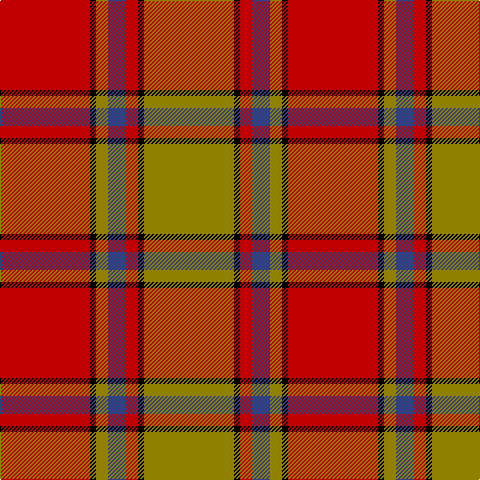

In pattern [GKRBGKR](/stripes/gkrbgkr/).

This was sourced from weddslist.  It is a [7 stripe tartan](/stripes/stripes7/).

Original link http://www.weddslist.com/cgi-bin/tartans/pg.pl?source=sts

## Thread count
R/90 K6 LG12 B18 R12 K6 LG/90

## Palette
Each colour and the base-6 reference it is a variant of.

| Colour | Shade | Base |
|---|---|---|
| B | <code style="background-color:#304080;">#304080</code> `oklch(39.4% 0.109 270.2)` <small>#304080</small> | B <code style="background-color:#2A418A;">#2A418A</code> |
| K | <code style="background-color:#000000;">#000000</code> `oklch(0.0% 0.000 0.0)` <small>#000000</small> | K <code style="background-color:#000000;">#000000</code> |
| LG | <code style="background-color:#908000;">#908000</code> `oklch(59.6% 0.124 100.6)` <small>#908000</small> | G <code style="background-color:#006100;">#006100</code> |
| R | <code style="background-color:#C00000;">#C00000</code> `oklch(50.7% 0.208 29.2)` <small>#C00000</small> | R <code style="background-color:#CC0000;">#CC0000</code> |

# Sample pattern

## Nearest tartans

The nearest existing variants by ΔTartan distance.

1. [MacNab 6](/setts/s7/g28r7m7g14m7r48k4~x2/) — ΔT 0.84
1. [MacNab 5](/setts/s7/g6r2r2g4r2r12k1~x2/) — ΔT 0.89
1. [MacNab (Crimson)](/setts/s7/dg28r7m7dg14m7r48k4~x2/) — ΔT 0.89
1. [Scrymgeour (Clan)](/setts/s7/r15k1lo2g3r2k1lo15~x6/) — ΔT 0.90
1. [Lennox](/setts/s7/r2r1r10r2g10lr1g2~x4/) — ΔT 0.96
1. [MacNab #3](/setts/s7/dg6r2r2dg4r2r12k1~x2/) — ΔT 1.02
1. [Lennox](/setts/s7/r2r1r10r2g10w1g2~x2/) — ΔT 1.09
1. [Cetoloni (Personal)](/setts/s6/db1r12g6ly1g6db1~x4/) — ΔT 1.14
1. [McInally (Name)](/setts/s7/r3g16r4k6r28g2lo3~x2/) — ΔT 1.14
1. [Wilson's, No 5](/setts/s6/r32t5g17r4g5w2~x2/) — ΔT 1.19

## Neighbour map

Every grey dot is one of 14299 variants placed by the first two principal components of the ΔTartan feature space (44% of its variance). Red is this tartan; blue dots are its nearest — click one to open its page.

<svg viewBox="0 0 640 380" role="img" style="max-width:100%;height:auto;border:1px solid #e0e0e0;border-radius:4px;display:block" xmlns="http://www.w3.org/2000/svg"><image href="/nn/cloud.v1.png" width="640" height="380"/><a href="/setts/s7/g28r7m7g14m7r48k4~x2/"><circle cx="289.3" cy="186.9" r="4" fill="#3465a4"><title>MacNab 6</title></circle></a><a href="/setts/s7/g6r2r2g4r2r12k1~x2/"><circle cx="288.0" cy="190.4" r="4" fill="#3465a4"><title>MacNab 5</title></circle></a><a href="/setts/s7/dg28r7m7dg14m7r48k4~x2/"><circle cx="298.1" cy="187.8" r="4" fill="#3465a4"><title>MacNab (Crimson)</title></circle></a><a href="/setts/s7/r15k1lo2g3r2k1lo15~x6/"><circle cx="310.7" cy="161.3" r="4" fill="#3465a4"><title>Scrymgeour (Clan)</title></circle></a><a href="/setts/s7/r2r1r10r2g10lr1g2~x4/"><circle cx="285.0" cy="198.1" r="4" fill="#3465a4"><title>Lennox</title></circle></a><a href="/setts/s7/dg6r2r2dg4r2r12k1~x2/"><circle cx="297.8" cy="191.4" r="4" fill="#3465a4"><title>MacNab #3</title></circle></a><a href="/setts/s7/r2r1r10r2g10w1g2~x2/"><circle cx="270.0" cy="191.3" r="4" fill="#3465a4"><title>Lennox</title></circle></a><a href="/setts/s6/db1r12g6ly1g6db1~x4/"><circle cx="288.3" cy="197.8" r="4" fill="#3465a4"><title>Cetoloni (Personal)</title></circle></a><a href="/setts/s7/r3g16r4k6r28g2lo3~x2/"><circle cx="345.5" cy="171.4" r="4" fill="#3465a4"><title>McInally (Name)</title></circle></a><a href="/setts/s6/r32t5g17r4g5w2~x2/"><circle cx="352.5" cy="177.7" r="4" fill="#3465a4"><title>Wilson's, No 5</title></circle></a><circle cx="305.7" cy="166.4" r="5" fill="#c00000"/></svg>

ID: /setts/s7/r15k1y2db3r2k1y15~x6/
