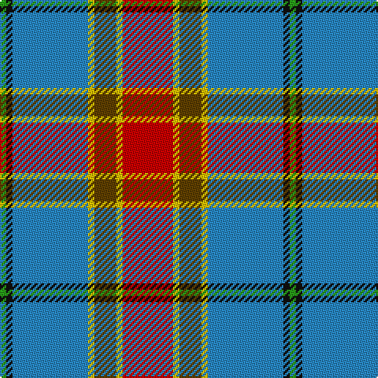

This page is one **sett** — a single exact thread-count. It belongs to the [tartan](/tartans/r16ly2dy7ly2t24k2g2/)
(the same proportion at any scale), whose colour order is pattern [GKBYGYR](/stripes/gkbygyr/).

Sourced from register-of-tartans.  It is a [7 stripe tartan](/stripes/stripes7/).

Original link https://www.tartanregister.gov.uk/tartanDetails.aspx?ref=4146

2 attestations — the source records this cloth was collapsed from (oldest owns this page)

<ul>
<li>24/08/2002 — Traill (Personal) (register-of-tartans, <a href="https://www.tartanregister.gov.uk/tartanDetails.aspx?ref=4146">record</a>)</li>
<li>2002 — Traill (Name) (tartans-authority, <a href="http://www.tartansauthority.com/tartan-ferret/display/3093/">record</a>)</li>
</ul>

## Register references

External register numbers recorded for this tartan.

- Scottish Register of Tartans: [4146](https://www.tartanregister.gov.uk/tartanDetails.aspx?ref=4146)
- Scottish Tartans Authority (ITI): 3093
- Scottish Tartans World Register: 2927

## Thread count
R/32 Y4 T14 Y4 B48 K4 G/4

## Palette

Palette: <strong>Tartan Register</strong>
<table><thead><tr><th>Colour</th><th>Threads</th><th>Shade</th><th>Base</th><th>OKLCh</th></tr></thead><tbody><tr><td>R/</td><td style="text-align:right;font-variant-numeric:tabular-nums">32</td><td><code style="background-color:#C80000;">#C80000</code> <small style="color:#888">#C80000</small></td><td>R <code style="background-color:#CC0000;">#CC0000</code></td><td><small style="color:#888">oklch(52.3% 0.215 29.2)</small></td></tr><tr><td>Y</td><td style="text-align:right;font-variant-numeric:tabular-nums">4</td><td><code style="background-color:#E8C000;">#E8C000</code> <small style="color:#888">#E8C000</small></td><td>Y <code style="background-color:#F2BF00;">#F2BF00</code></td><td><small style="color:#888">oklch(81.9% 0.168 93.7)</small></td></tr><tr><td>T</td><td style="text-align:right;font-variant-numeric:tabular-nums">14</td><td><code style="background-color:#604000;">#604000</code> <small style="color:#888">#604000</small></td><td>G <code style="background-color:#006100;">#006100</code></td><td><small style="color:#888">oklch(39.8% 0.083 76.8)</small></td></tr><tr><td>Y</td><td style="text-align:right;font-variant-numeric:tabular-nums">4</td><td><code style="background-color:#E8C000;">#E8C000</code> <small style="color:#888">#E8C000</small></td><td>Y <code style="background-color:#F2BF00;">#F2BF00</code></td><td><small style="color:#888">oklch(81.9% 0.168 93.7)</small></td></tr><tr><td>B</td><td style="text-align:right;font-variant-numeric:tabular-nums">48</td><td><code style="background-color:#2888C4;">#2888C4</code> <small style="color:#888">#2888C4</small></td><td>B <code style="background-color:#2A418A;">#2A418A</code></td><td><small style="color:#888">oklch(60.1% 0.125 241.5)</small></td></tr><tr><td>K</td><td style="text-align:right;font-variant-numeric:tabular-nums">4</td><td><code style="background-color:#101010;">#101010</code> <small style="color:#888">#101010</small></td><td>K <code style="background-color:#000000;">#000000</code></td><td><small style="color:#888">oklch(17.3% 0.000 89.9)</small></td></tr><tr><td>G/</td><td style="text-align:right;font-variant-numeric:tabular-nums">4</td><td><code style="background-color:#289C18;">#289C18</code> <small style="color:#888">#289C18</small></td><td>G <code style="background-color:#006100;">#006100</code></td><td><small style="color:#888">oklch(60.6% 0.191 141.6)</small></td></tr></tbody></table>

# Sample pattern

## Nearest tartans

The nearest existing variants by ΔTartan distance, with this tartan at the top so the swatches line up against it.

ΔTartan

Tartan

Sett

—

<a href="/ttd/edit/#slug=r16ly2dy7ly2t24k2g2~x2">Traill (Personal)</a> <a class="nn-out" href="/setts/s7/r16ly2dy7ly2t24k2g2~x2/" title="open its dictionary page">↗</a>

0.79

<a href="/ttd/edit/#slug=r16ly2dy7ly2b24k2g2~x2">Traill Clan/Family Weavers Tartan Tartan Number: 3093. Earliest known date: 2002 The Traill tartan is for anyone tracing their ancestry to the Scottish 'Traills' - Traill of Blebo and descendants in Orkney and elsewhere. Blue is poor. See products available Copyright © Blair Urquhart, Comrie, 2015</a> <a class="nn-out" href="/setts/s7/r16ly2dy7ly2b24k2g2~x2/" title="open its dictionary page">↗</a>

0.96

<a href="/ttd/edit/#slug=w3b25m3r3m3r5g10m3k2~x2">Edinburgh District</a> <a class="nn-out" href="/setts/s9/w3b25m3r3m3r5g10m3k2~x2/" title="open its dictionary page">↗</a>

1.08

<a href="/ttd/edit/#slug=w3n25m3r3m3r5g10m3k2~x2">Edinburgh District (District)</a> <a class="nn-out" href="/setts/s9/w3n25m3r3m3r5g10m3k2~x2/" title="open its dictionary page">↗</a>

1.08

<a href="/ttd/edit/#slug=lg2r20g2dt15k2lg19lb2~x2">Wallace Memorial Centenary</a> <a class="nn-out" href="/setts/s7/lg2r20g2dt15k2lg19lb2~x2/" title="open its dictionary page">↗</a>

1.09

<a href="/ttd/edit/#slug=o4do2o21db11w2o20r3~x2">Barbour Dress</a> <a class="nn-out" href="/setts/s7/o4do2o21db11w2o20r3~x2/" title="open its dictionary page">↗</a>

1.11

<a href="/ttd/edit/#slug=r3w2o7n25k8o15dg2~x2">Allman-Jones (Personal)</a> <a class="nn-out" href="/setts/s7/r3w2o7n25k8o15dg2~x2/" title="open its dictionary page">↗</a>

1.13

<a href="/ttd/edit/#slug=lb4ly2lb21k11w2n21r2~x2">Barbour -Modern</a> <a class="nn-out" href="/setts/s7/lb4ly2lb21k11w2n21r2~x2/" title="open its dictionary page">↗</a>

1.15

<a href="/ttd/edit/#slug=w3db25r3r3r3r5g10r3k2~x2">Edinburgh District</a> <a class="nn-out" href="/setts/s9/w3db25r3r3r3r5g10r3k2~x2/" title="open its dictionary page">↗</a>

1.15

<a href="/ttd/edit/#slug=w4t30g6r2g6r28ly2r3~x2">Scotland 2000 Commemorative Tartan Tartan Number: 2514. Earliest known date: 1999 Strathmore Woollen Mills Millenium tartan designed by Arthur Mackie of Strathmore Woollen Co., Forfar See products available Copyright © Blair Urquhart, Comrie, 2015</a> <a class="nn-out" href="/setts/s8/w4t30g6r2g6r28ly2r3~x2/" title="open its dictionary page">↗</a>

1.17

<a href="/ttd/edit/#slug=db16w6r8db3ly1g1b3db1g9~x2">Ohio</a> <a class="nn-out" href="/setts/s9/db16w6r8db3ly1g1b3db1g9~x2/" title="open its dictionary page">↗</a>

## Neighbour map

Every grey dot is one of 14299 variants placed by the first two principal components of the ΔTartan feature space (44% of its variance). Red is this tartan; blue dots are its nearest — click one to open its page.

<svg viewBox="0 0 640 380" role="img" style="max-width:100%;height:auto;border:1px solid #e0e0e0;border-radius:4px;display:block" xmlns="http://www.w3.org/2000/svg"><image href="/nn/cloud.v1.png" width="640" height="380"/><a href="/setts/s7/r16ly2dy7ly2b24k2g2~x2/"><circle cx="212.2" cy="152.3" r="4" fill="#3465a4"><title>Traill Clan/Family Weavers Tartan Tartan Number: 3093. Earliest known date: 2002 The Traill tartan is for anyone tracing their ancestry to the Scottish 'Traills' - Traill of Blebo and descendants in Orkney and elsewhere. Blue is poor. See products available Copyright © Blair Urquhart, Comrie, 2015</title></circle></a><a href="/setts/s9/w3b25m3r3m3r5g10m3k2~x2/"><circle cx="192.6" cy="129.6" r="4" fill="#3465a4"><title>Edinburgh District</title></circle></a><a href="/setts/s9/w3n25m3r3m3r5g10m3k2~x2/"><circle cx="205.9" cy="136.1" r="4" fill="#3465a4"><title>Edinburgh District (District)</title></circle></a><a href="/setts/s7/lg2r20g2dt15k2lg19lb2~x2/"><circle cx="139.1" cy="152.7" r="4" fill="#3465a4"><title>Wallace Memorial Centenary</title></circle></a><a href="/setts/s7/o4do2o21db11w2o20r3~x2/"><circle cx="189.8" cy="167.4" r="4" fill="#3465a4"><title>Barbour Dress</title></circle></a><a href="/setts/s7/r3w2o7n25k8o15dg2~x2/"><circle cx="206.2" cy="168.1" r="4" fill="#3465a4"><title>Allman-Jones (Personal)</title></circle></a><a href="/setts/s7/lb4ly2lb21k11w2n21r2~x2/"><circle cx="148.7" cy="143.3" r="4" fill="#3465a4"><title>Barbour -Modern</title></circle></a><a href="/setts/s9/w3db25r3r3r3r5g10r3k2~x2/"><circle cx="195.6" cy="131.0" r="4" fill="#3465a4"><title>Edinburgh District</title></circle></a><a href="/setts/s8/w4t30g6r2g6r28ly2r3~x2/"><circle cx="238.5" cy="147.7" r="4" fill="#3465a4"><title>Scotland 2000 Commemorative Tartan Tartan Number: 2514. Earliest known date: 1999 Strathmore Woollen Mills Millenium tartan designed by Arthur Mackie of Strathmore Woollen Co., Forfar See products available Copyright © Blair Urquhart, Comrie, 2015</title></circle></a><a href="/setts/s9/db16w6r8db3ly1g1b3db1g9~x2/"><circle cx="164.7" cy="129.5" r="4" fill="#3465a4"><title>Ohio</title></circle></a><circle cx="203.4" cy="141.3" r="5" fill="#c00000"/></svg>

ID: /setts/s7/r16ly2dy7ly2t24k2g2~x2/
